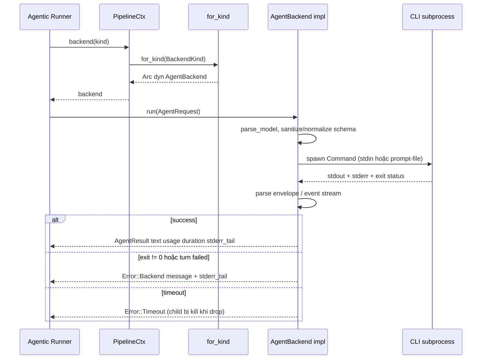

# Agent Backend Integration — Module Deep-Dive

## 1. Mục đích của module

`src/backend/` là lớp adapter (supporting domain) biến các agent CLI **đã xác thực sẵn** trên máy người dùng — `devin`, `claude`, `codex` — thành các LLM provider đồng nhất cho toàn bộ pipeline. Thay vì tự quản lý API key và gọi HTTP API, agentwiki spawn subprocess, truyền prompt vào, rồi chuẩn hóa output (stdout thô, JSON envelope, hoặc luồng sự kiện JSONL) về một kiểu kết quả duy nhất.

Module chịu trách nhiệm:

- **Định nghĩa hợp đồng**: trait `AgentBackend` + các kiểu dữ liệu `AgentRequest` / `AgentResult` / `TokenUsage` / `BackendKind`.
- **Dispatch**: phân tích model string dạng `"<backend>:<model>"` (với hậu tố `@<effort>` tùy backend), auto-detect CLI trên `PATH`, và factory `for_kind` — nơi duy nhất `match` trên `BackendKind`.
- **Subprocess governance**: mỗi backend thật dùng `tokio::process::Command` với `kill_on_drop`, `sanitized_env` (loại bỏ biến môi trường billing), và `tokio::time::timeout` theo từng call.
- **Offline testing**: `MockBackend` chạy in-process, truy cập qua model string `mock:*` nên test đi qua đúng đường dispatch production.

## 2. Cấu trúc nội bộ

| File | Thành phần | Vai trò |
|---|---|---|
| `src/backend/mod.rs` | `BackendKind`, `AgentRequest`, `AgentResult`, `TokenUsage`, `trait AgentBackend`, `for_kind`, `sanitized_env`, `tail` | Hợp đồng + dispatch + helper chung |
| `src/backend/devin.rs` | `DevinBackend` | Reference implementation — adapter đơn giản nhất, `devin -p`, stdout thô |
| `src/backend/claude.rs` | `ClaudeBackend`, `parse_model`, `sanitize_schema`, `parse_envelope` | `claude -p` + JSON envelope |
| `src/backend/codex.rs` | `CodexBackend`, `parse_model`, `normalize_schema`, `parse_events`, `is_nullable` | `codex exec` + JSONL event stream |
| `src/backend/mock.rs` | `MockBackend`, `MockHandler`, `canned`, `with_delay` | Test double có kịch bản |

Thiết kế "one file = one backend": thêm backend mới chỉ cần một file implement trait + một arm trong `for_kind` (ghi rõ trong doc-comment của `mod.rs`).

## 3. Giao diện chính

### 3.1 `trait AgentBackend`

```rust
#[async_trait]
pub trait AgentBackend: Send + Sync {
    fn kind(&self) -> BackendKind;
    fn supports_fs(&self) -> bool;                 // agentic/file-reading mode gate
    async fn run(&self, req: AgentRequest) -> Result<AgentResult>;
}
```

- `supports_fs()`: `true` cho cả 3 CLI thật (chúng có thể đọc file trong `cwd`), `false` cho mock — cờ này quyết định agent có chạy được ở chế độ agentic hay không.
- Backend được giữ dưới dạng `Arc<dyn AgentBackend>` trong `HashMap<BackendKind, Arc<dyn AgentBackend>>` của `PipelineCtx`; test inject mock qua `PipelineCtx::new` thay vì qua factory.

### 3.2 `AgentRequest` / `AgentResult`

`AgentRequest` mang: `prompt` (đã render đầy đủ), `model` tùy chọn (truyền thẳng xuống CLI), `cwd`, `timeout` per-call, `agent` (tên dùng cho span/log correlation), và `json_schema` tùy chọn. Quan trọng: **`json_schema` là best-effort** — backend nào hỗ trợ (`codex --output-schema`, `claude --json-schema`) thì enforce, backend nào không (devin) thì bỏ qua một cách có chủ đích.

`AgentResult` chuẩn hóa: `text` (final message), `backend`, `model`, `duration` wall-clock, `usage: Option<TokenUsage>` (`None` khi CLI không expose), `stderr_tail` (500 ký tự cuối stderr — giữ cả khi thành công để chẩn đoán).

### 3.3 `BackendKind`: parsing, defaults, detect

- `parse("<backend>:<model>")` → `(kind, Option<model>)`. `"mock"` và `"test"` đều map về `Mock`; backend lạ → `Error::BackendNotAvailable`.
- `as_str()` cho id ổn định trong log/cache key/audit line.
- `default_models()` cung cấp cặp `(efficient, powerful)` theo kind, ví dụ `("claude:sonnet@low", "claude:sonnet@high")` — nguồn cho built-in profiles.
- `detect()` quét `PATH` theo thứ tự ưu tiên **devin → codex → claude**.

## 4. Luồng dữ liệu & điều khiển

```mermaid
flowchart TD
    MS[model string backend:model] --> PARSE[BackendKind::parse]
    DET[BackendKind::detect quét PATH] --> PARSE
    PARSE --> FK[for_kind factory]
    FK --> ARC[Arc dyn AgentBackend]
    ARC --> RUN[AgentBackend::run AgentRequest]
    RUN --> D{kind}
    D -->|Devin| DV[devin -p --prompt-file tmp]
    D -->|Claude| CL[claude -p --output-format json stdin]
    D -->|Codex| CX[codex exec --json -o file stdin]
    D -->|Mock| MK[handler closure in-process]
    DV --> ENV[sanitized_env + timeout + kill_on_drop]
    CL --> ENV
    CX --> ENV
    ENV --> P1[stdout text]
    ENV --> P2[parse_envelope result usage is_error]
    ENV --> P3[parse_events JSONL + file -o]
    MK --> P4[canned hoặc custom handler]
    P1 --> AR[AgentResult]
    P2 --> AR
    P3 --> AR
    P4 --> AR
```





Runner (`src/agent/runner.rs`) là consumer duy nhất: nó đặt cache/quota **trước** `run()`, nên backend chỉ lo dịch request → subprocess → result.

## 5. Từng backend

### 5.1 Devin (`devin.rs`) — reference implementation

- Lệnh: `devin -p --prompt-file <tmp> --respect-workspace-trust false --permission-mode auto [--model M]`.
- Prompt đi qua `NamedTempFile` thay vì argv để tránh giới hạn độ dài argv.
- `--permission-mode auto`: read-only tools tự approve; failure trong print-mode vẫn bề nổi qua exit≠0 thay vì treo im lặng.
- Không parse gì: stdout trim → `text`, `usage: None`, `json_schema` bị bỏ qua (documented).
- `stdin` đặt `Stdio::null()` — không cần ghi prompt.

### 5.2 Claude (`claude.rs`)

- Lệnh: `claude -p --output-format json --no-session-persistence --permission-mode bypassPermissions --setting-sources local [--model M] [--effort E] [--json-schema S]`; prompt ghi qua **stdin pipe**.
- `--setting-sources local` cố ý bỏ qua `CLAUDE.md` của user/project để prompt không bị nhiễm.
- `parse_model` tách `<model>@<effort>` (rsplit trên `@`), validate effort trong `EFFORTS = [low, medium, high, xhigh, max]` — typo fail **trước khi spawn**.
- `sanitize_schema`: xóa đệ quy mọi key `$schema` vì `claude --json-schema` từ chối draft URI mà schemars phát ra.
- `parse_envelope` đọc envelope JSON: ưu tiên `structured_output` (khi có `--json-schema`), fallback `result`; `input` = `input_tokens` + `cache_creation_input_tokens` + `cache_read_input_tokens` để khớp ngữ nghĩa "total prompt tokens" với codex; **`is_error` được surface tường minh** vì claude có thể exit 0 trên turn thất bại — `subtype` khác `"success"` được prepend vào message (`"error_max_turns: hit the turn limit"`).
- Envelope không parse được → fallback stdout thô, giữ cho downstream JSON-extraction vẫn dùng được.

### 5.3 Codex (`codex.rs`)

- Lệnh: `codex exec --skip-git-repo-check -s read-only --color never --ephemeral --disable hooks -c project_doc_max_bytes=0 --json -o <tmp> [-m M] [-c model_reasoning_effort="E"] [--output-schema <file>] -`; prompt qua stdin (`-`).
- Các cờ `--ephemeral` (một subprocess/call, không để lại session), `--disable hooks`, và `project_doc_max_bytes=0` (không nhét `AGENTS.md` của project vào prompt — materials là việc của agentwiki) thể hiện chính sách "prompt sạch".
- `EFFORTS` thêm `"ultra"` so với claude; effort map sang `model_reasoning_effort` qua `-c`.
- `normalize_schema` viết lại schema của schemars theo subset strict mà codex chấp nhận:
  - `oneOf` → `enum` khi mọi variant là `const` cùng `type`, ngược lại downgrade `anyOf`;
  - `$ref` phải đứng một mình — mọi sibling keyword bị drop (`allOf` cũng bị cấm);
  - object nào cũng `additionalProperties: false` và `required` liệt kê **toàn bộ** properties; field vốn optional được bọc `anyOf: [orig, {type: null}]` (kiểm tra `is_nullable` trước để không bọc kép).
- `parse_events` đọc stdout JSONL: `item.completed`/`agent_message` cuối = text fallback; `turn.completed` → usage (`output` gồm cả `reasoning_output_tokens`); `turn.failed`/`error` → surface lỗi vì codex exec **exit 0 trên turn fail**.
- Text cuối ưu tiên file `-o` (last message của agent); event stream chỉ là fallback khi file rỗng. Schema file phải là `NamedTempFile` sống lâu hơn child process.

### 5.4 Mock (`mock.rs`)

- `MockBackend::new(handler)` bọc `Fn(&AgentRequest) -> Result<String,String>`; `Err(msg)` mô phỏng CLI fail → `Error::Backend`.
- `canned(responses)`: match chính xác `req.agent`, sau đó match prefix `name@target` (cho fan-out instances), default `"{}"`.
- `with_delay` dùng `tokio::time::sleep` — async nên cancellation vẫn cắt được mid-flight; `calls: Mutex<Vec<String>>` public cho assertions.
- `supports_fs() = false`; `for_kind(Mock)` luôn tạo `canned(&[])` — mock tùy chỉnh phải inject qua `PipelineCtx::new`.

## 6. Quyết định triển khai đáng chú ý

1. **`sanitized_env` tập trung**: `BANNED_PREFIXES` (`ANTHROPIC_*`, `OPENAI_*`, `CLAUDE_API`, `CODEX_API`, `DEVIN_API`, `OPENHANDS_*`) bị `env_remove` khỏi mọi child — tránh CLI bị flip sang metered API billing hoặc rối session state. Định nghĩa một lần trong `mod.rs`, dùng bởi tất cả backend.
2. **`kill_on_drop(true)` ở mọi backend**: khi cancel/timeout làm drop `Child`, subprocess phải chết — orphan sẽ tiếp tục đốt quota mà không ai cache kết quả (comment trong code nói đúng như vậy).
3. **`build_cmd` private mỗi file**: toàn bộ CLI invocation ở một chỗ → đổi flag là single-point fix.
4. **Exit 0 ≠ success**: cả claude (`is_error`) lẫn codex (`turn.failed`/`error`) đều có thể exit 0 khi turn thất bại — cả hai parser đều surface lỗi từ payload thay vì tin exit code.
5. **Schema capability gradient**: devin bỏ qua, claude truyền inline sau khi strip `$schema`, codex enforce strict nhất qua file — `AgentRequest::json_schema` do đó là hint, không phải contract.
6. **Prompt transport khác nhau có lý do**: devin dùng `--prompt-file` (argv limit), claude/codex dùng stdin (CLI hỗ trợ, tránh temp file cho payload lớn — riêng codex vẫn cần temp file cho `-o` và `--output-schema`).
7. **Parsing tách pure functions** (`parse_envelope`, `parse_events`, `normalize_schema`, `sanitize_schema`, `parse_model`) → unit-testable in-file; test coverage tập trung vào edge cases của claude/codex, còn devin/mock được cover bởi integration test (`tests/incremental_offline.rs`, gating `AGENTWIKI_E2E=1` cho e2e thật).

## 7. Rủi ro / điểm cần theo dõi

- **Coupling với format output của CLI ngoài**: envelope của `claude` hay event schema của `codex` đổi sẽ phá parser — test offline với mock không bắt được; cần e2e (`AGENTWIKI_E2E=1`) để phát hiện.
- **Devin không báo usage** → `TokenUsage` tổng hợp sẽ thiếu khi backend là devin.
- **Fork của effort list**: claude và codex giữ hai bảng `EFFORTS` gần giống nhau — hợp lý vì codex thêm `"ultra"`, nhưng drift giữa hai file cần chú ý khi CLI đổi tên mức.

## 8. File liên quan

- `src/backend/mod.rs`, `src/backend/{devin,claude,codex,mock}.rs` — toàn bộ module.
- `src/agent/runner.rs` — consumer duy nhất của `AgentBackend::run` (đứng sau cache/quota).
- `src/pipeline/mod.rs` — `PipelineCtx` giữ `HashMap<BackendKind, Arc<dyn AgentBackend>>`, điểm inject mock.
- `src/error.rs` — `Error::Backend`, `Error::Timeout`, `Error::BackendNotAvailable`, `Error::io`.
- `src/sys.rs` — `find_on_path` cho `BackendKind::detect`.
- `tests/incremental_offline.rs` — integration test offline qua `mock:*`.