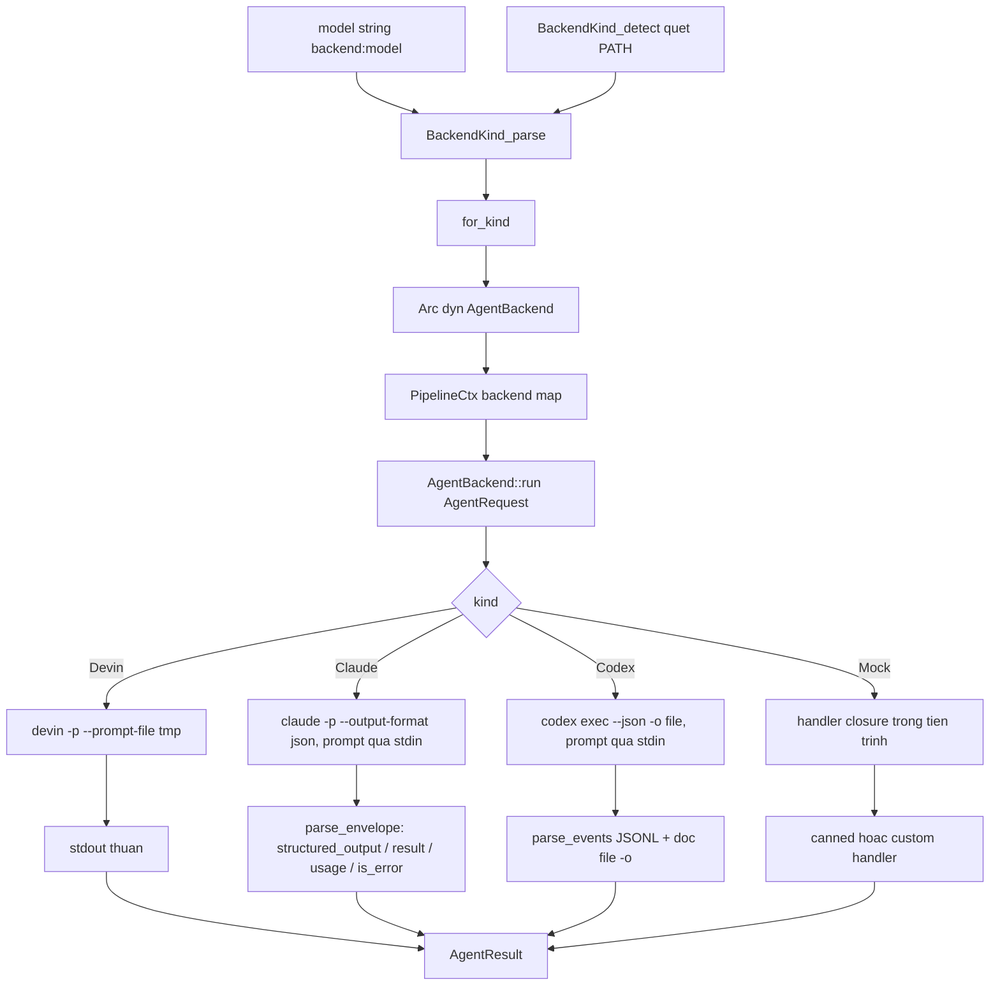
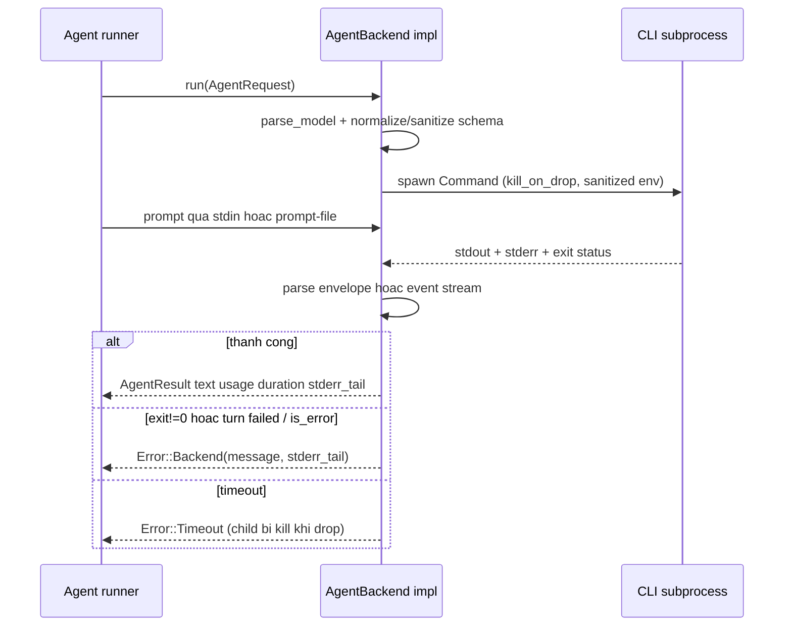

# Agent Backend Integration

## 1. Mục đích của module

`src/backend` là tầng adapter biến các agent CLI đã xác thực sẵn (`devin`, `claude`, `codex`) thành các LLM provider đồng nhất phía sau trait bất đồng bộ `AgentBackend`, kèm theo một mock chạy trong tiến trình (`MockBackend`) cho test offline. Đây là supporting domain nhưng mang tính quyết định cho toàn bộ pipeline: mọi lời gọi model đều đi qua một điểm duy nhất là `AgentBackend::run`, nên cost boundary (cache, quota, audit), timeout, và cách normalize output đều được định nghĩa ở đây.

Module chịu trách nhiệm:

- Phân tích chuỗi model `"<backend>:<model>"` (với hậu tố `@<effort>` do từng backend tự xử lý) và dispatch tới implementation tương ứng.
- Dịch `AgentRequest` thành một lời gọi subprocess với flags, stdin/prompt-file, env đã lọc, timeout, và `kill_on_drop`.
- Chuẩn hóa ba giao thức output khác nhau — stdout thuần (devin), JSON envelope (claude), JSONL event stream + file `-o` (codex) — về cùng một `AgentResult`.
- Cung cấp `mock:*` để toàn bộ pipeline chạy offline qua đúng đường dispatch production.

## 2. Cấu trúc nội bộ

| File | Vai trò |
|---|---|
| `src/backend/mod.rs` | Định nghĩa `BackendKind`, `AgentRequest`/`AgentResult`/`TokenUsage`, trait `AgentBackend`, `for_kind`, `sanitized_env`, `tail` |
| `src/backend/devin.rs` | Reference backend: `devin -p --prompt-file`, stdout thuần |
| `src/backend/claude.rs` | `claude -p --output-format json`, parse JSON envelope, hỗ trợ `model@effort`, `sanitize_schema` |
| `src/backend/codex.rs` | `codex exec --json -o <file>`, parse JSONL events, `normalize_schema` sang subset nghiêm ngặt của codex |
| `src/backend/mock.rs` | Test double trong tiến trình: `MockBackend::new` / `canned` / `with_delay`, trường `calls` public để assert |

Quy ước mở rộng được ghi ngay trong header của `mod.rs`: thêm backend = thêm một file + một arm trong `for_kind` — `for_kind` là nơi duy nhất `match` trên `BackendKind` tồn tại.

## 3. Interface chính

```rust
#[async_trait]
pub trait AgentBackend: Send + Sync {
    fn kind(&self) -> BackendKind;
    fn supports_fs(&self) -> bool;          // true cho CLI thật, false cho mock
    async fn run(&self, req: AgentRequest) -> Result<AgentResult>;
}
```

Các kiểu dữ liệu chia sẻ (`src/backend/mod.rs`):

- **`AgentRequest`**: `prompt` đã render, `model` (Option, pass-through vào CLI), `cwd` (empty-cwd cho embedded mode hoặc project root cho agentic mode), `timeout` per-call, `agent` (tên để correlate span/log), `json_schema` (Option — backend nào hỗ trợ thì enforce, còn lại bỏ qua).
- **`AgentResult`**: `text` (final message/stdout), `backend`, `model` thực dùng, `duration` wall-clock, `usage: Option<TokenUsage>` (`None` khi CLI không expose), `stderr_tail` (giữ cả khi success để chẩn đoán).
- **`BackendKind`**: `Devin | Claude | Codex | Mock`. `parse("mock:test")` cũng nhận alias `"test"`. `detect()` quét `PATH` theo thứ tự ưu tiên devin → codex → claude. `default_models()` trả về cặp `(efficient, powerful)` cho từng kind (vd `claude:sonnet@low` / `claude:sonnet@high`, `codex:gpt-5.6-sol@low` / `codex:gpt-5.6-sol@high`). `as_str()` cho id ổn định dùng trong log, cache key, audit.

Helpers dùng chung:

- **`sanitized_env(cmd)`**: gỡ khỏi env của process con các prefix có thể bật billing qua API key hoặc nhiễu session — `ANTHROPIC_*`, `OPENAI_*`, `CLAUDE_API`, `CODEX_API`, `DEVIN_API`, `OPENHANDS_*`. Đây là điểm kiểm soát để đảm bảo cuộc gọi luôn đi qua login state của CLI thay vì vô tình dùng metered API.
- **`tail(s, n)`**: lấy `n` ký tự cuối (char-aware) cho thông điệp lỗi và `stderr_tail` (500 ký tự).

## 4. Luồng dữ liệu và điều khiển

### Dispatch



`PipelineCtx` giữ `HashMap<BackendKind, Arc<dyn AgentBackend>>` — injectable qua `PipelineCtx::new` để test có thể thay mock tùy biến. `agent/runner.rs` gọi `run` phía sau cache/quota: cache hit thì không spawn subprocess nào.

### Một lời gọi điển hình



Cả ba backend thật đều: spawn qua `tokio::process::Command` với `kill_on_drop(true)` (drop do cancel/timeout phải giết CLI — process orphan sẽ tiếp tục tốn call mà không ai cache kết quả), áp `tokio::time::timeout` per-call trả về `Error::Timeout`, và trả `Error::Backend` kèm `stderr_tail` khi exit code khác 0.

## 5. Từng backend

### Devin (`devin.rs`, 97 dòng)

Adapter đơn giản nhất — reference implementation của v1. Prompt được ghi vào `NamedTempFile` (`agentwiki-devin-*`) rồi truyền qua `--prompt-file` để tránh giới hạn argv. Command: `devin -p --prompt-file <tmp> --respect-workspace-trust false --permission-mode auto [--model <m>]`. `permission-mode auto` auto-approve các tool read-only; prompt print-mode bị fail sẽ lộ ra qua exit≠0 thay vì treo im lặng. stdout trim được trả về nguyên trạng; `usage: None` vì CLI không expose. `json_schema` bị bỏ qua (documented behavior).

### Claude (`claude.rs`, 352 dòng)

Prompt qua stdin; command: `claude -p --output-format json --no-session-persistence --permission-mode bypassPermissions --setting-sources local [--model][--effort][--json-schema <inline>]`. `--setting-sources local` chặn `CLAUDE.md` và settings của user/project khỏi nhiễu prompt.

- **`parse_model`**: tách `"<model>@<effort>"`, validate effort trong `[low, medium, high, xhigh, max]` trước khi spawn — typo fail sớm thay vì fail trong CLI.
- **`sanitize_schema`**: xóa đệ quy mọi key `$schema`, vì `claude --json-schema` từ chối draft URI mà schemars emit ở root.
- **`parse_envelope`**: ưu tiên `structured_output` (xuất hiện khi có `--json-schema`) rồi đến `result`; `usage.input` cộng `input_tokens + cache_creation_input_tokens + cache_read_input_tokens` để `input` mang nghĩa "tổng prompt tokens" nhất quán với codex. **`is_error` được surface tường minh** — claude có thể exit 0 trên một turn fail; `subtype` khác `""`/`success` được prepend vào message (vd `error_max_turns: hit the turn limit`). Nếu exit≠0 thì error text trong envelope được ưu tiên hơn bare exit code. Envelope không parse được → fallback stdout thuần.

### Codex (`codex.rs`, 438 dòng)

Phức tạp nhất. Prompt qua stdin (đối số `-`); command: `codex exec --skip-git-repo-check -s read-only --color never --ephemeral --disable hooks -c project_doc_max_bytes=0 --json -o <tmp> [-m <model>] [-c model_reasoning_effort="<e>"] [--output-schema <file>]`. Các flag đáng chú ý: `--ephemeral` (mỗi call một subprocess, không để lại session file), `--disable hooks` (user hooks như SessionStart sẽ chạy mỗi call nếu không tắt), `project_doc_max_bytes=0` (giữ `AGENTS.md` của project khỏi prompt — materials là việc của agentwiki).

- **`parse_model`**: giống claude nhưng EFFORTS thêm `"ultra"`; effort map sang `-c model_reasoning_effort="<e>"`.
- **`parse_events`**: quét stdout JSONL từng dòng — `item.completed` có `item.type == "agent_message"` làm fallback text (bản cuối ghi đè), `turn.completed` cho usage (`output` gồm cả `reasoning_output_tokens`), `turn.failed`/`error` cho failure — `codex exec` cũng exit 0 trên turn fail nên phải surface tường minh.
- **Text cuối**: ưu tiên file `-o` (final message của agent); nếu file rỗng thì dùng `agent_message` cuối trong event stream.
- **`normalize_schema`**: viết lại schema của schemars sang subset nghiêm ngặt mà `--output-schema` chấp nhận — xóa `$schema`; `$ref` phải đứng một mình (sibling keywords bị drop, `allOf` bị cấm); `oneOf` → `enum` nếu mọi variant là `const` cùng một `type` (giữ `type` khi dedup còn đúng một), ngược lại hạ xuống `anyOf`; mọi object nhận `additionalProperties: false` và `required` liệt kê toàn bộ properties — field vốn optional được bọc `{"anyOf": [orig, {"type":"null"}]}` trừ khi đã nullable (`is_nullable` kiểm tra `type: "null"`, union type, hoặc `anyOf` chứa null). Schema file temp phải sống lâu hơn child process.

### Mock (`mock.rs`, 106 dòng)

`MockBackend` chạy hoàn toàn trong tiến trình, `supports_fs() == false` (gate chế độ agentic/file-reading). `calls: Mutex<Vec<String>>` public ghi lại `req.agent` của mọi request để assert. `delay` là `tokio::time::sleep` — async nên cancellation vẫn cắt được, cho phép test các đường mid-flight. `canned(responses)` match `req.agent` exact trước, rồi prefix `name@target` (key là prefix, phần còn lại phải bắt đầu bằng `@`), miss thì trả `"{}"`. Lưu ý: arm `for_kind` cho Mock luôn tạo `canned(&[])` — mock tùy biến phải inject qua `PipelineCtx::new`, không qua factory.

## 6. Quyết định thiết kế đáng chú ý

- **Không quản lý credential**: `sanitized_env` chủ động xóa API-key env vars, ép mọi call đi qua login state của CLI — đúng với boundary "delegated, not implemented".
- **Fail-before-spawn**: effort strings được validate trong `parse_model` của từng backend trước khi spawn, biến typo thành `Error::Backend` có message liệt kê giá trị hợp lệ.
- **Exit 0 ≠ success**: cả claude (`is_error`) lẫn codex (`turn.failed`) đều có thể exit 0 trên turn fail — hai parser đều surface lỗi envelope/event tường minh thay vì tin exit code.
- **Schema là best-effort**: `AgentRequest.json_schema` được enforce ở claude (`--json-schema` inline) và codex (`--output-schema` file, sau `normalize_schema`), devin/mock bỏ qua. Runner chịu trách nhiệm extract/validate JSON sau cùng nên backend chỉ cần "khuyến khích" cấu trúc.
- **Single-point flag ownership**: mỗi backend giữ toàn bộ invocation trong `build_cmd` private — đổi flag của một CLI chỉ sửa một hàm.
- **`stderr_tail` luôn được giữ** (kể cả khi success) để chẩn đoán sau; lỗi trả `tail(..., 500)` để log không phình to.
- **Testability**: unit test trong file cho các parser/normalizer (`parse_model`, `parse_envelope`, `sanitize_schema`, `parse_events`, `normalize_schema`, `is_nullable`); devin/mock dựa vào integration test (`tests/incremental_offline.rs`); suite e2e với CLI thật bị gate bởi `AGENTWIKI_E2E=1`.

## 7. Rủi ro đã biết

- Độ tin cậy gắn với hành vi CLI ngoài: đổi format envelope/event của `claude`/`codex` sẽ phá parsing (fail silent tới khi test/drift bắt được).
- Mock qua `for_kind` luôn là `canned(&[])` — test cần handler riêng phải inject backend map thủ công.
- Devin không báo usage → token accounting thiếu cho backend đó.

## 8. File liên quan

- `src/backend/mod.rs` — trait, types, parse/detect, factory, env sanitizer
- `src/backend/{devin,claude,codex,mock}.rs` — bốn implementation
- `src/pipeline/mod.rs` — `PipelineCtx` giữ và resolve backend map
- `src/agent/runner.rs` — nơi duy nhất gọi `run` (phía sau cache/quota/retry)
- `tests/incremental_offline.rs` — test pipeline offline qua `mock:*`