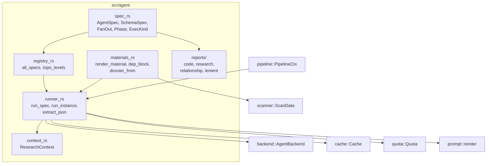
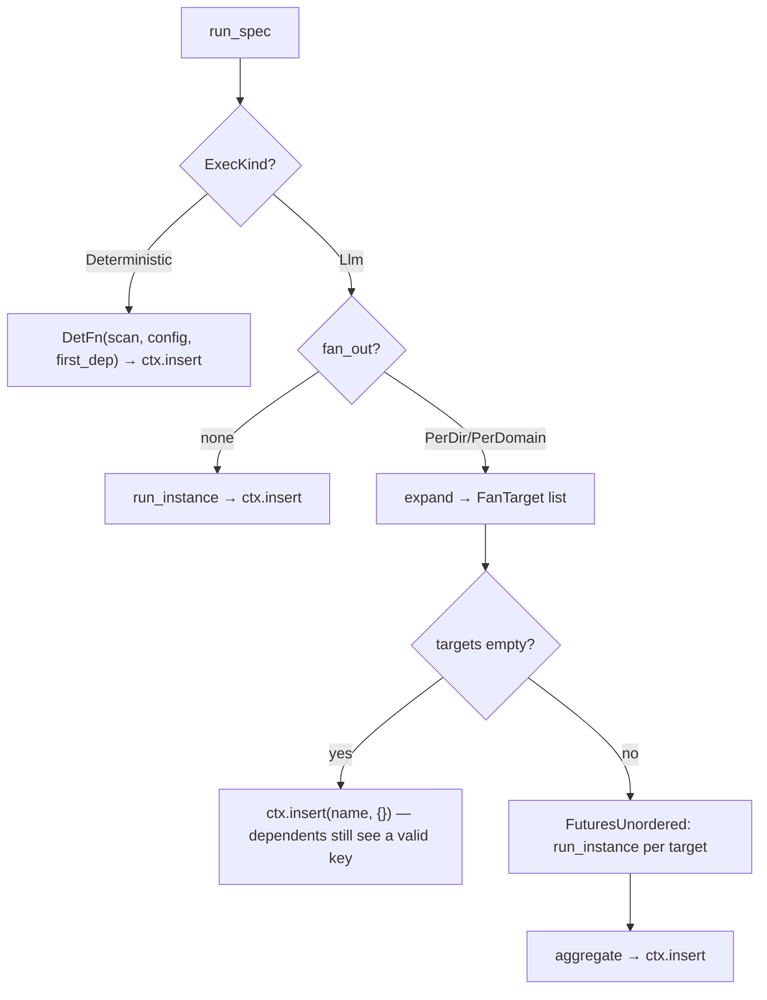
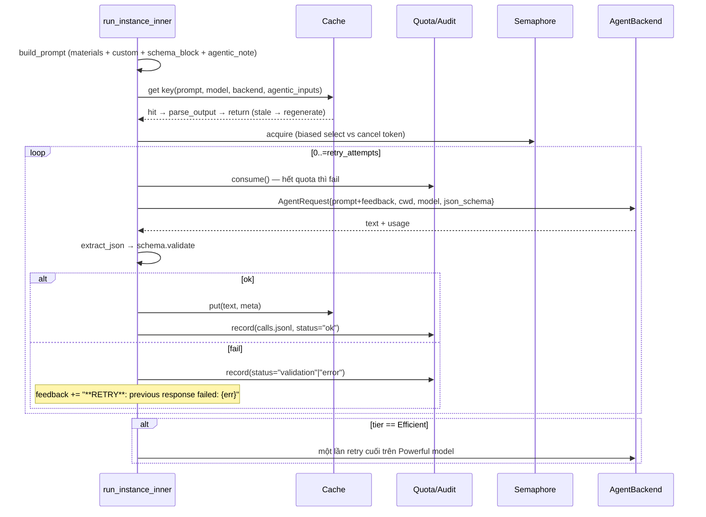

# Deep-Dive: Agent Orchestration & Analysis (`src/agent`)

## 1. Mục đích của module

`src/agent` là **core business domain** của agentwiki — nơi hiện thực hóa toàn bộ cơ chế "multi-agent" của pipeline tài liệu hóa. Thay vì gọi LLM một cách ad-hoc, module mô hình hóa công việc nghiên cứu/soạn thảo thành một **DAG các `AgentSpec` khai báo tĩnh**, lập lịch theo topo level, thực thi qua một **agentic loop** có cache/quota/retry/fallback, và trao đổi kết quả định kiểu qua một **shared store** (`ResearchContext`).

Module trả lời ba câu hỏi trung tâm:

1. **Chạy cái gì, theo thứ tự nào?** — `registry.rs` + `spec.rs` khai báo node, dependency, fan-out axis, model tier, phase.
2. **Chạy như thế nào cho đáng tin và rẻ?** — `runner.rs` hiện thực vòng lặp build prompt → cache → quota → backend → validate → retry-with-feedback → tier fallback.
3. **Kết quả đi đâu?** — `context.rs` (typed key-value store) + `reports/` (schema contract) + `materials.rs` (render ngược kết quả thành prompt của agent hạ nguồn).

## 2. Cấu trúc nội bộ



| File | Vai trò |
|---|---|
| `spec.rs` | Định nghĩa cấu trúc node DAG: `AgentSpec`, `SchemaSpec`, `FanOut`, `Phase`, `Material`, `ExecKind`, `FanTarget`, hàm `expand`. |
| `registry.rs` | Khai báo toàn bộ 15 node (9 research + 6 compose), `display_name`, và `topo_levels` (Kahn level-ordering). |
| `runner.rs` | Engine thực thi: `run_spec` → fan-out `FuturesUnordered` → `run_instance_inner` (agentic loop) → `aggregate`. |
| `context.rs` | `ResearchContext`: `RwLock<HashMap<String, Value>>` async, snapshot/save/load cho `--skip-research`. |
| `materials.rs` | Render các block `{{materials}}`/`{{custom}}` với cap kích thước; merge response + scanner metadata thành `DirectoryDossier`. |
| `reports/*.rs` | Contract kiểu dữ liệu cho output của model, với lenient deserializers chịu được JSON "bẩn" từ LLM. |

## 3. Mô hình `AgentSpec` — node của DAG

Mỗi node là một struct khai báo thuần túy (`spec.rs:103-124`):

- `name` — định danh duy nhất, cũng là key trong `ResearchContext`.
- `prompt_tmpl` — file template trong `prompts/` (compose agent dùng `editors/…`).
- `schema: Option<SchemaSpec>` — contract JSON; `None` nghĩa output là markdown tự do (`architecture`, `workflow`, các doc compose).
- `tier: ModelTier` — `Efficient` hoặc `Powerful`; quyết định model string qua `config.model_for(tier)` và quyền được fallback.
- `deps` — danh sách tên node phải xong trước; kết quả của chúng được inject vào prompt dưới dạng `#### <display_name>` fenced block.
- `fan_out` — `PerDir` (một instance per thư mục đã scan) hoặc `PerDomain` (một instance per domain trong `DomainModulesReport`).
- `materials` — block scan/context bổ sung vào `{{materials}}`: `ProjectStructure`, `CodeInsights`, `Relationships`, `Readme`, `Custom`.
- `phase` — `Research` (phase 1) hoặc `Compose` (phase 2).
- `exec` — `Llm` (gọi backend) hoặc `Deterministic(DetFn)` (render markdown thuần, không tốn call — `boundary_doc`, `database_doc`).

`SchemaSpec` (`spec.rs:13-52`) gói hai function pointer: `json_schema` sinh `schemars::schema_for!(T)` để inject vào `{{schema_block}}`, và `validate` thực hiện `from_value::<T>` rồi serialize lại thành canonical form trước khi lưu ctx — kèm fallback thử unwrap mảng 1 phần tử (model hay bọc object trong array).

## 4. Registry & topo scheduling

`registry.rs` khai báo DAG bằng hai hàm `research_specs()` / `compose_specs()`. Phase Research gồm:

- **`dir_summary`** (`PerDir`, Efficient) — node gốc của mọi thứ; fan-out per thư mục.
- **`relationships`**, **`system_context`**, **`database`**, **`boundary`** — phân tích toàn cục, đều phụ thuộc `dir_summary` (+ `system_context`/`relationships` cho node sau).
- **`domain_modules`** — phụ thuộc `dir_summary` + `system_context` + `relationships`; output của nó là *input cho fan-out axis* `PerDomain`.
- **`key_module`** (`PerDomain`, Efficient) — phân tích sâu từng domain.
- **`architecture`**, **`workflow`** (Powerful, schema `None`) — nghiên cứu free-form.

Phase Compose gồm `overview`, `architecture_doc`, `workflow_doc`, `deep_dive` (`PerDomain`), cộng hai renderer deterministic `boundary_doc`/`database_doc`.

`topo_levels` (`registry.rs:232-258`) là Kahn's algorithm dạng level-order: lặp chọn mọi spec chưa xong mà toàn bộ deps đã ở level trước, `debug_assert` không còn node nào → phát hiện cycle ở debug build. Dep không tồn tại trong tập specs được bỏ qua (`!names.contains(d)`), cho phép chạy một phase độc lập.

## 5. Agentic Runner — luồng thực thi

`run_spec` (`runner.rs:24-76`) là điểm vào duy nhất được pipeline gọi per topo level:



**`run_instance_inner`** (`runner.rs:142-299`) là governance loop áp cho mọi paid call:



Các quyết định implementation đáng chú ý:

- **`FuturesUnordered` thay vì `JoinSet`** (`runner.rs:54-56`): futures nằm trong task hiện tại, nên khi task bị hủy, mỗi `Child` subprocess được drop đồng bộ → `kill_on_drop` giết CLI con ngay, không rò rỉ tiến trình.
- **Biased `select!` với cancel token** (`runner.rs:175-205`): cancel thắng khi đang xếp hàng ở semaphore, nhưng response vừa về vẫn được cache trước khi unwind — tránh mất một call đã trả tiền.
- **Retry-with-feedback**: lỗi parse/validate được chèn thẳng vào prompt lần sau (`**RETRY**: Your previous response failed: …`), tận dụng khả năng tự sửa của model thay vì retry mù.
- **Fallback tier**: chỉ agent `Efficient` được retry một lần trên `Powerful`; agent vốn đã Powerful thì fail luôn — tránh fallback vòng.
- **Cache key trong agentic mode** (`agentic_inputs`, `runner.rs:326-340`): vì `cwd` là repo root và agent CLI tự đọc file, prompt không chứa source — key phải trộn thêm fingerprint từ manifest: `subtree_fingerprint(rel)` cho `PerDir` (đổi file trong dir B không bust cache của dir A), `fingerprint_all()` cho agent toàn cục.
- **`project_dep`** (`runner.rs:388-430`): PerDomain instance chỉ nhìn thấy slice dep của chính nó — `domain_modules` được chiếu thành `{domain, other_domains: [tên]}`; các dep dạng `{domain: result}` map được lấy đúng entry `t.key`. Đây là cơ chế khiến text churn của domain B không làm invalidate prompt/cache của `key_module@A` (có test `per_domain_prompt_stable_when_other_domain_changes` chứng minh).

**`aggregate`** (`runner.rs:79-118`): sort kết quả theo key rồi merge — `dir_summary` ghép `DirectorySummaryResponse` + `DirectoryInfo` của scanner thành `DirectoryDossier` qua `materials::dossier_from` (điền `file_path` vì model chỉ trả tên file); `PerDomain` lưu dạng map `{domain: result}` và **stamp `domain_name`** vì model không echo lại domain một cách đáng tin.

**`extract_json`** (`runner.rs:497-537`): pipeline lenient ba lớp — strict parse → tìm fence ` ```json ` → depth-counted scan object/array đầu tiên có tôn trọng chuỗi và escape. Lớp cuối cho phép model bọc JSON trong prose.

## 6. ResearchContext — bus dữ liệu giữa các phase

`context.rs` hiện thực `ResearchContext` — thay thế "Memory" của deepwiki-rs — là `RwLock<HashMap<String, serde_json::Value>>` async:

- `insert` / `get` / `get_typed<T>` / `contains` / `keys` — truy cập typed qua serde.
- `snapshot` / `save` / `load` — persist ra `research.json` (atomic write), nạp lại cho `--skip-research`.

Điểm thiết kế cần lưu ý: **wiring giữa các spec là implicit qua key string** — `spec.deps` tra cứu ctx lúc build prompt, nên một spec đọc key không có producer sẽ chỉ "im lặng thiếu material" chứ không fail lúc khai báo DAG. Đây là trade-off có ý thức: đổi lại sự linh hoạt (dep tùy chọn, absent dep → block bị bỏ qua) bằng việc mất compile-time guarantee.

## 7. Prompt materials

`materials.rs` là port của DataFormatter: biến `ScanData` + kết quả dep thành markdown block với cap cứng (`README_CAP = 16_384`, `DB_SUMMARY_CAP = 10_240`, insight limit = 50; `materials_char_cap` cắt tổng `{{materials}}` ở `build_prompt`).

- `render_material` xử lý block stateless (`ProjectStructure` — tree đầy đủ hoặc dirs-only khi >100 file; `Readme`).
- `CodeInsights`, `Relationships`, `Custom` cần ctx nên runner tự dựng: `code_insights_block` (top-N `FileInsight` theo `importance_score`), `relationships_block` (edge list `from → to [type]`), và `custom_block` per-agent:
  - `dir_summary@dir`: metrics + interfaces + source preview từng file.
  - `key_module`/`deep_dive@domain`: domain detail + `filtered_insights` (path intersect `code_paths` hai chiều).
  - `boundary`: lọc insights theo `CodePurpose::{Entry,Api,Config,Router,Controller,Command}`.
  - `database`: lọc `Database|Dao` + file `.sql`/`.sqlproj`.
- `dep_block` render kết quả dep thành `#### Display Name` + fenced JSON, dùng `registry::display_name` cho tiêu đề người-đọc.

Trong **agentic mode** (`build_materials`, `runner.rs:356-358`), chỉ dep blocks được gửi — scan materials bị bỏ qua vì agent tự đọc repo ở cwd; `{{agentic_note}}` thêm chỉ dẫn "READ-ONLY".

## 8. Report types — contract của output

`reports/` định nghĩa schema typed cho mọi structured agent:

- `code.rs`: `DirectorySummaryResponse`, `FileInsight`, `CodePurpose`, `DirectoryDossier`, `classify_directory_purpose`.
- `research.rs`: `SystemContextReport`, `DomainModulesReport` (+ `DomainModule`, `SubModule`, `DomainRelation`), `KeyModuleReport`, `BoundaryAnalysisReport`, `DatabaseOverviewReport` — kèm ~25 deserializer `de_vec_*` chịu đựng field thiếu/sai kiểu.
- `relationship.rs`: `RelationshipAnalysis`, `CoreDependency`, `DependencyType`, `ArchitectureLayer`.
- `lenient.rs`: deserializer coerce qua `serde_json::Value` trung gian.

Canonicalization hai chiều (`validate` deserialize rồi serialize lại) đảm bảo ctx luôn chứa dạng chuẩn — quan trọng vì dep output được dump nguyên vào prompt của agent khác và vào cache key gián tiếp.

## 9. Giao diện ra ngoài

| Điểm tiếp xúc | Chiều | Chi tiết |
|---|---|---|
| `pipeline::run_level_order` → `run_spec` | vào | Pipeline duyệt topo levels, gọi `run_spec` cho từng spec. |
| `backend::AgentBackend::run(AgentRequest)` | ra | Subprocess CLI duy nhất mọi model call đi qua; `json_schema` được truyền cho backend hỗ trợ structured output. |
| `cache::Cache::{key,get,put}` | ra | Content-hash cache, meta gồm agent/backend/model/secs. |
| `quota::{consume,record}` | ra | Daily cap + append `calls.jsonl` (best-effort audit). |
| `scanner::ScanData` | vào | Input cho `expand(PerDir)`, `DetFn`, và materials. |
| `manifest` (trong `PipelineCtx`) | vào | Fingerprint cho cache key ở agentic mode. |
| `prompt::{load,render}` | ra | Template `prompts/<prompt_tmpl>` + biến `{{materials}}`, `{{custom}}`, `{{language_instruction}}`, `{{schema_block}}`, `{{agentic_note}}`. |
| `output::{boundary_doc,database_doc}` | gọi ngược | `ExecKind::Deterministic` trỏ thẳng vào renderer output — compose docs không tốn LLM call. |

## 10. Đánh giá & rủi ro

**Điểm mạnh**: DAG khai báo giúp thêm agent mới chỉ là thêm một `AgentSpec`; cost boundary tập trung đúng một chỗ (`run_instance_inner`); fan-out + `project_dep` cho cache locality theo domain/dir; deterministic renderers tách docs không cần LLM ra khỏi cơ chế trả phí.

**Rủi ro**: dep wiring implicit qua ctx key (không kiểm tra lúc compile); `aggregate`/`custom_block`/`project_dep` dispatch bằng **string match trên `spec.name`** — đổi tên spec mà không sửa các match này sẽ âm thầm sai hành vi; cache key bao cảm prompt nên sửa template invalidates diện rộng.