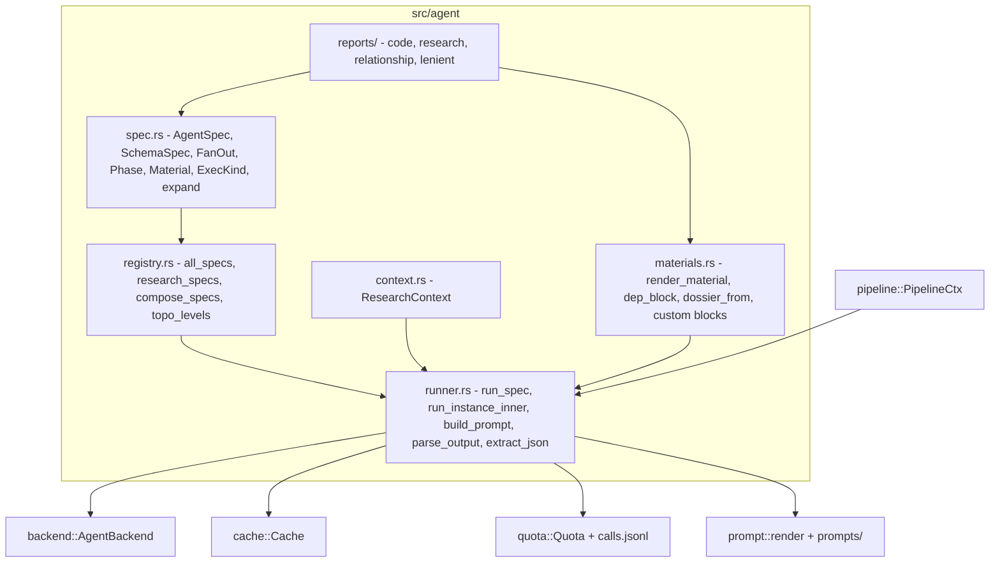
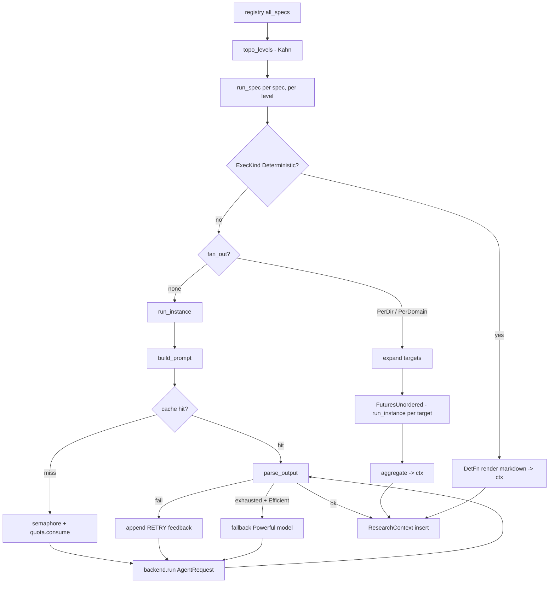
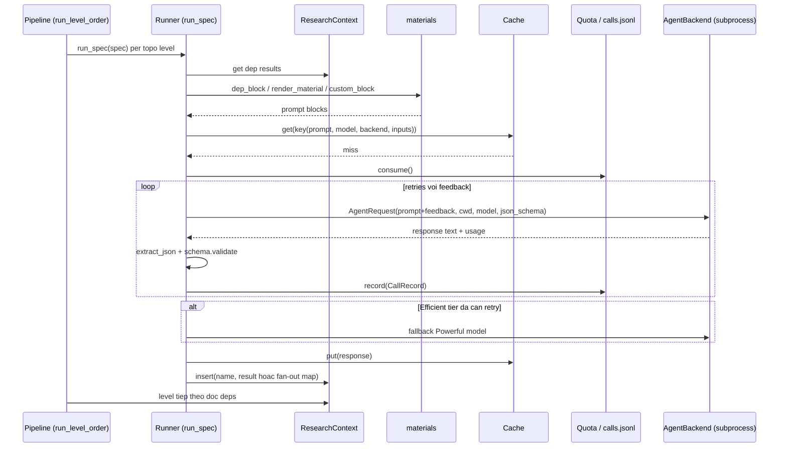

# Agent Orchestration & Analysis — Module Deep-Dive

## 1. Mục đích module

`src/agent` là **core business domain** của agentwiki: một DAG tác vụ đa-agent khai báo tĩnh, chịu trách nhiệm biến `ScanData` (kết quả quét repo ở Phase 0) thành các báo cáo nghiên cứu kiến trúc có cấu trúc (Phase 1 — Research) rồi thành các tài liệu Markdown C4-style (Phase 2 — Compose). Module không tự gọi LLM API; mọi inference được ủy quyền cho các agent CLI bên ngoài (`devin`, `claude`, `codex`) thông qua trait `AgentBackend` ở `src/backend`.

Vai trò của module trong pipeline:

- **Khai báo**: `registry.rs` + `spec.rs` định nghĩa các node `AgentSpec` (tên, prompt template, schema đầu ra, model tier, dependencies, trục fan-out, phase, kiểu thực thi).
- **Lập lịch**: `topo_levels` sắp xếp DAG theo mức Kahn; pipeline chạy tuần tự theo level, song song trong một level.
- **Thực thi**: `runner.rs` là agentic loop — render prompt → cache → quota/semaphore → backend subprocess → parse/validate JSON → retry kèm feedback → fallback sang model tier mạnh hơn.
- **Trao đổi dữ liệu**: `context.rs` (`ResearchContext`) là shared store async; các agent không gọi nhau trực tiếp mà đọc/ghi kết quả typed qua key.
- **Hỗ trợ**: `materials.rs` format scan data + dep results thành các block markdown có giới hạn kích thước để chèn vào prompt; `reports/` định nghĩa các kiểu schema typed với deserializer "lenient" chịu được JSON xấu từ LLM.

## 2. Cấu trúc nội bộ



| File | Trách nhiệm |
|---|---|
| `src/agent/spec.rs` | Định nghĩa `AgentSpec` (node DAG), `SchemaSpec` (contract JSON 2 hàm: `json_schema` inject vào prompt, `validate` normalize output), enum `FanOut`/`Phase`/`Material`/`ExecKind`, `FanTarget`, và hàm `expand` mở rộng trục fan-out thành target cụ thể. |
| `src/agent/registry.rs` | Registry khai báo toàn bộ 15 spec (9 research + 6 compose), `display_name` cho dep block, `topo_levels` (Kahn level-ordering). |
| `src/agent/runner.rs` | Engine thực thi: `run_spec` → fan-out qua `FuturesUnordered` → `run_instance_inner` (cache → semaphore → retry loop → fallback) → `aggregate` vào ctx; `build_prompt`, `project_dep`, `custom_block`, `extract_json`. |
| `src/agent/context.rs` | `ResearchContext` — `RwLock<HashMap<String, Value>>` async với `insert`/`get`/`get_typed`/`contains`/`keys` và `snapshot`/`save`/`load` (persist `research.json` cho `--skip-research`). |
| `src/agent/materials.rs` | Render prompt material: `project_structure`, `readme_block` (cap 16.384 chars), `code_insights_block` (top-N theo `importance_score`), `relationships_block`, `dep_block`, các `*_custom` block cho từng instance, `dossier_from` merge scanner metadata vào response. |
| `src/agent/reports/` | Schema backbone: `code.rs` (`DirectorySummaryResponse`, `FileInsight`, `CodePurpose`, `DirectoryDossier`, `classify_directory_purpose`), `research.rs` (`SystemContextReport`, `DomainModulesReport`, `KeyModuleReport`, `BoundaryAnalysisReport`, `DatabaseOverviewReport` + ~25 `de_*` deserializer), `relationship.rs` (`RelationshipAnalysis`, `DependencyType`), `lenient.rs` (coerce `Value` → string/number/list thay vì fail). |

## 3. Các interface chính

### `AgentSpec` — node của task DAG

```rust
pub struct AgentSpec {
    pub name: &'static str,            // "dir_summary", "system_context", ...
    pub prompt_tmpl: &'static str,     // file dưới prompts/
    pub schema: Option<SchemaSpec>,    // contract JSON; None → raw markdown
    pub tier: ModelTier,               // Efficient | Powerful
    pub deps: &'static [&'static str], // tên node phải chạy trước
    pub fan_out: Option<FanOut>,       // PerDir | PerDomain
    pub materials: &'static [Material],// block chèn vào {{materials}}
    pub phase: Phase,                  // Research | Compose
    pub exec: ExecKind,                // Llm | Deterministic(DetFn)
}
```

`SchemaSpec` gồm hai function pointer: `json_schema()` trả `schemars::schema_for!(T)` để inject vào prompt, và `validate(v, agent)` deserialize → re-serialize để lưu dạng canonical vào ctx (kèm fallback unwrap mảng một phần tử — lỗi phổ biến của model).

### `ResearchContext` — bus dữ liệu typed

Mọi trao đổi giữa agents đi qua key `spec.name` (fan-out lưu map `{target_key: result}`). `deps` chỉ là *tên key* — wiring ngầm, không có kiểm tra kiểu lúc khai báo. `save`/`load` dùng `util::write_atomic` để persist `research.json`, cho phép `--skip-research` tái sử dụng kết quả research cũ.

### `run_spec(spec, pctx)` — điểm vào của orchestrator

Phân nhánh theo `ExecKind`:

- `Deterministic(f)`: gọi `f(&scan, &config, &first_dep_result)` → markdown string vào ctx. `boundary_doc`, `database_doc` dùng cơ chế này (renderer thuần, không tốn LLM call — port từ deepwiki-rs).
- `Llm` không fan-out: một `run_instance`.
- `Llm` có fan-out: `expand` trục (`PerDir` → mỗi `scan.directories`, `PerDomain` → mỗi entry trong `DomainModulesReport` lấy từ ctx), chạy `FuturesUnordered` các `run_instance`, rồi `aggregate`.

## 4. Luồng điều khiển & dữ liệu

### 4.1 Luồng tổng thể



### 4.2 Agentic loop chi tiết (`run_instance_inner`)

1. `build_prompt`: load template `spec.prompt_tmpl`, render `{{materials}}`, `{{custom}}`, `{{language_instruction}}`, `{{schema_block}}`, `{{agentic_note}}`.
2. **Cache**: `Cache::key(prompt, model, backend_kind, cache_inputs)`. Ở `Mode::Agentic`, `agentic_inputs` thêm fingerprint từ manifest — `dir_summary@<dir>` dùng `subtree_fingerprint(rel)`, các agent khác dùng `fingerprint_all()` vì cwd repo-root cho phép đọc bất kỳ file nào. Hit → parse lại text đã lưu (entry hỏng được coi là stale, regenerate).
3. **Semaphore + cancel**: `tokio::select!` biased giữa `semaphore.acquire()` và `cancel.cancelled()` — hủy được ngay cả khi đang xếp hàng.
4. **Retry loop** `0..=retry_attempts`: mỗi lần `quota.consume()` → `backend.run(AgentRequest{prompt+feedback, cwd, model, timeout, agent, json_schema})`. Thất bại → ghi `CallRecord` vào `calls.jsonl` (status `"error"`/`"validation"`) → nối feedback `**RETRY**: Your previous response failed: {err}. Correct it and return ONLY the required output.` vào prompt lần sau.
5. **Fallback**: nếu `spec.tier == Efficient` và đã hết retry, thử đúng một lần trên model `Powerful` (vẫn qua quota, vẫn cache kết quả nếu thành công).
6. Thành công → `cache.put` + record `"ok"` + trả `Value`.



### 4.3 Aggregation theo trục fan-out

`aggregate` sort kết quả theo `target.key` rồi:

- `dir_summary`: parse từng `DirectorySummaryResponse`, merge với `DirectoryInfo` của scanner qua `materials::dossier_from` (điền `file_path` từ `rel_path` — model chỉ trả về tên file), lưu `Vec<DirectoryDossier>`.
- Spec `PerDomain` khác (`key_module`, `deep_dive`): lưu map `{domain_name: result}`; với `key_module` runner stamp `domain_name` vào object vì model không echo lại đáng tin cậy.
- Fan-out rỗng (vd `domain_modules` trả về 0 domain) → insert object rỗng để downstream vẫn thấy context hợp lệ.

### 4.4 Chiếu dep theo fan-out (`project_dep`)

Instance `PerDomain` không nhận toàn bộ dep value mà chỉ lát cắt của mình:

- dep `domain_modules` → `{ "domain": <entry của domain này>, "other_domains": [tên các domain khác] }` — giữ context "có những module nào" mà không gửi full prose của domain khác.
- dep là map PerDomain (`{domain: result}`) → chỉ lấy `v[target.key]`.

Đây là quyết định tối ưu cache quan trọng: text churn ở domain B chỉ bust cache `key_module@B`, không ảnh hưởng `key_module@A` (có test `per_domain_prompt_stable_when_other_domain_changes` bảo vệ hành vi này).

## 5. Registry: 15 spec trong DAG

**Research (Phase 1)** — 9 agent:

| Spec | Tier | Deps | Fan-out | Schema |
|---|---|---|---|---|
| `dir_summary` | Efficient | — | PerDir | `DirectorySummaryResponse` |
| `relationships` | Efficient | `dir_summary` | — | `RelationshipAnalysis` |
| `system_context` | Efficient | `dir_summary` | — | `SystemContextReport` |
| `domain_modules` | Efficient | `dir_summary`, `system_context`, `relationships` | — | `DomainModulesReport` |
| `database` | Efficient | `dir_summary` | — | `DatabaseOverviewReport` |
| `architecture` | Powerful | `system_context`, `domain_modules` | — | none (free-form, theo deepwiki-rs) |
| `workflow` | Powerful | `system_context`, `domain_modules` | — | none |
| `key_module` | Efficient | `system_context`, `domain_modules` | PerDomain | `KeyModuleReport` |
| `boundary` | Efficient | `system_context`, `relationships` | — | `BoundaryAnalysisReport` |

**Compose (Phase 2)** — 6 agent: `overview` (Efficient), `architecture_doc` (Powerful), `workflow_doc` (Powerful), `boundary_doc` + `database_doc` (Deterministic — không gọi CLI), `deep_dive` (Powerful, fan-out PerDomain).

`topo_levels` triển khai Kahn bằng vòng lặp level: mỗi vòng chọn mọi spec chưa done mà tất cả deps đã done; `debug_assert` phát hiện cycle. Dep không tồn tại trong registry được bỏ qua (`!names.contains(d)` → coi như thỏa).

## 6. Quyết định implement đáng chú ý

- **`FuturesUnordered` thay vì `JoinSet`**: các future nằm trong cùng task, nên hủy task sẽ drop đồng bộ từng future → drop `Child` → `kill_on_drop` giết subprocess CLI. Tránh agent CLI mồ côi khi cancel.
- **Retry-with-feedback**: lỗi parse/validation được chèn lại vào prompt (`**RETRY**` block) thay vì retry mù — tận dụng khả năng tự sửa của model.
- **Fallback một phát**: chỉ tier `Efficient` được fallback sang `Powerful` — kiểm soát chi phí, tránh vòng fallback vô hạn.
- **`extract_json` ba lớp** (port từ deepwiki-rs): strict `serde_json::from_str` → tìm fence ```` ```json ```` → quét depth-counted object/array đầu tiên có tôn trọng string/escape. Chịu được model trả prose bọc JSON.
- **Lenient deserializers** (`reports/lenient.rs`): LLM hay trả `"8"` cho số, `{"name": ...}` cho string — các `de_*` coerce qua `serde_json::Value` thay vì fail, kết hợp `schema_spec::validate` unwrap mảng một phần tử.
- **Material caps**: README 16.384 chars, DB source summary 10.240, insight list 50, `materials_char_cap` tổng từ config — giữ prompt trong giới hạn context.
- **Cache key bao phủ input ngầm**: ở agentic mode agent có thể tự đọc file ngoài prompt, nên fingerprint manifest (subtree hoặc toàn repo) nằm trong cache key — đổi code → invalidate đúng phạm vi.
- **Dep wiring ngầm qua ctx key**: `deps` chỉ là tên string; không có compile-time check rằng producer tồn tại (ngoại trừ dep tên lạ bị `topo_levels` skip → agent chạy thiếu input). Đây là điểm yếu đã được ghi nhận trong đánh giá kiến trúc.
- **Deterministic compose**: `boundary_doc`/`database_doc` là renderer thuần (`DetFn`) — tài liệu từ report có schema thì render deterministically, vừa miễn phí vừa tái lập được.

## 7. File liên quan

- `src/agent/mod.rs` — re-export `ResearchContext`, `run_spec`, `AgentSpec`…
- `src/agent/spec.rs` — `AgentSpec`, `SchemaSpec`, `FanOut`, `Phase`, `Material`, `ExecKind`, `expand`
- `src/agent/registry.rs` — `all_specs`, `research_specs`, `compose_specs`, `topo_levels`, `display_name`
- `src/agent/runner.rs` — `run_spec`, `run_instance(_inner)`, `build_prompt`, `project_dep`, `custom_block`, `parse_output`, `extract_json`, `record`
- `src/agent/context.rs` — `ResearchContext` (`insert`/`get_typed`/`snapshot`/`save`/`load`)
- `src/agent/materials.rs` — `render_material`, `dep_block`, `dossier_from`, `filtered_insights`, các `*_custom`
- `src/agent/reports.rs` + `reports/{code,research,relationship,lenient}.rs` — contract typed cho output

Phụ thuộc ngoài module: `pipeline::PipelineCtx` (scan, config, ctx, cache, quota, semaphore, cancel, progress, stats), `backend::{AgentRequest, BackendKind}`, `cache::Cache`, `quota::CallRecord`, `prompt::render`, `output::{boundary_doc, database_doc}` (DetFn).