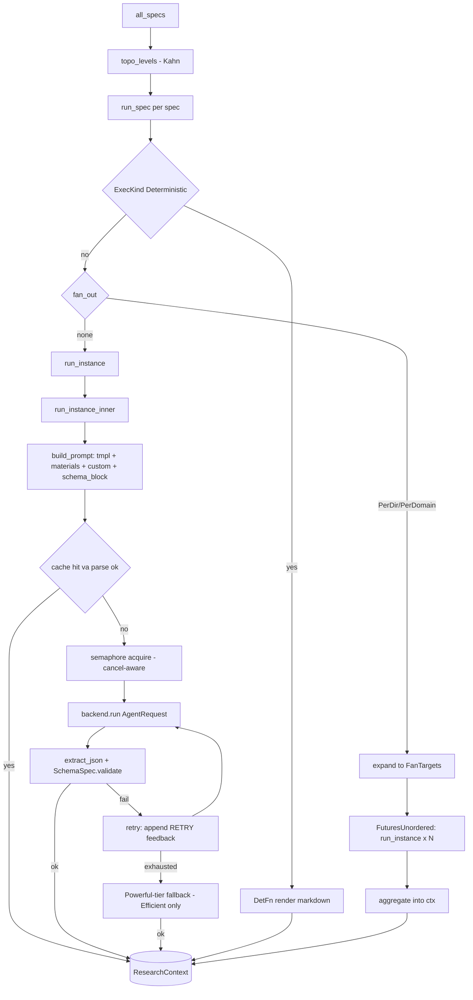

# Agent Orchestration — Module Deep-Dive

## 1. Mục đích của module

`src/agent` là domain nghiệp vụ cốt lõi của agentwiki: một **DAG khai báo (declarative DAG)** gồm các agent phân tích LLM tạo ra dữ liệu nghiên cứu có cấu trúc — nền tảng để Compose stage dựng bộ tài liệu C4. Module đảm nhiệm toàn bộ vòng đời của một "lời gọi agent":

- Định nghĩa node DAG (`AgentSpec`: dependencies, fan-out axis, materials, model tier, output schema).
- Lập lịch theo tầng topo (`topo_levels`) để các agent độc lập chạy song song.
- Lắp ráp prompt (template + materials từ `ScanData` + kết quả dep + schema contract).
- Gọi backend CLI qua các lớp cache → quota → semaphore, với retry-có-feedback và fallback sang model mạnh hơn.
- Parse output có cấu trúc bằng chiến lược nhiều lớp và lenient deserializers.
- Trao đổi kết quả giữa các agent qua `ResearchContext` — một blackboard chia sẻ thay vì gọi trực tiếp agent-to-agent.

Module này là bản port của orchestrator trong deepwiki-rs (Litho).

## 2. Cấu trúc nội bộ

| File | Vai trò |
|---|---|
| `src/agent/spec.rs` | Định nghĩa `AgentSpec`, `SchemaSpec`, `FanOut`, `Phase`, `Material`, `ExecKind`, `FanTarget`, hàm `expand` |
| `src/agent/registry.rs` | Khai báo 15 spec (9 research + 6 compose), `topo_levels` (Kahn), `display_name` |
| `src/agent/runner.rs` | Engine thực thi: `run_spec`, `run_instance`, `build_prompt`, `parse_output`, `extract_json`, `aggregate` |
| `src/agent/context.rs` | `ResearchContext` — store key→JSON bọc `RwLock`, hỗ trợ `snapshot`/`save`/`load` |
| `src/agent/materials.rs` | Render các block `{{materials}}`/`{{custom}}` từ `ScanData` và dep results |
| `src/agent/reports.rs` + `reports/{code,research,relationship,lenient}.rs` | ~1.900 dòng type định nghĩa contract output (serde + schemars) và lenient deserializers |
| `src/agent/mod.rs` | Re-export: `ResearchContext`, `run_spec`, các type của `spec` |

## 3. Interface chính

### `AgentSpec` — interface của một node DAG

```rust
pub struct AgentSpec {
    pub name: &'static str,              // định danh duy nhất ("dir_summary", ...)
    pub prompt_tmpl: &'static str,       // template dưới prompts/
    pub schema: Option<SchemaSpec>,      // contract JSON; None → markdown tự do
    pub tier: ModelTier,                 // Efficient | Powerful
    pub deps: &'static [&'static str],   // phải hoàn thành trước; inject vào prompt
    pub fan_out: Option<FanOut>,         // PerDir | PerDomain
    pub materials: &'static [Material],  // block quét từ ScanData cho {{materials}}
    pub phase: Phase,                    // Research | Compose
    pub exec: ExecKind,                  // Llm | Deterministic(DetFn)
}
```

`SchemaSpec` là cặp function pointer được build bởi `schema_spec::<T>()` (yêu cầu `T: JsonSchema + DeserializeOwned + Serialize`):
- `json_schema()` → `serde_json::Value` để inject vào prompt (`{{schema_block}}`).
- `validate(value, agent)` → `serde_json::from_value::<T>` rồi re-serialize, lưu **canonical form** vào context. Có fallback: nếu model wrap output trong array một phần tử, validate thử lại với phần tử đó.

`ExecKind::Deterministic(DetFn)` với `DetFn = fn(&ScanData, &Config, &Value) -> Result<String>` cho phép node không cần LLM — `boundary_doc` và `database_doc` render markdown thuần từ report của dep đầu tiên.

### `ResearchContext` — blackboard chia sẻ

```rust
insert(key, value) / get(key) / get_typed::<T>(key) / contains / keys
snapshot() / save(path) / load(path)
```

Key là `spec.name` (hoặc map `{domain: result}` cho fan-out PerDomain). `save`/`load` ghi/đọc `research.json` bằng `write_atomic`, phục vụ `--skip-research`.

### `Backend` interface mà runner tiêu thụ

`AgentRequest { prompt, cwd, model, timeout, agent, json_schema }` → `backend.run(req)`. Cache key = `sha256(prompt ‖ NUL ‖ model ‖ NUL ‖ backend ‖ SCHEMA_VERSION)`.

## 4. DAG của các agent

**Research phase (9 spec):**

| Agent | Tier | Deps | Fan-out | Schema |
|---|---|---|---|---|
| `dir_summary` | Efficient | — | PerDir | `DirectorySummaryResponse` |
| `relationships` | Efficient | dir_summary | — | `RelationshipAnalysis` |
| `system_context` | Efficient | dir_summary | — | `SystemContextReport` |
| `domain_modules` | Efficient | dir_summary, system_context, relationships | — | `DomainModulesReport` |
| `database` | Efficient | dir_summary | — | `DatabaseOverviewReport` |
| `architecture` | Powerful | system_context, domain_modules | — | free-form |
| `workflow` | Powerful | system_context, domain_modules | — | free-form |
| `key_module` | Efficient | system_context, domain_modules | PerDomain | `KeyModuleReport` |
| `boundary` | Efficient | system_context, relationships | — | `BoundaryAnalysisReport` |

**Compose phase (6 spec):** `overview`, `architecture_doc`, `workflow_doc`, `deep_dive` (PerDomain) là Llm; `boundary_doc`, `database_doc` là `Deterministic`.

`topo_levels` thực hiện level-ordering kiểu Kahn: `levels[i]` chứa các spec mà mọi dep đã ở tầng trước, có `debug_assert` phát hiện cycle. Dep trỏ tới spec không có trong danh sách được coi là đã thỏa (cho phép chạy subset).

## 5. Luồng điều khiển



`run_spec` xử lý 3 nhánh:
1. **Deterministic**: gọi `f(&scan, &config, &first_dep_result)` → insert markdown vào ctx.
2. **Fan-out**: `expand` sinh `FanTarget` (`PerDir` từ `scan.directories`; `PerDomain` đọc `DomainModulesReport` từ ctx). Các instance chạy trong `FuturesUnordered`, rồi `aggregate`:
   - `dir_summary` → `Vec<DirectoryDossier>` qua `dossier_from` (merge response với metadata scanner, điền `file_path` vì model chỉ trả về tên file).
   - PerDomain (`key_module`, `deep_dive`) → map `{domain_name: result}`; `key_module` được "stamp" `domain_name` vì model không echo lại đáng tin cậy.
   - Nếu targets rỗng (vd. `domain_modules` không sinh domain nào) → insert object rỗng để dependents vẫn thấy context hợp lệ.
3. **Đơn lẻ**: `run_instance` → insert trực tiếp.

`run_instance_inner` là agentic loop: `build_prompt` → cache lookup (entry cũ không parse được bị coi là stale và regenerate) → acquire semaphore (biased `select!` với cancellation) → vòng retry `0..=retry_attempts`: `quota.consume` → `backend.run` → `parse_output`. Mỗi lần fail, prompt được nối thêm feedback `**RETRY**: Your previous response failed: {err}`. Hết retry mà `tier == Efficient` thì fallback một lần lên model Powerful. Mọi lần gọi đều ghi `CallRecord` vào `calls.jsonl` và update `RunStats`.

## 6. Parse output — defense in depth

`extract_json` (port từ deepwiki-rs) thử 3 chiến lược:

1. `serde_json::from_str` trên toàn bộ text.
2. Tìm fence ```` ```json ```` và parse phần thân.
3. **Depth-counted extraction**: quét từ `{`/`[` đầu tiên, đếm depth bỏ qua dấu ngoặc trong chuỗi và escape `\\` — bắt được JSON nhúng trong prose.

Sau đó `SchemaSpec::validate` deserialize sang type T (với lenient deserializers `de_string`, `de_f64`, `de_bool`, `de_vec_obj`… chấp nhận `"8"` cho số, object `{"name": ...}` cho string, string lẻ cho array) và re-serialize canonical. Spec không có schema chỉ cần response non-empty → lưu raw string.

## 7. Lắp ráp prompt

`build_prompt` render template với các biến:

| Biến | Nội dung |
|---|---|
| `{{materials}}` | Dep results (`#### <display_name>` + fenced JSON) **trước**, rồi scan materials (`ProjectStructure`, `Readme` cap 16K chars, `CodeInsights` top-N theo importance). Char-capped bởi `limits.materials_char_cap`. **Agentic mode chỉ inject dep results** — repo là cwd nên agent tự đọc file |
| `{{custom}}` | Block theo instance: `dir_summary_custom` (metadata dir + interfaces/deps/source preview per file), `key_module_custom`, `relationships_custom`, `boundary_custom` (lọc insight Entry/Api/Config/Router/Controller/Command), `database_custom` (Database/Dao + `.sql`), `deep_dive` (domain header) |
| `{{schema_block}}` | JSON Schema pretty-printed + chỉ dẫn "single valid JSON object" |
| `{{language_instruction}}` | Ngôn ngữ mục tiêu của docs |
| `{{agentic_note}}` | Chỉ ở `Mode::Agentic`: "repo is your cwd, READ-ONLY" |

`cwd` của `AgentRequest` phản ánh mode: `Agentic` → `scan.root` (agent CLI đọc trực tiếp repo); `Embedded` → `empty_cwd` (mọi context phải nằm trong prompt).

## 8. Quyết định triển khai đáng chú ý

- **`FuturesUnordered` thay vì `JoinSet`** cho fan-out: các future sống trong task hiện tại, nên khi task bị abort (cancel) chúng bị drop đồng bộ → drop `Child` process với `kill_on_drop`, giết CLI con ngay lập tức.
- **Biased `select!`** tại hai điểm: acquire semaphore và chờ response — ưu tiên hoàn tất việc đang chạy nhưng vẫn unwind nhanh khi cancel; một response vừa về tới vẫn được cache kể cả khi cancel cùng tick.
- **Retry-with-feedback** thay vì retry thuần: thông báo lỗi được nối vào prompt để model tự sửa — phản ánh thực tế output JSON của CLI agent thường xuyên malformed.
- **Canonical form trong ctx**: `validate` re-serialize sau khi deserialize typed, đảm bảo downstream agents và drift checker (`core_dependencies` claims) đọc dữ liệu nhất quán.
- **Schema là function pointer, không phải dữ liệu**: `schema_spec::<T>()` build `SchemaSpec` tại chỗ trong registry — registry vẫn là code khai báo thuần, không cần registry động hay macro.
- **Lenient deserializers tập trung** ở `reports/lenient.rs` với unit test riêng — giới hạn độ "dễ dãi" ở một chỗ thay vì rải trong runner.

## 9. Rủi ro / điểm cần theo dõi

- `runner.rs` tập trung nhiều trách nhiệm (prompt, cache, quota, parse, retry, fallback) — ứng viên tách module đầu tiên nếu phình to.
- Fan-out × retry × fallback nhân số lượng CLI call; quota và content-hash cache là guardrail chính.
- `filtered_insights` match `code_paths` bằng `contains` hai chiều — heuristic đơn giản, có thể khớp thừa với path ngắn/generic.

## 10. Associated files

`src/agent/mod.rs`, `src/agent/spec.rs`, `src/agent/registry.rs`, `src/agent/runner.rs`, `src/agent/context.rs`, `src/agent/materials.rs`, `src/agent/reports.rs`, `src/agent/reports/{code,research,relationship,lenient}.rs`. Liên quan chặt: `src/pipeline/mod.rs` (PipelineCtx), `src/backend/` (AgentBackend), `src/prompt.rs` + `prompts/`, `src/scanner/` (ScanData), `src/cache.rs`, `src/quota.rs`, `src/output/` (DetFn renderers).