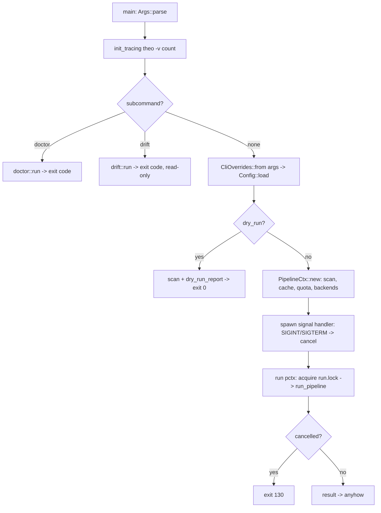
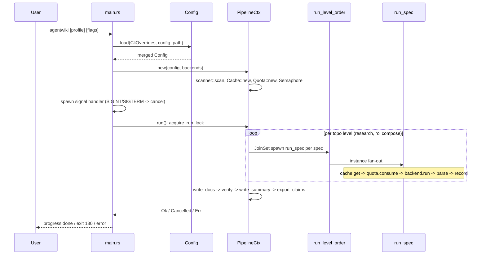
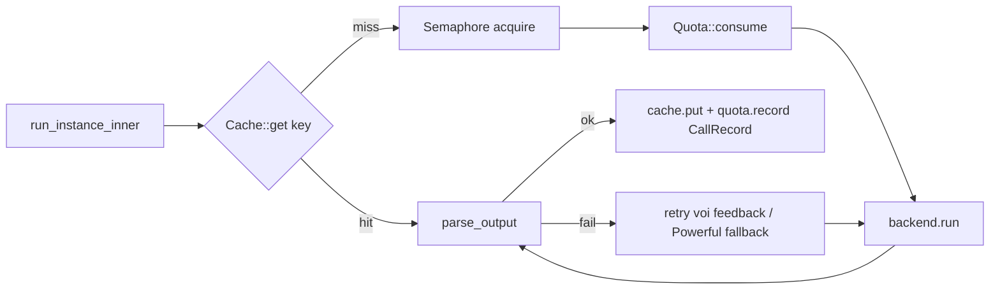

# Module Deep-Dive: CLI & Runtime Infrastructure

## 1. Mục đích của module

**CLI & Runtime Infrastructure** là lớp hạ tầng xuyên suốt (cross-cutting) của agentwiki — một Rust CLI sinh tài liệu kiến trúc kiểu C4 bằng cách điều phối các agent LLM thông qua các CLI bên ngoài (`devin`, `claude`, `codex`). Module này không chứa logic nghiệp vụ phân tích; thay vào đó nó cung cấp toàn bộ "xương sống" vận hành mà ba workflow chính (`run`, `drift`, `doctor`) đều dựa vào:

- **CLI entry & dispatch**: parse tham số bằng clap, khởi tạo tracing, định tuyến subcommand, xử lý tín hiệu hủy.
- **Configuration management**: merge cấu hình nhiều lớp (defaults → global TOML → project TOML → profile → CLI overrides), chọn model theo tier.
- **Caching & quota**: cache theo content-hash cho kết quả gọi agent, giới hạn số call mỗi ngày kèm audit log.
- **Diagnostics**: `agentwiki doctor` — pin kiểm tra sức khỏe môi trường.
- **Runtime utilities**: progress spinner, introspection tiến trình/PATH, error enum thống nhất, atomic file writes, và `PipelineCtx` — đối tượng ngữ cảnh dùng chung cho toàn bộ pipeline.

Module này giữ cho pipeline có thể test offline hoàn toàn (qua `MockBackend` được inject vào `PipelineCtx`) và đảm bảo các lệnh read-only (`doctor`, `drift`) không bao giờ chạm vào run lock hay trạng thái pipeline.

## 2. Cấu trúc nội bộ

| Sub-module | Files | Trách nhiệm |
|---|---|---|
| CLI Entry & Dispatch | `src/main.rs`, `src/cli.rs` | Định nghĩa `Args`/`Command` bằng clap derive, khởi tạo tracing, định tuyến `doctor`/`drift`/run mặc định, signal handling SIGINT/SIGTERM |
| Configuration Management | `src/config.rs` (~812 dòng) | Schema `Config` + các partial TOML structs, merge pipeline nhiều lớp, profile resolution, model-tier selection, `call_timeout()` |
| Pipeline Context | `src/pipeline/mod.rs` | `PipelineCtx` (shared `Arc`), run lock, `run_pipeline` (research → compose → write → verify), `run_level_order` với JoinSet + cancellation, `dry_run_report` |
| Caching & Quota | `src/cache.rs`, `src/quota.rs` | Content-hash cache (`sha256(prompt ‖ model ‖ backend ‖ SCHEMA_VERSION)`), `DayState` cap theo ngày UTC, audit log `calls.jsonl` |
| Diagnostics & Health Check | `src/doctor.rs`, `src/diag.rs` | Probe battery 5 section (config / agent CLIs / processes / state / project), `--fix` cleanup, `Report`/`Status` primitives dùng chung |
| Runtime Utilities | `src/progress.rs`, `src/sys.rs`, `src/error.rs`, `src/util.rs` | indicatif spinner, process listing đa nền tảng (`ps`/`tasklist`), thiserror `Error` enum, `write_atomic` |

## 3. Giao diện chính

### 3.1 `main()` và dispatch

`src/main.rs` là một wrapper mỏng trên thư viện (`#[tokio::main]`, `anyhow::Result`). Luồng điều khiển:



Điểm thiết kế quan trọng: **`doctor` và `drift` được dispatch trước khi tạo `PipelineCtx` hay run lock** — cả hai là read-only, không bao giờ ghi trạng thái pipeline. `drift` vẫn chạy scanner vì cần file inventory, nhưng không cài cancellation handler.

### 3.2 `Config::load(&CliOverrides, Option<&Path>) -> Result<Config>`

Thứ tự merge (ưu tiên tăng dần):

1. `Config::default()` — `project_path=.`, `output_path=./agentwiki.docs`, `internal_path=.agentwiki`, `max_parallels=2`, `mode=Embedded`, `daily_cap=300`, `call_timeout_s=600`, `retry_attempts=3`.
2. Global config: `$XDG_CONFIG_HOME/agentwiki/config.toml` hoặc `~/.config/agentwiki/config.toml`.
3. Project TOML: `-c` path, hoặc `<project>/agentwiki.toml`, fallback `agentwiki.toml` ở cwd.
4. Profile: positional arg `agentwiki <profile>`; project profiles shadow global profiles; built-in profiles (`default` no-op, tên backend trần như `agentwiki claude` chọn default model pair của CLI đó). Profile không tồn tại → `Error::Config` kèm danh sách tên hợp lệ.
5. CLI overrides: `-p`, `-o`, `--target-language`, `--model-*`, `--max-parallels`, `--agentic`, các flag boolean OR vào.
6. **PATH auto-detection**: các tier model chưa được set ở đâu cả (theo dõi bằng `models_set: [bool; 2]` qua `track_models`) sẽ fallback về CLI đầu tiên tìm thấy trên PATH theo thứ tự devin → codex → claude, qua `BackendKind::detect()`.

Cấu trúc TOML dùng mô hình `TomlConfig` (mọi field `Option`) + các `*Partial` structs (`ModelsPartial`, `LimitsPartial`, `ScanPartial`, `VerifyPartial`, `DriftPartial`) — mỗi lớp chỉ ghi đè các field nó định nghĩa. `internal_path` tương đối được resolve tương đối theo `project_path`, đảm bảo cache/state là per-repo.

Các truy cập chính: `model_for(ModelTier)` trả model string `"<backend>:<model>"`, `call_timeout()` trả `Duration`.

### 3.3 `PipelineCtx` — shared context

```rust
pub struct PipelineCtx {
    pub config: Config,
    pub scan: ScanData,
    pub ctx: ResearchContext,
    pub cache: Cache,
    pub quota: Quota,
    pub prompts: PromptLoader,
    pub semaphore: Semaphore,
    pub stats: Mutex<RunStats>,
    pub empty_cwd: PathBuf,
    pub progress: Progress,
    pub cancel: CancellationToken,
    backends: HashMap<BackendKind, Arc<dyn AgentBackend>>,
}
```

`PipelineCtx::new(config, backends)` thực hiện scan ngay (Phase 0), tạo `<internal>/` và `empty-cwd/` (cwd sạch cho embedded-mode calls), rồi khởi tạo `Cache`, `Quota`, `PromptLoader`, `Semaphore::new(max_parallels)`, `Progress`, `CancellationToken`, `ResearchContext`. Tham số `backends: Option<...>` cho phép test inject `MockBackend`; `None` thì `default_backends` chỉ khởi tạo các `BackendKind` thực sự được tham chiếu bởi `models.efficient`/`models.powerful`. `backend(kind)` resolve `Arc<dyn AgentBackend>` hoặc `Error::BackendNotAvailable`.

### 3.4 Cache

- Key: `sha256(prompt ‖ NUL ‖ model ‖ NUL ‖ backend ‖ NUL ‖ SCHEMA_VERSION)` — `SCHEMA_VERSION = "2"` là hằng số được bump khi ngữ nghĩa prompt/schema thay đổi, nằm trong mọi key nên tự động vô hiệu hóa cache cũ.
- Entry: `.agentwiki/cache/<key>.json` chứa `{text, meta{agent, backend, model, created_at, secs}}`.
- `Cache::new(internal, disabled, no_read)`: `--no-cache` tắt cả đọc lẫn ghi; `--force-regenerate` chỉ bỏ qua đọc nhưng vẫn ghi (recompute + overwrite).
- `put` ghi qua `write_atomic` — crash an toàn.
- `CacheStats`/`RunStats` tích lũy `cache_hits`, `cli_calls`, `saved_secs` cho summary report.

### 3.5 Quota

- `state.json` lưu `DayState{date, count}`; khi ngày UTC đổi thì count reset về 0.
- `consume()` chạy dưới `tokio::Mutex`: check + increment là một thao tác nguyên tử, ngăn các agent chạy song song vượt cap. Hết hạn mức → `Error::QuotaExceeded{cap}`.
- `record(CallRecord)` append một dòng JSON vào `calls.jsonl` — **best-effort**: lỗi ghi log không làm pipeline fail. `CallRecord` chứa `ts` (RFC3339), `agent` (dạng `name@target`), `backend`, `model`, `prompt_chars`, `secs`, `status` (`ok`/`error`/`timeout`), và `input_tokens`/`output_tokens` khi backend báo usage.
- `today_count()` phục vụ summary và doctor.

### 3.6 Doctor & diag

`doctor::run(project_path, config_path, fix) -> i32` chạy 5 section và trả exit code (0 = ok/warn, 1 = có section `Fail`):

- **config**: `Config::load` (fail thì dùng defaults để các check khác vẫn chạy), validate `models.*` parse được thành `BackendKind`, liệt kê nguồn config.
- **agent CLIs**: `find_on_path` + `probe_version` (`<cli> --version` với timeout 5s). CLI vắng mặt chỉ `Fail` khi được `models.*` yêu cầu; ngược lại là `Info`. Cũng probe `mermaid-fixer` nếu `verify.mermaid_fixer` bật.
- **processes**: `sys::list_processes` + `agent_name` phát hiện `agentwiki`/`devin`/`claude`/`codex` đang chạy — cảnh báo concurrent run hoặc orphan processes (kèm `etime`).
- **state**: kiểm tra `.agentwiki/` — `run.lock` (live pid vs. stale), `quota_state` (state.json), `cache_state` (số entry + dung lượng), `research_state` (`--skip-research` khả dụng không), `calls_state` (audit log), `temp_state` (file `agentwiki-*` sót lại trong tempdir — **không dọn khi có run đang active**).
- **project**: project path tồn tại, git repo + `git` trên PATH (ảnh hưởng `git_tracked_only`), `writable_probe`, output dir.

`--fix` xóa stale `run.lock` và tempfile sót lại. `diag.rs` cung cấp `Status` (Info < Ok < Warn < Fail, `Ord` để `max` tính worst) và `Report{lines, worst, fixes}` dùng chung cho doctor và drift.

### 3.7 Runtime utilities

- **`Progress`** (`progress.rs`): một spinner `indicatif` duy nhất theo dõi `pos/len` của agent instances. `len` tăng khi fan-out targets được phát hiện (`add_total`), `start`/`finish` quản lý tập in-flight (`BTreeSet` dưới `Mutex`) và render tên instance đang chạy — truncate một dòng ở 72 chars (`… +N`). Tự ẩn khi stderr không phải TTY (CI, pipe, test). Kết thúc qua `done` / `fail(err)` / `cancel` ("cancelled — rerun resumes from cache").
- **`sys.rs`**: introspection không phụ thuộc crate ngoài — unix gọi `ps -eo pid=,etime=,args=` (fallback không `etime`), Windows gọi `tasklist /FO CSV`. `agent_name` nhận diện cả trường hợp CLI chạy qua interpreter (`node /path/to/codex`) bằng danh sách `INTERPRETERS`. `pid_alive` phục vụ run-lock reclaim; `find_on_path` phục vụ doctor + `BackendKind::detect`.
- **`error.rs`**: `Error` enum thiserror gồm `Config`, `Io{path, source}` (luôn kèm path context qua `Error::io`), `Backend{backend, message, stderr_tail}`, `BackendNotAvailable`, `Parse`/`Validation` (kèm agent name), `QuotaExceeded{cap}`, `Timeout{agent, secs}`, `Prompt`, `DepFailed`, `Cancelled`, `AlreadyRunning{pid}`, `Pipeline`. Binary wrap bằng `anyhow`.
- **`util::write_atomic`**: `NamedTempFile::new_in(parent_dir)` + `persist` — temp file cùng filesystem nên rename nguyên tử; crash để lại bản cũ hoặc bản mới, không bao giờ file rách. Được dùng bởi cache, quota, research context save, drift.json, và doc writers.

## 4. Luồng điều khiển chi tiết

### 4.1 Vòng đời một run đầy đủ



### 4.2 Run lock và cancellation

`acquire_run_lock` dùng `create_new` trên `<internal>/run.lock`, ghi pid vào file:

- File tồn tại với **pid còn sống** (`sys::pid_alive`) → `Error::AlreadyRunning{pid}`, fail fast.
- File tồn tại với pid chết hoặc không đọc được → **stale lock, reclaim** (xóa và thử lại, tối đa 2 vòng).
- `RunLock` xóa file trong `Drop` — kể cả khi pipeline panic.

Cancellation hai tầng: signal handler trong `main` — SIGINT/SIGTERM thứ nhất gọi `cancel.cancel()` (cooperative), tín hiệu thứ hai `exit(130)`. Bên trong `run_level_order`, mỗi DAG level chạy trong một `JoinSet` với `tokio::select!` có `biased` trên `cancel.cancelled()`: khi cancel, `abort_all()` drop các task đang chạy — vì backend children được spawn với `kill_on_drop(true)`, tiến trình CLI con chết theo. Drain được giới hạn 3 giây để task kẹt trong sync poll không treo shutdown. Exit code 130 theo convention SIGINT; message progress báo "rerun resumes from cache".

### 4.3 Luồng dữ liệu qua từng lời gọi agent



Mọi call đi qua cùng một đường: cache key → semaphore (`max_parallels`, default 2) → `quota.consume()` → backend → `quota.record()` audit → `cache.put()`. Đây chính là điểm mà cost governance được gắn vào call path.

## 5. Quyết định triển khai đáng chú ý

- **Phân tách read-only vs. mutating ngay ở dispatch**: `doctor`/`drift` thoát sớm trước cả `PipelineCtx::new` — không run lock, không signal handler, không ghi state. Điều này cho phép `doctor` chạy song song với một run đang active (nó chỉ báo `run.lock held by live pid` ở mức Info).
- **Staleness an toàn cho run.lock**: lock chứa pid và được reclaim khi `pid_alive` fail, nên một run bị `kill -9` không khóa repo vĩnh viễn. `doctor --fix` cho phép dọn thủ công.
- **Cache key bao gồm `SCHEMA_VERSION`**: thay đổi schema/prompt semantics tự động invalidate toàn bộ cache mà không cần migration.
- **Quota check+increment dưới một Mutex**: prevent parallel overrun — nếu không, N instance cùng đọc `count < cap` sẽ vượt cap.
- **`calls.jsonl` best-effort**: audit log không được phép làm pipeline fail — đúng vai trò observability side-channel.
- **`JoinSet` + `biased select` + bounded drain**: hủy nhanh, dọn dẹp child processes nhờ `kill_on_drop`, không treo shutdown. (Trong runner, `FuturesUnordered` được chọn cho fan-out instance cùng lý do.)
- **Progress tự ẩn trên non-TTY**: caller không cần check CI vs. terminal.
- **`sys.rs` không phụ thuộc crate platform-specific**: `ps`/`tasklist` + parser nội bộ; xử lý cả interpreter-wrapped CLIs (node-installed `codex`).
- **Atomic writes ở mọi nơi state được ghi**: cache entries, `state.json`, `research.json`, `drift.json`, markdown docs — đảm bảo reader (kể cả `drift` chạy trong CI) không bao giờ thấy torn file.
- **Config merge bằng partial structs + tracking `models_set`**: cho phép auto-detect backend từ PATH chỉ cho các tier "không ai set", tránh override im lặng config của user.
- **`internal_path` resolve theo `project_path`**: cache/quota/research là per-repo, nên hai project không đụng state của nhau.

## 6. Danh sách file liên quan

- `src/main.rs` — entry point, dispatch, signal handling, `init_tracing` (`-v` → warn/info/debug/trace, `RUST_LOG` override)
- `src/cli.rs` — `Args`, `Command::{Doctor, Drift}`, `DoctorArgs`, `Lang`, `From<&Args> for CliOverrides`
- `src/config.rs` — `Config`, `TomlConfig` + partials, `CliOverrides`, `ModelTier`, `Mode`, `TargetLanguage`, `load`/`apply_toml`/`model_for`/`call_timeout`
- `src/pipeline/mod.rs` — `PipelineCtx`, `RunStats`, `RunLock`, `acquire_run_lock`, `run`, `run_pipeline`, `run_level_order`, `dry_run_report`
- `src/cache.rs` — `Cache`, `CacheEntry`/`CacheMeta`, `SCHEMA_VERSION`, `CacheStats`
- `src/quota.rs` — `Quota`, `DayState`, `CallRecord`, `today`, `now_rfc3339`
- `src/doctor.rs` — `run`, `probe_version`, `quota_state`, `cache_state`, `research_state`, `calls_state`, `temp_state`, `writable_probe`
- `src/diag.rs` — `Status`, `Report`, `print_section`
- `src/progress.rs` — `Progress` (indicatif spinner)
- `src/sys.rs` — `ProcInfo`, `list_processes`, `pid_alive`, `agent_name`, `find_on_path`, `AGENT_PROCS`
- `src/error.rs` — `Error`, `Result`, `Error::io`
- `src/util.rs` — `write_atomic`
- `src/lib.rs` — re-export `run`, `PipelineCtx`, `dry_run_report` và các module

## 7. Đánh giá & rủi ro

- **Điểm mạnh**: ranh giới mutating/read-only rõ ràng ngay từ dispatch; cost control (cache + quota + audit) nằm trên đường call bắt buộc; crash-safety toàn diện nhờ `write_atomic` và pid-based lock reclaim; toàn bộ context inject được (`PipelineCtx::new` nhận backends tùy chọn) nên test hermetic.
- **Rủi ro**: `PipelineCtx` là god-object chứa mọi shared service — tiện nhưng làm coupling giữa runner và infrastructure chặt; quota là per-process mutex nên hai `agentwiki` chạy trên hai repo khác nhau với cùng `internal_path` (không khuyến nghị) vẫn có thể vượt cap do state.json race — thực tế lock file ngăn điều này trong cùng project; `sys.rs` phụ thuộc `ps`/`tasklist` sẵn có trên host (hợp lý cho CLI tool nhưng là external dependency mềm).