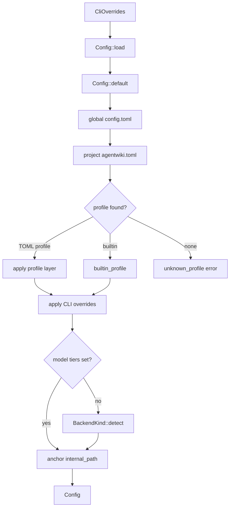
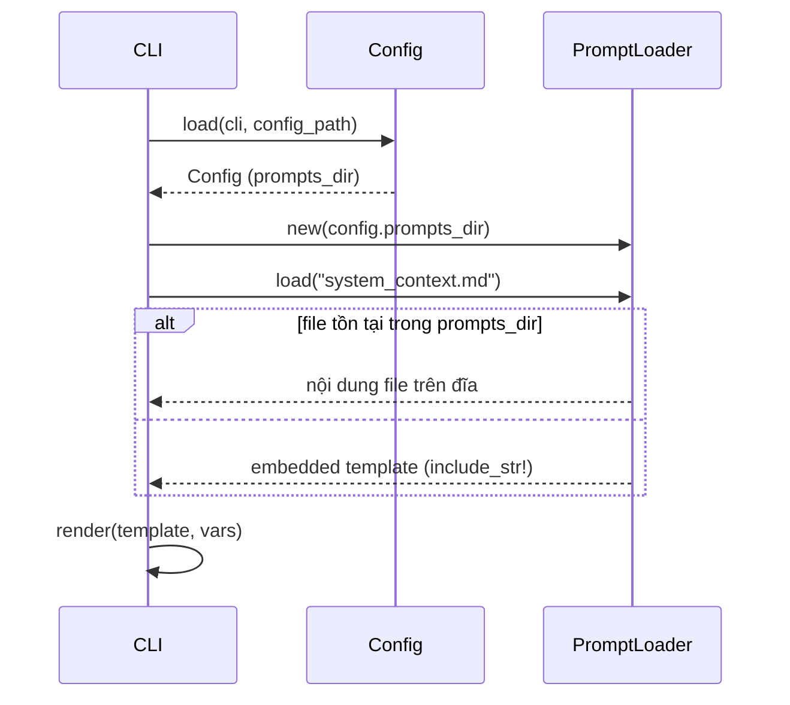

# Module Deep-Dive: Configuration & Prompt Management

## 1. Mục đích module

Đây là **domain hạ tầng** cung cấp hai dịch vụ nền tảng cho toàn bộ pipeline của agentwiki:

1. **Giải quyết cấu hình phân lớp** (`src/config.rs`): hợp nhất cấu hình theo thứ tự ưu tiên `defaults → TOML global → TOML project → profile → CLI overrides`, sau đó tự phát hiện model từ PATH cho các tier chưa được đặt. Mọi tham số vận hành — model backend, giới hạn quota, chính sách scan, verify, drift — đều chảy qua một `Config` đã resolve đầy đủ.
2. **Engine prompt template** (`src/prompt.rs` + `prompts/`): thư viện 13 template Markdown được embed vào binary qua `include_str!`, cho phép override bằng file trên đĩa, và render qua cơ chế thay thế `{{key}}` đơn giản.

Module này không tự gọi LLM; nó chỉ định hình *prompt nào* được gửi và *backend/model nào* được spawn — ranh giới mà runner trong domain Agent Orchestration tiêu thụ.

## 2. Cấu trúc nội bộ

### 2.1 Config Resolution (`src/config.rs`)

```
Config                    — cấu hình runtime đã resolve đầy đủ (Serialize/Deserialize)
├── ModelsConfig          — [models]: efficient / powerful ("<backend>:<model>")
├── LimitsConfig          — [limits]: daily_cap, call_timeout_s, retry_attempts,
│                           materials_char_cap, code_insights_limit, file_source_chars
├── ScanConfig            — [scan]: max_depth, max_file_size, git_tracked_only,
│                           include_hidden/tests, excluded_dirs/files
├── VerifyConfig          — [verify]: mermaid_fixer
└── DriftConfig           — [drift] (định nghĩa ở src/drift/config.rs, apply qua DriftPartial)

TomlConfig (private)      — mirror toàn-optional của Config + bảng [profiles.<name>]
*Partial (private)        — ModelsPartial, LimitsPartial, ScanPartial, VerifyPartial
CliOverrides (public)     — struct phẳng do clap flatten: profile, -p/-o,
                            --model-*, --agentic, --incremental/--full, skip flags

Enums:
Mode          — Embedded (default: prompt chứa sẵn code) | Agentic (agent tự đọc file)
TargetLanguage— 8 ngôn ngữ; instruction() trả về câu chỉ thị nối vào mọi prompt
ModelTier     — Efficient | Powerful (không Serialize — chỉ là key nội bộ)
```

### 2.2 Prompt Engine (`src/prompt.rs`)

```
render(template, &HashMap<&str, String>) -> String   — thay {{key}}, giữ nguyên placeholder lạ
embedded! macro                                        — ánh xạ 13 tên → include_str! assets
embedded_template(name) -> Option<&'static str>        — match tĩnh sinh bởi macro
PromptLoader { dir: Option<PathBuf> }
├── new(dir)          — dir = config.prompts_dir
└── load(name)        — disk-first, fallback embedded, lỗi Error::Prompt nếu không có
```

### 2.3 Prompt Template Library (`prompts/`)

| Nhóm | Template | Vai trò |
|---|---|---|
| Research (9) | `system_context.md`, `domain_modules.md`, `architecture.md`, `workflow.md`, `boundary.md`, `database.md`, `relationships.md`, `dir_summary.md`, `key_module.md` | Persona phân tích: yêu cầu JSON schema cứng, quy tắc output, `{{schema_block}}` |
| Editors (4) | `editors/overview.md`, `editors/architecture_doc.md`, `editors/workflow_doc.md`, `editors/deep_dive.md` | Persona biên soạn tài liệu C4; nhúng sẵn Mermaid safety rules (ASCII-only node IDs, header chuẩn) |

Placeholder dùng chung gồm `{{materials}}`, `{{language_instruction}}`, `{{schema_block}}`, `{{agentic_note}}`, `{{custom}}` — research template có thêm `{{schema_block}}`, editor template nhấn mạnh quy tắc Mermaid.

## 3. Interface chính

| API | Chữ ký | Người dùng |
|---|---|---|
| `Config::load` | `(cli: &CliOverrides, config_path: Option<&Path>) -> Result<Config>` | Điểm vào duy nhất, gọi từ main/CLI parsing |
| `Config::model_for` | `(ModelTier) -> &str` | Runner/backend spawner lấy chuỗi `"<backend>:<model>"` |
| `Config::call_timeout` | `() -> Duration` | Runner khi spawn subprocess |
| `Config::global_config_file` | `() -> Option<PathBuf>` | doctor/status để hiển thị |
| `prompt::render` | `(&str, &HashMap<&str,String>) -> String` | Agent runner khi build prompt |
| `PromptLoader::new` / `load` | `(Option<PathBuf>)` / `(name) -> Result<String>` | Pipeline stages fetch template |

Phụ thuộc ra ngoài: `crate::backend::BackendKind` (`parse`, `detect`, `default_models`) và `crate::error::{Error, Result}` — `Error::Config` và `Error::Prompt` là hai failure surface.

## 4. Luồng dữ liệu / điều khiển

### 4.1 Luồng resolve cấu hình



Chi tiết từng lớp trong `Config::load` (`src/config.rs:377-483`):

1. **Defaults**: `Config::default()` — `max_parallels=2`, `Mode::Embedded`, model mặc định của `BackendKind::Devin`, scan loại trừ `target`, `node_modules`, lockfiles, `.env`, v.v.
2. **Global TOML**: `$XDG_CONFIG_HOME/agentwiki/config.toml` → fallback `~/.config/agentwiki/config.toml` (hàm `global_config_path`, `src/config.rs:604`).
3. **Project TOML**: `config_path` tường minh, hoặc `agentwiki.toml` cạnh `project_path` rồi đến cwd.
4. **Profile**: tên từ positional arg `agentwiki <profile>` (mặc định `"default"`). Thứ tự tìm: `[profiles.<name>]` trong TOML project → TOML global → built-in.
5. **CLI overrides**: field-wise; cờ bool dùng `|=`, `max_parallels` clamp `>= 1`, `--full` xóa `incremental`.
6. **Auto-detect**: `BackendKind::detect()` quét PATH theo thứ tự devin → codex → claude, chỉ fill tier chưa được set.
7. **Anchor**: `internal_path` tương đối được ghép vào `project_path` (state `.agentwiki/` luôn theo repo).

### 4.2 Luồng tải và render prompt



`PromptLoader::load` thử `dir.join(name)` trước; nếu không phải file, rơi về `embedded_template(name)`. Không có cả hai → `Error::Prompt { name, "unknown template" }`.

## 5. Quyết định triển khai đáng chú ý

- **Merge theo field-wise partial overlay.** `apply_toml` chỉ chép các field `Some` từ `TomlConfig` sang accumulator — mỗi lớp là một overlay riêng, không có merge sâu danh sách (excluded_dirs/files bị thay thế nguyên vẹn, không nối thêm). `TomlConfig` còn tái dùng chính nó cho `[profiles.<name>]` (key `profiles` lồng trong profile bị bỏ qua).
- **Tracking tier đã-set qua `[bool; 2]`.** `track_models` ghi lại tier nào được đặt tường minh ở *bất kỳ* lớp nào (kể cả CLI flags — có test `cli_model_flags_count_as_explicit`). Chỉ tier còn trống mới được `BackendKind::detect()` fill; khi PATH không có CLI nào, giữ nguyên default và để lỗi spawn ở runtime nói rõ vấn đề.
- **Profile built-in cho tên backend trần.** `agentwiki claude` resolve qua `BackendKind::parse` → layer chỉ chứa cặp model mặc định của CLI đó (ví dụ `claude:sonnet@low` / `claude:sonnet@high`). `mock`/`test` bị loại khỏi profile built-in; `default` là no-op layer để `agentwiki default` luôn chạy được. Profile TOML shadow built-in cùng tên; tên lạ → `Error::Config` liệt kê đầy đủ profile khả dụng.
- **Render `{{key}}` bằng `str::replace` và cố ý giữ placeholder lạ.** `render` chạy O(vars × template), thay từng `{{k}}` bằng giá trị. Placeholder không có trong map được giữ nguyên — điều này cho phép template chứa ví dụ JSON kiểu `{{"a": 1}}` mà không bị phá (test `render_replaces_known_leaves_unknown` khóa hành vi này). Đánh đổi: không có escaping hay lỗi khi thiếu biến — biến thiếu lặng lẽ lọt vào prompt cuối.
- **Self-contained binary với disk override.** Macro `embedded!` sinh `match` tĩnh trả `Option<&'static str>` từ `include_str!`, nên binary phát hành mang sẵn toàn bộ prompt library; `config.prompts_dir` cho phép người dùng/CI override từng file mà không cần rebuild — điểm mở rộng chính để iterate prompt.
- **`internal_path` neo vào project.** Cache, quota, research context luôn nằm dưới `<project>/.agentwiki/`, đảm bảo state per-repo kể cả khi chạy từ cwd khác.
- **`TargetLanguage::instruction()` là câu prose chèn vào prompt**, không phải locale code — ví dụ `"Write all prose in Vietnamese. JSON keys stay in English."`, tiêm qua placeholder `{{language_instruction}}`.

## 6. Files liên quan

- `src/config.rs` — toàn bộ resolver cấu hình + tests (precedence, profile shadowing, unknown-profile error, explicit-model tracking)
- `src/prompt.rs` — `render`, macro `embedded!`, `PromptLoader`
- `prompts/` — 9 research template + `prompts/editors/` 4 editor template
- Phụ thuộc: `src/backend/mod.rs` (`BackendKind`), `src/error.rs`, `src/drift/config.rs` (`DriftConfig`/`DriftPartial`), `src/cli.rs` (clap flatten vào `CliOverrides`)

## 7. Điểm cần lưu ý khi mở rộng

- Thêm field cấu hình mới phải đụng 4 chỗ: `Config`, `TomlConfig` (+`*Partial` nếu trong section), `apply_toml`, và `CliOverrides` nếu muốn CLI flag.
- Thêm template mới: tạo file trong `prompts/` và thêm một dòng vào block `embedded!` — thiếu dòng macro sẽ chỉ lỗi runtime (`unknown template`), không lỗi compile.
- Vì cache key của runner bao gồm prompt, sửa template sẽ invalidate cache rộng — cân nhắc khi iterate prompt trên repo lớn.