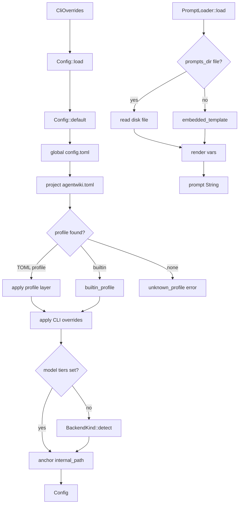
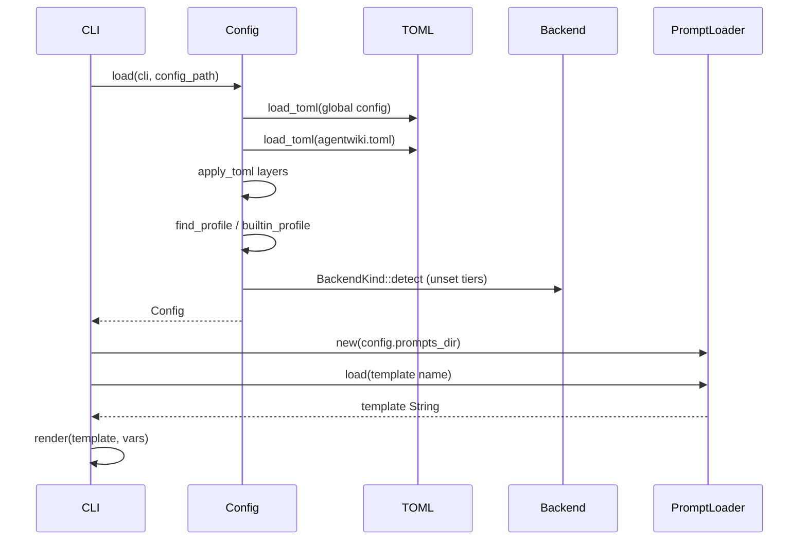

# Tài liệu kỹ thuật: Configuration & Prompt Management

## 1. Mục đích của module

Module **Configuration & Prompt Management** là tầng hạ tầng chịu trách nhiệm cung cấp hai năng lực cho toàn bộ pipeline của agentwiki:

1. **Phân giải cấu hình nhiều lớp** (`src/config.rs`): gộp các nguồn cấu hình theo thứ tự ưu tiên `mặc định → TOML toàn cục → TOML dự án → profile được chọn → tham số CLI`, sau đó tự phát hiện backend trên PATH cho các model tier chưa được cấu hình, và tạo ra một struct `Config` đã resolve hoàn chỉnh.
2. **Engine prompt template** (`src/prompt.rs` + thư mục `prompts/`): render các placeholder `{{key}}` và nạp template với cơ chế "ghi đè trên đĩa, fallback về template nhúng", giúp binary tự chứa hoàn toàn nhưng vẫn cho phép người dùng tùy biến prompt mà không cần build lại.

Module này không tự thực thi pipeline; nó là **dependency thuần túy** — mọi consumer (CLI entry, agentic runner, backend spawner, compose stage) đều đọc `Config` và gọi `PromptLoader` thay vì tự đọc file cấu hình.

## 2. Cấu trúc nội bộ

```
src/config.rs   (~828 dòng)   ─ Config, CliOverrides, TomlConfig + *Partial,
                                enums Mode / TargetLanguage / ModelTier,
                                hàm merge: load, apply_toml, track_models,
                                find_profile, builtin_profile, unknown_profile
src/prompt.rs   (~88 dòng)    ─ render(), PromptLoader, macro embedded!,
                                embedded_template()
prompts/                      ─ 9 template phân tích + prompts/editors/ (4 template)
```

### 2.1 Config Resolution (`src/config.rs`)

Các thành phần chính:

- **`Config`**: struct cấu hình runtime đã resolve đầy đủ — `project_path`, `output_path`, `internal_path` (state dir `.agentwiki/`), `prompts_dir`, `target_language`, `max_parallels`, `mode`, các cờ skip/no-cache/incremental, và các section lồng `models`, `limits`, `scan`, `verify`, `drift`. `Config::default()` mặc định `devin` làm cặp model, `max_parallels = 2`, `mode = Embedded`.
- **`CliOverrides`**: tập tham số đã được clap flatten — `profile` (positional), `-p`/`-o`, `--model-efficient`, `--model-powerful`, `--agentic`, `--incremental`/`--full`, các cờ skip.
- **`TomlConfig` + các `*Partial`** (`ModelsPartial`, `LimitsPartial`, `ScanPartial`, `VerifyPartial`, `DriftPartial`): mọi trường đều `Option<T>`, để mỗi lớp chỉ là **overlay một phần**; `TomlConfig` cũng tái sử dụng cho `[profiles.<name>]`.
- **Enums**: `Mode::{Embedded, Agentic}` (prompt nhúng code vs. agent tự đọc file tại project root), `TargetLanguage` (8 ngôn ngữ; mỗi ngôn ngữ có `instruction()` được append vào mọi prompt, ví dụ `Vi` → "Write all prose in Vietnamese. JSON keys stay in English."), `ModelTier::{Efficient, Powerful}` (model rẻ/nhanh cho tác vụ thường vs. model mạnh cho schema phức tạp và retry fallback).
- **`LimitsConfig`** kiểm soát chi phí: `daily_cap` (300), `call_timeout_s` (600), `retry_attempts` (3), `materials_char_cap` (192K), `code_insights_limit` (25), `file_source_chars` (500). **`ScanConfig`** quy định giới hạn quét: `max_depth`, `max_file_size`, `git_tracked_only`, danh sách `excluded_dirs`/`excluded_files` (bao gồm cả `agentwiki.toml` và `.env`).

### 2.2 Prompt Engine (`src/prompt.rs`)

- **`render(template, vars)`**: thay `{{key}}` bằng `str::replace` cho từng biến. Độ phức tạp O(số biến × độ dài template) — chấp nhận được vì prompt chỉ render một lần cho mỗi agent call.
- **Macro `embedded!`**: sinh `embedded_template(name) -> Option<&'static str>` dạng `match` trên 13 tên template, mỗi nhánh trả `include_str!("../prompts/...")`. Template được biên dịch vào binary nên không phụ thuộc file hệ thống.
- **`PromptLoader { dir: Option<PathBuf> }`**: `load(name)` trước hết kiểm tra `dir.join(name)` trên đĩa (là `config.prompts_dir`); nếu file tồn tại thì đọc nó, nếu không fallback về `embedded_template`; không có cả hai → `Error::Prompt { name, "unknown template" }`.

### 2.3 Thư viện template (`prompts/`)

| Nhóm | Template | Persona |
|---|---|---|
| Phân tích | `system_context.md`, `domain_modules.md`, `boundary.md`, `database.md`, `workflow.md`, `relationships.md`, `dir_summary.md`, `key_module.md`, `architecture.md` | Research agents: tóm tắt thư mục, trích quan hệ, mô tả system context, ranh giới, database, workflow |
| Editor | `editors/overview.md`, `editors/architecture_doc.md`, `editors/workflow_doc.md`, `editors/deep_dive.md` | Compose-stage agents render tài liệu C4 |

Tất cả template đều nhúng quy tắc an toàn Mermaid (ASCII-only node IDs, các diagram header được phép) và có điểm chèn `{{custom}}` cho biến do caller truyền vào.

## 3. Interface công khai

```rust
// Điểm vào duy nhất, gọi từ main/CLI parsing
Config::load(cli: &CliOverrides, config_path: Option<&Path>) -> Result<Config>

// Tiện ích trên Config
cfg.model_for(ModelTier) -> &str          // "<backend>:<model>" cho backend spawner
cfg.call_timeout() -> Duration            // limits.call_timeout_s
Config::global_config_file() -> Option<PathBuf>

// Phía prompt
prompt::render(template, &HashMap<&str, String>) -> String
PromptLoader::new(Option<PathBuf>) -> Self
loader.load("system_context.md") -> Result<String>
```

Phụ thuộc: `crate::backend::BackendKind` (`parse`, `detect`, `default_models`), `crate::error::{Error, Result}`, `crate::drift::config::DriftConfig`. Bề mặt lỗi là `Error::Config` và `Error::Prompt`.

## 4. Luồng dữ liệu / điều khiển

### 4.1 Chuỗi phân giải cấu hình





### 4.2 Thứ tự các lớp trong `Config::load`

1. `Config::default()` làm nền; mảng `models_set: [bool; 2]` (efficient, powerful) theo dõi tier nào đã được cấu hình tường minh.
2. **Global TOML** — `global_config_path()` thử `$XDG_CONFIG_HOME/agentwiki/config.toml` rồi `~/.config/agentwiki/config.toml`.
3. **Project TOML** — `config_path` nếu được chỉ định; ngược lại tìm `agentwiki.toml` cạnh `project_path`, sau đó ở cwd.
4. **Profile** — tên từ `cli.profile` (mặc định `"default"`): `find_profile` tra `[profiles.<name>]` trong TOML dự án trước (project shadow global), sau đó `builtin_profile`:
   - `default` → lớp no-op (`TomlConfig::default()`), đảm bảo `agentwiki default` chạy được trên máy mới.
   - Tên backend trần (`devin`, `claude`, `codex`) → `BackendKind::parse` rồi dùng `default_models()` của CLI đó làm cặp efficient/powerful. `mock`/`test` bị loại khỏi profile.
   - Không khớp → `unknown_profile` trả `Error::Config` liệt kê mọi profile khả dụng (built-ins + TOML).
5. **CLI overrides** — cờ bool được OR vào (`|=`), `max_parallels` bị clamp `>= 1`, `--full` xóa `incremental`. Cờ `--model-*` cũng đánh dấu `models_set`.
6. **Auto-detect** — nếu còn tier nào chưa set, `BackendKind::detect()` chọn CLI đầu tiên trên PATH (devin → codex → claude) và chỉ điền các tier còn trống; không tìm thấy backend thì giữ default.
7. **Anchor `internal_path`** — nếu là đường dẫn tương đối, ghép vào `project_path` để state `.agentwiki/` luôn per-repo.

## 5. Quyết định triển khai đáng chú ý

- **Merge theo từng trường**: `apply_toml` chỉ copy trường `Some` — mỗi lớp là overlay một phần, không phải thay thế nguyên section. Đây là lý do cần song song `TomlConfig` (Option) và `Config` (giá trị concrete).
- **Tracking tường minh cho model tier**: mảng `[bool; 2]` phân biệt "người dùng không set" với "default", để `BackendKind::detect()` không ghi đè model đã cấu hình — bao gồm cả cờ CLI (CLI model flags được tính là explicit).
- **Profile shadowing có thứ tự**: TOML dự án > TOML global > built-in, cho phép `[profiles.claude]` trong TOML đè lên built-in `claude`.
- **Binary tự chứa**: `include_str!` nhúng cả 13 template; `prompts_dir` là điểm mở rộng tùy chọn.
- **`render` giữ nguyên placeholder lạ**: JSON ví dụ trong template (kiểu `{{"a": 1}}`) không bị phá, vì chỉ key khớp mới được thay. Đây là hành vi có chủ đích và được test.
- **`internal_path` neo vào project** sau mọi lớp merge, đảm bảo cache/quota/research context luôn nằm trong repo đích.
- **Các bài test** phủ: thứ tự ưu tiên TOML→CLI, CLI model flags chặn auto-detect, profile override TOML nhưng vẫn thua CLI, profile TOML shadow built-in backend, lỗi unknown profile liệt kê đầy đủ tên khả dụng, và render giữ placeholder lạ.

## 6. Các file liên quan

- `src/config.rs` — toàn bộ resolver cấu hình
- `src/prompt.rs` — render + `PromptLoader` + bảng template nhúng
- `prompts/*.md` — 9 template phân tích: `dir_summary`, `relationships`, `system_context`, `domain_modules`, `architecture`, `workflow`, `key_module`, `boundary`, `database`
- `prompts/editors/*.md` — 4 template compose: `overview`, `architecture_doc`, `workflow_doc`, `deep_dive`
- `src/backend/mod.rs` — `BackendKind` (dependency: `parse`, `detect`, `default_models`)
- `src/drift/config.rs` — `DriftConfig`/`DriftPartial` được merge qua `apply_toml`
- `src/cli.rs`, `src/main.rs` — sản xuất `CliOverrides` và gọi `Config::load`