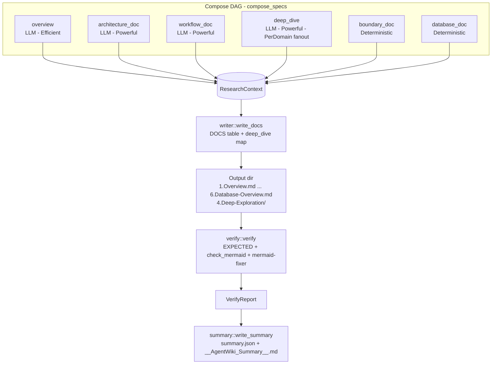
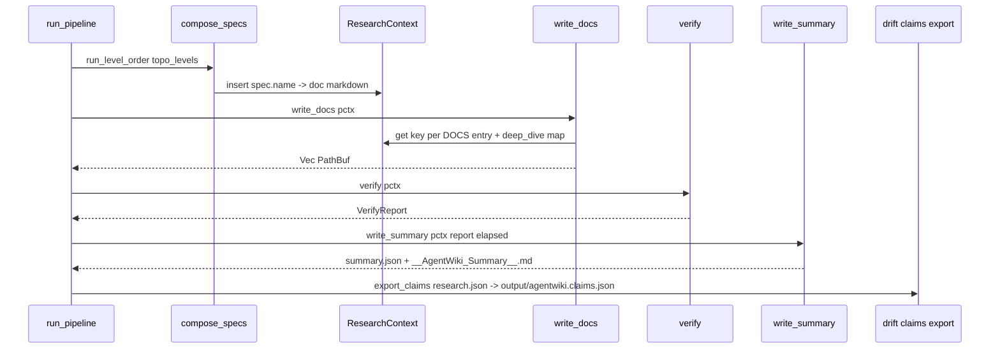

# Module Deep-Dive: Documentation Composition & Output

## 1. Mục đích của module

Module **Documentation Composition & Output** (`src/output/` + `prompts/editors/`) là giai đoạn **Compose** trong pipeline bốn pha của agentwiki (Preprocess → Research → Compose → Verify). Module chịu trách nhiệm:

1. **Chuyển đổi structured reports** do phase Research sinh ra (JSON trong `ResearchContext`) thành bộ tài liệu C4 gồm 6 loại: Overview, Architecture, Workflow, Boundary Interfaces, Deep-Exploration per domain, Database Overview.
2. **Kiểm tra đầu ra sau khi ghi** (`verify`): tính toàn vẹn file + kiểm tra cú pháp Mermaid, không bao giờ làm pipeline fail.
3. **Ghi artifact cuối cùng**: cây thư mục Markdown được đánh số (`1.Overview.md` … `6.Database-Overview.md`), `4.Deep-Exploration/<Domain>.md`, `__AgentWiki_Summary__.md` và `summary.json`.

Điểm đặc trưng kiến trúc: compose phase trộn hai kiểu agent trong cùng một DAG — **4 editor agent dùng LLM** (overview, architecture_doc, workflow_doc, deep_dive fan-out PerDomain) và **2 renderer deterministic** (boundary_doc, database_doc) — cả hai đều được khai báo như `AgentSpec` thông thường và chạy qua `run_level_order`, nên thứ tự phụ thuộc được bảo đảm bởi `topo_levels` giống phase research.

## 2. Cấu trúc nội bộ



| File | Vai trò |
|---|---|
| `src/output/mod.rs` | Re-export API công khai: `boundary_doc`, `database_doc`, `write_docs`, `verify`/`VerifyReport`, `write_summary`. |
| `src/output/writer.rs` | Materialize context → cây file Markdown (`write_docs`, `write_file`, `sanitize_filename`). |
| `src/output/verify.rs` | VerifyReport, danh sách EXPECTED, `check_mermaid` heuristic, tích hợp `mermaid-fixer` ngoài. |
| `src/output/summary.rs` | `SummaryJson` (machine-readable) + `__AgentWiki_Summary__.md` (human-readable). |
| `src/output/boundary.rs` | Renderer deterministic cho `5.Boundary-Interfaces.md` (port từ deepwiki-rs `BoundaryEditor`). |
| `src/output/database.rs` | Renderer deterministic cho `6.Database-Overview.md`, gồm `erDiagram` Mermaid. |
| `prompts/editors/*.md` | 4 template prompt cho editor LLM agents (overview, architecture_doc, workflow_doc, deep_dive). |

## 3. Hai kiểu composition: LLM editors vs deterministic renderers

### 3.1 Editor agents (LLM)

Khai báo trong `compose_specs()` tại `src/agent/registry.rs:132`:

| Spec | Tier | Deps | Fan-out | Materials |
|---|---|---|---|---|
| `overview` | Efficient | system_context, domain_modules | — | Readme |
| `architecture_doc` | Powerful | system_context, domain_modules, architecture, workflow | — | — |
| `workflow_doc` | Powerful | system_context, domain_modules, workflow | — | CodeInsights |
| `deep_dive` | Powerful | system_context, domain_modules, architecture, workflow, key_module | **PerDomain** | Custom |

Các editor dùng `prompt_tmpl` dưới `prompts/editors/` (load qua `PromptLoader` — disk override theo `config.prompts_dir`, fallback `include_str!` embedded). Prompt chứa output contract (raw Markdown, cấu trúc section gợi ý) và **Mermaid safety rules** (node ID ASCII-only, header chuẩn). `deep_dive` fan-out theo từng domain trong report `domain_modules`; kết quả được aggregate thành map `{domain_name: markdown}` trong context.

Quan trọng: không có `SchemaSpec` cho editor agents — output là văn bản Markdown tự do, nên chuẩn C4 chỉ được enforce qua prompt text, không qua schema.

### 3.2 Deterministic renderers (`ExecKind::Deterministic`)

`boundary_doc` và `database_doc` là `DetFn` — hàm thuần với signature `(ScanData, Config, dep: serde_json::Value) -> Result<String>` chạy **in-process, không gọi CLI**:

- **`boundary_doc`** (`src/output/boundary.rs`): deserialize `dep` thành `BoundaryAnalysisReport`, render các section theo thứ tự CLI → API → Router → Integration Suggestions bằng `std::fmt::Write` vào một `String` buffer duy nhất. Mỗi section helper (`cli_section`, `api_section`, `router_section`, `integration_section`) chỉ được chèn khi list tương ứng non-empty. Kết thúc bằng footer `**Analysis Confidence**: X/10`.
- **`database_doc`** (`src/output/database.rs`): deserialize thành `DatabaseOverviewReport`, mở đầu bằng bảng Summary (đếm projects/tables/views/procedures/functions/relationships), rồi các section Projects/Tables/Views/Procedures/Functions/Relationships/DataFlows. `table_relationships` được render kép: một `mermaid erDiagram` + một bảng chi tiết From/To/Columns/Type. `mermaid_id()` sanitize identifier về `[A-Za-z0-9_]` (mọi ký tự khác → `_`) để tên `schema.table` không phá cú pháp diagram — ví dụ `dbo.Users` thành `dbo_Users`.

Lý do deterministic: hai tài liệu này chỉ cần format lại dữ liệu có cấu trúc — không cần sáng tạo văn xuôi — nên render thẳng tiết kiệm CLI call, tăng determinism, và bỏ qua toàn bộ lớp retry/fallback.

## 4. Writer: materialize context thành cây file

`write_docs(pctx)` (`writer.rs:20`) đọc context theo bảng `DOCS` ánh xạ `(ctx key → relative path)`:

```rust
const DOCS: &[(&str, &str)] = &[
    ("overview",         "1.Overview.md"),
    ("architecture_doc", "2.Architecture.md"),
    ("workflow_doc",     "3.Workflow.md"),
    ("boundary_doc",     "5.Boundary-Interfaces.md"),
    ("database_doc",     "6.Database-Overview.md"),
];
```

Hành vi theo giá trị context:

- `Value::String(md)` → ghi trực tiếp.
- Giá trị JSON khác → fallback `serde_json::to_string_pretty` (ghi JSON thô thay vì drop).
- `None` → `tracing::warn!` và bỏ qua — pipeline không fail khi một doc không được sinh.

`deep_dive` được xử lý riêng: context key chứa `Value::Object` map domain → markdown; mỗi entry ghi ra `4.Deep-Exploration/<sanitize_filename(domain)>.md`. `sanitize_filename` thay `/ \ : * ? " < > |` bằng `-` để tên domain an toàn trên filesystem.

Mọi file ghi qua `crate::util::write_atomic` (temp file cùng thư mục + rename) sau khi `create_dir_all` parent — tránh file ghi dở khi bị cancel giữa chừng.

## 5. Verify: kiểm tra sau ghi, không bao giờ fail

`verify(pctx)` (`verify.rs:65`) trả `VerifyReport` và **luôn Ok** — mọi vấn đề chỉ log warn + tích lũy vào report:

```rust
pub struct VerifyReport {
    pub missing: Vec<String>,        // EXPECTED docs không có trên disk
    pub empty: Vec<String>,          // file tồn tại nhưng rỗng
    pub mermaid_blocks: usize,       // tổng số ```mermaid block
    pub mermaid_issues: Vec<String>, // "path: line N: lỗi"
    pub fixer_available: bool,
    pub fixer_output: String,        // stdout mermaid-fixer, tail 2000 chars
}
```

Ba lớp kiểm tra:

1. **Integrity**: từng entry trong `EXPECTED` phải tồn tại và non-empty; `4.Deep-Exploration/` chỉ kiểm tra sự tồn tại của thư mục (không kiểm từng file con).
2. **Mermaid heuristic** (`check_mermaid`): duyệt mọi `.md` qua `walkdir`, parse từng ```mermaid fence — đếm block, kiểm tra từ đầu tiên của body khớp whitelist `MERMAID_HEADERS` (gồm cả `c4context/container/component` và các loại `*-beta`), body ≥ 2 dòng, block phải được đóng (`unterminated mermaid block` nếu không).
3. **External `mermaid-fixer`**: nếu `config.verify.mermaid_fixer` bật, chạy `mermaid-fixer -d <out> --dry-run` (subprocess đồng bộ, khác biệt với backend layer — đây là tool validator chứ không phải LLM), capture stdout+stderr và cắt tail 2000 ký tự.

## 6. Summary report

`write_summary(pctx, verify, total)` (`summary.rs:39`) phát hai artifact:

- **`<internal>/summary.json`** — `SummaryJson` serializable: timestamp RFC3339, project/output path, `total_secs`, `cli_calls`, `cache_hits` (từ `RunStats` trong Mutex), `quota_used_today` (từ `Quota::today_count`), `spec_timings`, và `VerifyReport` nhúng nguyên vẹn.
- **`<output>/__AgentWiki_Summary__.md`** — bản human-readable cùng các metric trên cộng `daily_cap`, danh sách missing docs, section "Mermaid issues", và bảng per-spec timings.

## 7. Luồng điều khiển tổng



Trong `run_pipeline` (`src/pipeline/mod.rs:196`): research chạy trước và snapshot `research.json` (cho `--skip-research`), compose + `write_docs` chỉ chạy khi không có `--skip-documentation`, rồi `verify` → `write_summary` → export `agentwiki.claims.json` cạnh docs (non-fatal) để `drift` trong CI tìm được mà không cần `--export-claims`. Có hai điểm kiểm tra `cancel.is_cancelled()` xen giữa các giai đoạn.

## 8. Quyết định implementation đáng chú ý

- **Compose là DAG, không phải script tuần tự**: editor docs và deterministic renderers chia sẻ scheduler `topo_levels`/`run_level_order`, nên `boundary_doc` chạy ngay sau khi dep `boundary` xong — song song với các LLM editors — thay vì chờ toàn bộ compose.
- **String building bằng `fmt::Write`**: cả hai renderer dùng một `String` buffer + `writeln!` — zero-allocation-formatting, không template engine, giữ renderer thuần và testable.
- **Verify là advisory-only**: thiết kế "never fails the pipeline" phản ánh triết lý rằng tài liệu thiếu/Mermaid lỗi nhỏ không nên phá run đã tốn nhiều LLM call; strict gating được dành cho `drift`.
- **Whitelist Mermaid headers rộng hơn safety rules**: `MERMAID_HEADERS` chấp nhận cả `gitgraph`, `xychart-beta`... — kiểm tra ở verify lỏng hơn ràng buộc mà prompt áp lên editor agents (heuristic phòng lỗi nghiêm trọng, không phải enforcement).
- **Chi phí ưu tiên determinism**: 2/6 tài liệu không tốn LLM call nào; `overview` dùng tier Efficient; chỉ architecture/workflow/deep_dive cần Powerful.
- **Atomic writes + non-fatal side artifacts**: docs qua `write_atomic`; claims export và drift.json write chỉ warn khi lỗi.

## 9. Giới hạn đã biết

- Chuẩn C4 không có enforcement ngoài prompt text cho 4 LLM editor docs.
- `4.Deep-Exploration` chỉ được verify ở mức thư-mục-tồn-tại, không theo file.
- Heuristic Mermaid chỉ kiểm tra header/body/termination — lỗi cú pháp bên trong diagram chỉ bắt được khi có `mermaid-fixer`.
- `std::fs::write` trong `write_summary` không atomic (khác `write_docs`) — chấp nhận được cho artifact báo cáo.

## 10. Associated files

```
src/output/mod.rs          — re-export public API
src/output/writer.rs       — DOCS table, write_docs, sanitize_filename
src/output/verify.rs       — VerifyReport, EXPECTED, check_mermaid, mermaid-fixer
src/output/summary.rs      — SummaryJson, __AgentWiki_Summary__.md
src/output/boundary.rs     — boundary_doc (DetFn, BoundaryAnalysisReport → md)
src/output/database.rs     — database_doc (DetFn, DatabaseOverviewReport → md + erDiagram)
prompts/editors/overview.md
prompts/editors/architecture_doc.md
prompts/editors/workflow_doc.md
prompts/editors/deep_dive.md
src/agent/registry.rs      — compose_specs() đăng ký 6 compose nodes
src/pipeline/mod.rs        — run_pipeline điều phối compose → write → verify → summary
src/prompt.rs              — PromptLoader + render {{key}} cho editor templates
```