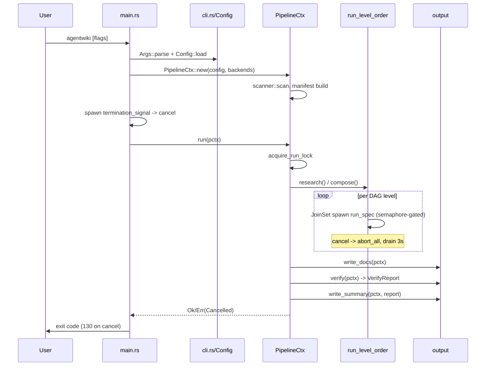
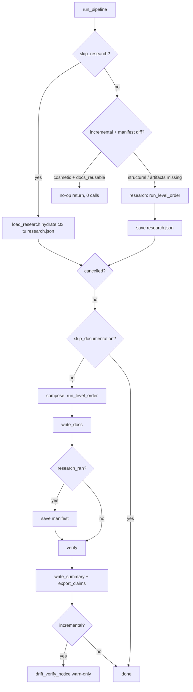

# Documentation Generation Pipeline — Deep Dive

## 1. Mục đích module

**Documentation Generation Pipeline** là domain nghiệp vụ cốt lõi (importance 9.5) của agentwiki: nó điều phối toàn bộ luồng **Preprocess → Research → Compose → Write → Verify** để biến một source repository thành bộ tài liệu kiến trúc dạng C4 (Overview, Architecture, Workflow, Deep-Exploration, Boundary, Database). Module sở hữu:

- `PipelineCtx` — trạng thái chia sẻ được bọc trong `Arc`, truyền cho mọi spec instance.
- Giới hạn concurrency qua `tokio::sync::Semaphore`.
- Cooperative cancellation qua `CancellationToken`.
- Run lock, incremental gate (manifest diff), và `RunStats` cho báo cáo tổng kết.

Module **không** tự gọi LLM và cũng không tự parse AST — mọi inference đều đi qua trait `AgentBackend` (subprocess tới `devin`/`claude`/`codex`), và pipeline chỉ orchestrate: quét repo, lập lịch DAG, ghi kết quả, kiểm tra.

## 2. Cấu trúc nội bộ

Module gồm ba phần, đúng như `code_paths` đã khai báo:

| Phần | File | Vai trò |
|---|---|---|
| Pipeline Orchestrator | `src/pipeline/mod.rs` | `PipelineCtx`, `run`, `run_pipeline`, `run_level_order`, `acquire_run_lock`, `dry_run_report` |
| CLI Entry & Command Surface | `src/main.rs`, `src/cli.rs` | Parse args (clap), phân tuyến subcommand read-only, cài signal handler |
| Deterministic Output & Verification | `src/output/{mod,writer,verify,summary,boundary,database}.rs` | Ghi doc tree, render doc không-LLM, verify artifact |

### 2.1 `PipelineCtx` — shared run context

[mod.rs:22-53](file:///home/ruan/datspace/agentwiki/src/pipeline/mod.rs)

`PipelineCtx` gom mọi thứ một spec instance cần:

- `config` — config đã resolve (CLI > `agentwiki.toml` > defaults).
- `scan` — `ScanData` của Phase 0 (file set, directory structure, README).
- `manifest: Option<Manifest>` — fingerprint của input; chỉ build khi `--incremental` hoặc `Mode::Agentic` vì chi phí hash mọi file + import graph không nhỏ.
- `ctx: ResearchContext` — kho kết quả research/compose theo key.
- `cache`, `quota`, `prompts` — bộ ba governance tại ranh giới "trả phí": content-hash cache, daily cap + `calls.jsonl`, prompt template loader.
- `semaphore` — bound số CLI call đồng thời (`config.max_parallels`).
- `stats: Mutex<RunStats>` — `cache_hits`, `cli_calls`, `saved_secs`, per-spec timings.
- `empty_cwd` — cwd "sạch" cho embedded-mode calls (agent CLI không tự đọc repo).
- `progress`, `cancel` — UI tiến trình và token hủy hợp tác.
- `backends: HashMap<BackendKind, Arc<dyn AgentBackend>>` — backend đã construct, injectable cho test (`MockBackend`).

`PipelineCtx::new` (dòng 91–127) chạy `scanner::scan` **đồng bộ**, build manifest có điều kiện, tạo `<internal>/` và `empty-cwd/`, rồi construct backend mặc định từ `models.efficient`/`models.powerful` qua `BackendKind::parse` — chỉ những kind thực sự được config tham chiếu mới được khởi tạo.

### 2.2 Run lock

`acquire_run_lock` (dòng 162–193) dùng `create_new` trên `<internal>/run.lock` chứa pid:

- Lock tồn tại + pid còn sống (`crate::sys::pid_alive`) → `Error::AlreadyRunning`.
- Lock stale (pid chết hoặc file không đọc được) → reclaim, retry một lần.
- `RunLock` implement `Drop` để xóa file khi kết thúc.

Đây là cơ chế chống double-run; các subcommand read-only (`doctor`, `drift`, `status`) cố tình **không** đi qua đường này.

### 2.3 Output stage (`src/output`)

`mod.rs` re-export: `boundary_doc`, `database_doc`, `write_summary`, `verify`/`VerifyReport`, `write_docs`.

- **`writer.rs`**: ánh xạ cố định `DOCS` từ ctx key → đường dẫn tương đối (`"overview" → "1.Overview.md"`, …), cộng thêm `4.Deep-Exploration/<domain>.md` per domain. Mọi ghi đều qua `util::write_atomic`. Danh sách file đã ghi được lưu vào `<internal>/written-docs-<sha12>.json` — **ghi sau cùng** để mtime của nó làm bằng chứng "write hoàn tất sau `research.json`", phục vụ `docs_reusable`. Stale deep-dive cleanup chỉ xóa file nằm trong danh sách lần trước mà lần này không ghi — file user tự thêm vào output dir không bị đụng.
- **`verify.rs`**: post-write check không bao giờ fail pipeline. Kiểm tra file kỳ vọng tồn tại/non-empty, đếm + heuristic-check mermaid block (header hợp lệ, body non-empty, không unterminated), và chạy `mermaid-fixer -d <out> --dry-run` nếu cài đặt và `config.verify.mermaid_fixer` bật. Kết quả gói trong `VerifyReport` (serialize được).
- **`boundary.rs` / `database.rs`**: renderer deterministic cho `5.Boundary-Interfaces.md` và `6.Database-Overview.md` — không tốn LLM call.
- **`summary.rs`**: `write_summary` xuất markdown summary + `SummaryJson` từ `RunStats` và `VerifyReport`.

## 3. Key interfaces

```rust
// Điểm vào chính (re-export qua lib.rs)
pub struct PipelineCtx { /* ... */ }
impl PipelineCtx {
    pub async fn new(config: Config,
        backends: Option<HashMap<BackendKind, Arc<dyn AgentBackend>>>)
        -> Result<Arc<Self>>;
    pub fn backend(&self, kind: BackendKind) -> Result<Arc<dyn AgentBackend>>;
}
pub async fn run(pctx: &Arc<PipelineCtx>) -> Result<()>;
pub fn dry_run_report(config: &Config, scan: &ScanData) -> String;

// Output
pub async fn write_docs(pctx: &PipelineCtx) -> Result<Vec<PathBuf>>;
pub async fn verify(pctx: &PipelineCtx) -> Result<VerifyReport>;
pub async fn write_summary(pctx: &PipelineCtx, report: &VerifyReport, elapsed: Duration) -> Result<()>;
```

CLI surface (`src/cli.rs`): `Args` là lệnh `generate` ngầm định ở top-level; `Command` chỉ có ba variant read-only — `Doctor`, `Drift`, `Status`. `From<&Args> for CliOverrides` chuyển cờ CLI sang lớp override của config. Lưu ý: không có `Command::Generate` — generate là default khi không có subcommand.

## 4. Control flow

### 4.1 Sequence tổng thể



### 4.2 `run_pipeline` — phase sequencing và incremental gate



Điểm đáng chú ý trong `run_pipeline` (`src/pipeline/mod.rs`):

- **Incremental gate**: nếu diff manifest là `Cosmetic` **và** `docs_reusable` xác nhận danh sách written-docs tồn tại, non-empty, mọi file còn trên đĩa, và `research.json` không mới hơn danh sách → run là no-op 0 call. Manifest cố tình **không** bị ghi đè để delta cosmetic còn hiện trong `agentwiki status`.
- **Manifest chỉ save khi `research_ran`**: `--skip-research` compose trên research cũ nên không được phép advance manifest — tránh trạng thái "manifest khẳng định docs phản ánh tree hiện tại" trong khi docs render từ research cũ. Tương tự, manifest chỉ save **sau** `write_docs` để run bị interrupt giữa compose không để lại manifest nói dối.
- **`export_claims`** ghi `agentwiki.claims.json` cạnh docs (non-fatal) để CI `drift` tìm thấy mà không cần nhớ `--export-claims`.
- **`drift_verify_notice`**: sau incremental run, re-check claims vừa ghi với import graph — warn-only, không ảnh hưởng exit code (strict gating là việc của `agentwiki drift --strict` trong CI).

### 4.3 `run_level_order` — topo scheduling + cancellation

Mỗi phase (`research`, `compose`) lấy specs từ `registry::{research_specs, compose_specs}`, tính `topo_levels`, rồi chạy từng level:

- Specs trong cùng level spawn vào `tokio::task::JoinSet`, mỗi task gọi `run_spec(&spec, &pctx)`; concurrency thực tế bị bound bởi `pctx.semaphore` trong runner.
- `tokio::select!` với `biased`: ưu tiên drain `join_next` khi cả hai branch sẵn sàng; khi `pctx.cancel` kích hoạt → `abort_all()` (dropping backend futures kill child CLIs nhờ `kill_on_drop`), drain có giới hạn **3 giây** để task kẹt trong sync poll không treo shutdown, rồi trả `Error::Cancelled`.
- Giữa các level kiểm tra `is_cancelled()` để không start level tiếp theo.

### 4.4 `main.rs` — entry, signal, exit code

- Subcommand `doctor`/`drift`/`status` return exit code trực tiếp, **không** lấy run lock, **không** cài cancellation handler — đúng tính chất read-only (`drift` vẫn scan để lấy file list nhưng không ghi state).
- `--dry-run` → scan + `dry_run_report` (effective config + DAG theo phase, kèm exec kind `llm`/`deterministic`, model tier, fan-out `×N dirs`/`×N(domains)`, deps) rồi thoát.
- Signal handler: SIGINT/SIGTERM thứ nhất → `cancel.cancel()` (hủy hợp tác); tín hiệu thứ hai → `exit(130)`. Nếu pipeline trả về mà `cancel` đã kích → `exit(130)` theo convention SIGINT.
- Tracing: `-v/-vv/-vvv` → info/debug/trace, `RUST_LOG` override.

## 5. Quyết định implement đáng chú ý

1. **Manifest build có điều kiện**: chỉ khi `--incremental` (cần diff) hoặc `Mode::Agentic` (mix vào cache key). Run embedded thường không được gì từ nó — tiết kiệm một lượt read+hash toàn bộ file + import graph.
2. **Backend injection**: `PipelineCtx::new(config, Some(map))` cho phép test nhét `MockBackend` — toàn bộ pipeline chạy offline không tốn call nào (`tests/*_offline.rs`).
3. **Fail-open an toàn ở incremental gate**: `docs_reusable` trả `false` ở mọi trạng thái không chắc (output dir mất, written-docs corrupt, `research.json` mới hơn written list) → run thật thay vì no-op trên docs cũ.
4. **Written-docs list như commit marker**: file `<internal>/written-docs-<sha12>.json` được ghi *cuối cùng* bằng atomic write, đóng vai trò bằng chứng "run đã hoàn tất" — ordering mtime so với `research.json` phát hiện interrupt giữa compose.
5. **Biased select + bounded drain**: ưu tiên hoàn thành task khi cancel và join cùng pending; drain 3s tránh hang shutdown bởi sync-poll task.
6. **Verify/summary/claims non-fatal**: giai đoạn cuối pipeline thu thập vấn đề vào report thay vì fail — strictness được dồn vào `drift --strict` ở CI.
7. **Hai `Phase` enum, bốn stage danh nghĩa**: code chỉ có `Phase::{Research, Compose}`; Preprocess là scan (Phase 0 input) và Verify nằm ở `output/verify.rs` — không phải `Phase`, nên enum sẽ không tự mở rộng thành 4 nếu không refactor.
8. **Stale deep-dive cleanup bị bound**: chỉ xóa path từng nằm trong written list của chính tool, tuyệt đối không quét "mọi `.md` không nhận ra" — file user tự thêm an toàn.

## 6. Associated files

| File | Nội dung |
|---|---|
| `src/pipeline/mod.rs` | `PipelineCtx`, `RunStats`, `RunLock`, `run`, `run_pipeline`, `research`/`compose`, `run_level_order`, `dry_run_report`, `drift_verify_notice`, `docs_reusable` |
| `src/main.rs` | `#[tokio::main]` entry, phân tuyến subcommand read-only, signal handler, `init_tracing` |
| `src/cli.rs` | `Args`, `Command` (`Doctor`/`Drift`/`Status`), `StatusArgs`, `DoctorArgs`, `Lang`, `From<&Args> for CliOverrides` |
| `src/output/mod.rs` | Re-export surface của output stage |
| `src/output/writer.rs` | `DOCS` map, `write_docs`, written-docs manifest, stale cleanup, `sanitize_filename` |
| `src/output/verify.rs` | `VerifyReport`, `verify`, heuristic mermaid check, `mermaid-fixer` hook |
| `src/output/summary.rs` | `write_summary` — markdown + JSON run summary |
| `src/output/boundary.rs` | `boundary_doc` — renderer deterministic cho boundary doc |
| `src/output/database.rs` | `database_doc` — renderer deterministic cho database doc |

**Dependencies vào module khác**: `agent::registry` (spec DAG + `topo_levels`), `agent::run_spec` + `ResearchContext`, `backend::{AgentBackend, BackendKind, for_kind}`, `scanner::scan`, `manifest` (build/diff/classify/output_key), `cache`, `quota`, `prompt::PromptLoader`, `drift::{claims, analyze}`, `sys::pid_alive`, `util::write_atomic`, `progress`. Lỗi đi qua `crate::error::{Error, Result}`; cancellation surface là `Error::Cancelled`.