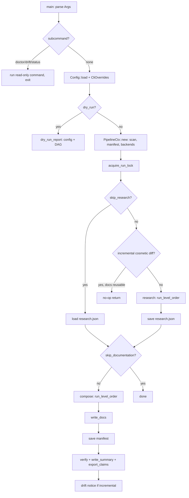
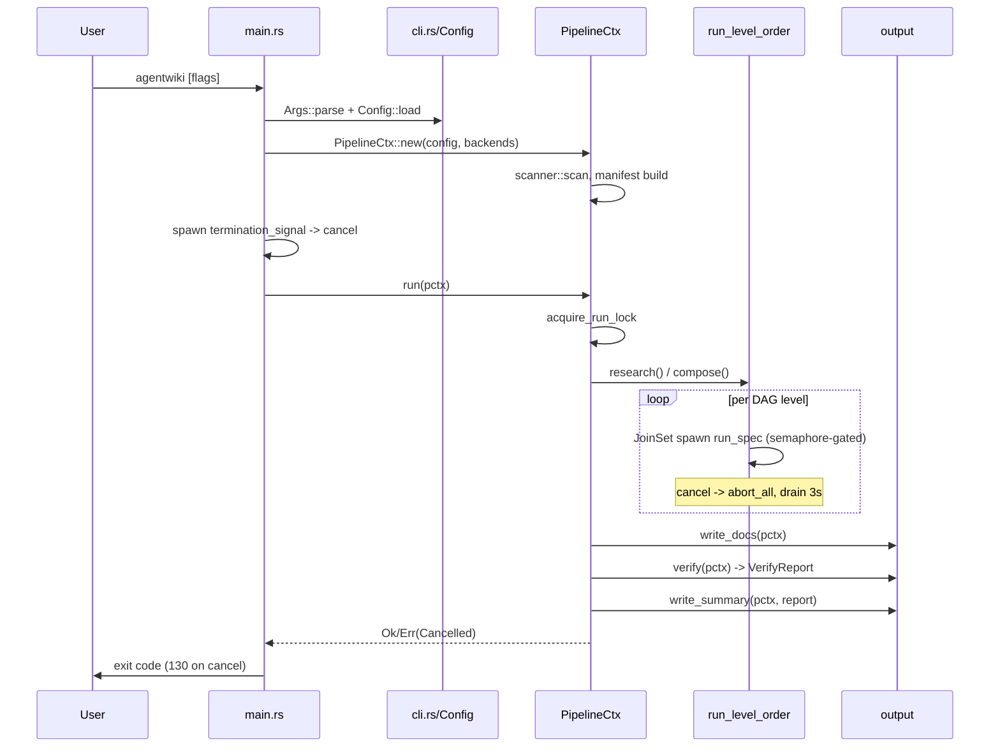

# Deep-dive: Documentation Generation Pipeline

## 1. Mục đích của module

`Documentation Generation Pipeline` là **core business domain** của agentwiki — nơi điều phối toàn bộ hành trình biến một source repository thành bộ tài liệu kiến trúc kiểu C4. Module chịu trách nhiệm:

- Tuần tự hóa 5 giai đoạn: **Preprocess → Research → Compose → Write → Verify**.
- Sở hữu `PipelineCtx` — shared context được bọc trong `Arc` và truyền cho mọi spec instance.
- Giới hạn concurrency qua `Semaphore`, xử lý cooperative cancellation qua `CancellationToken`.
- Áp dụng cổng incremental (manifest diff) và khóa chống chạy đôi (`run.lock`).
- Thu thập thống kê run (`RunStats`) cho báo cáo tổng kết.

Về mặt kiến trúc, module là **điểm duy nhất** nối CLI surface với các domain còn lại: scanner (Phase 0), agent orchestration (Research/Compose), backend abstraction (subprocess CLIs), governance (cache/quota/manifest), và output/verify (deterministic renderers).

## 2. Cấu trúc nội bộ

Module gồm 3 sub-module:

| Sub-module | Vị trí | Vai trò |
|---|---|---|
| Pipeline Orchestrator | `src/pipeline/mod.rs` (~490 dòng) | `PipelineCtx`, `run`, `run_pipeline`, `run_level_order`, `dry_run_report`, run lock |
| CLI Entry & Command Surface | `src/main.rs`, `src/cli.rs` | Parse args, dispatch subcommands, signal handling, tracing init |
| Deterministic Output & Verification | `src/output/` | `write_docs`, `boundary_doc`, `database_doc`, `write_summary`, `verify` |

### `PipelineCtx` — shared run context

```rust
pub struct PipelineCtx {
    pub config: Config,
    pub scan: ScanData,
    pub manifest: Option<Manifest>,
    pub ctx: ResearchContext,
    pub cache: Cache,
    pub quota: Quota,
    pub prompts: PromptLoader,
    pub semaphore: Semaphore,
    pub stats: Mutex<RunStats>,
    pub empty_cwd: PathBuf,
    pub progress: Progress,
    pub cancel: CancellationToken,
    backends: HashMap<BackendKind, Arc<dyn AgentBackend>>,
}
```

`PipelineCtx::new` (async, trả `Arc<Self>`) thực hiện tuần tự: `scanner::scan` đồng bộ → build `Manifest` **chỉ khi** `--incremental` hoặc `Mode::Agentic` (vì manifest tốn một lượt read+hash mọi file cộng import graph — không ai consume thì không đáng) → tạo `<internal>/` và `empty-cwd/` → dựng backends. Backends có thể inject (tests dùng `MockBackend`); `None` thì `default_backends` parse `models.efficient`/`models.powerful` qua `BackendKind::parse` và chỉ khởi tạo các kind thực sự được tham chiếu.

### `RunStats`

Bookkeeping cho summary report: `cache_hits`, `cli_calls`, `saved_secs` (giây tiết kiệm nhờ cache), `timings` (wall time per-spec). Được bảo vệ bởi `Mutex` vì nhiều spec chạy song song cùng ghi vào.

### Run lock

`acquire_run_lock` dùng `OpenOptions::create_new` trên `<internal>/run.lock` — atomic, không race. File chứa pid của process. Logic reclaim:

- Lock tồn tại + pid còn sống (`crate::sys::pid_alive`) → `Error::AlreadyRunning { pid }`, fail fast.
- Lock tồn tại + pid chết / file không đọc được → stale, xóa và thử lại (tối đa 2 vòng).
- `RunLock` implement `Drop` để xóa file khi run kết thúc — kể cả panic path.

## 3. Các interface chính

| Interface | Chữ ký | Vai trò |
|---|---|---|
| `PipelineCtx::new` | `async fn new(config, backends: Option<...>) -> Result<Arc<Self>>` | Dựng context: scan → manifest → dirs → backends |
| `run` | `pub async fn run(pctx: &Arc<PipelineCtx>) -> Result<()>` | Wrapper: acquire lock, settle progress (`done`/`cancel`/`fail`) |
| `run_pipeline` | private | Sequencing: incremental gate → research → compose → write → verify → summary |
| `run_level_order` | `async fn(specs, pctx) -> Result<()>` | Chạy DAG theo topo levels; parallel trong level; hủy cooperative |
| `dry_run_report` | `fn(config, scan) -> String` | Render effective config + task DAG cho `--dry-run` |
| `PipelineCtx::backend` | `fn(kind) -> Result<Arc<dyn AgentBackend>>` | Lookup backend đã dựng; `BackendNotAvailable` nếu thiếu |

CLI surface (`src/cli.rs`) định nghĩa `Args`, `Command::{Doctor, Drift, Status}`, `StatusArgs`, `DoctorArgs`, `Lang`, và `From<&Args> for CliOverrides`. Lưu ý: **`generate` không phải là `Command` variant** — nó là default action qua top-level args; ba subcommand kia là read-only và không chiếm run lock.

## 4. Luồng điều khiển

### 4.1 Entry & sequencing



`main.rs` (Tokio async main): parse `cli::Args` bằng clap → init tracing (`EnvFilter` từ `RUST_LOG` hoặc `-v`) → route subcommands read-only (không lock) → build `Config` từ `CliOverrides` (precedence CLI > `agentwiki.toml` > defaults) → `PipelineCtx::new` → spawn signal handler SIGINT/SIGTERM cancel `pctx.cancel` (signal thứ hai force-exit 130) → `pipeline::run`.

### 4.2 Sequence diagram



### 4.3 Incremental gate

Trong `run_pipeline`, khi `--incremental` và manifest cũ load được:

- `prev.diff(cur)` → `classify` ra `Significance::Cosmetic` hoặc `Structural(reasons)`.
- `Cosmetic` + `docs_reusable(pctx)` → in thông báo và **return Ok — 0-call no-op**. Manifest không được ghi đè, nên delta cosmetic vẫn hiện trong `agentwiki status` thay vì bị "hấp thụ".
- `docs_reusable` kiểm tra: output dir tồn tại, `research.json` và written-docs list đọc được, `research.json` không mới hơn written list (fail-open nếu run trước bị ngắt giữa research và compose), mọi doc trong list còn trên disk.

### 4.4 DAG scheduling & cancellation

`run_level_order` duyệt `registry::topo_levels(specs)` — mỗi level là tập spec không phụ thuộc lẫn nhau:

- Mỗi spec spawn vào `JoinSet` (spec + `Arc<PipelineCtx>` clone), `run_spec` tự acquire semaphore permit nên concurrency bị chặn bởi `config.max_parallels`.
- Vòng lặp `tokio::select! { biased; ... }` ưu tiên nhận kết quả task; nhánh `cancel.cancelled()` gọi `set.abort_all()` — abort làm drop backend futures, kéo theo `kill_on_drop` giết child CLI processes — rồi drain JoinSet với timeout 3s để task kẹt trong sync poll không treo shutdown.
- Giữa các level và giữa các phase, `pctx.cancel.is_cancelled()` được check lại để không start level/phase mới.

## 5. Quyết định implementation đáng chú ý

1. **Hai `Phase`, không phải bốn.** Code chỉ model `Phase::{Research, Compose}`; Preprocess là Phase-0 input (scanner) và Verify sống trong `src/output/verify.rs`. Tên "4-stage pipeline" là khái niệm marketing — enum sẽ không mọc lên 4 nếu không refactor.
2. **Manifest save sau `write_docs`, không phải trước.** Manifest khẳng định "docs trên disk phản ánh tree này" — ghi sớm sẽ cho phép một compose bị ngắt để lại manifest claim state mà docs chưa đạt, khiến `--incremental` run sau no-op vĩnh viễn trên stale docs.
3. **Manifest chỉ save khi `research_ran`.** `--skip-research` compose trên research cũ nên không được phép claim tree.
4. **`empty_cwd` cho embedded mode.** Một cwd sạch để subprocess CLI không vô tình đọc repo đang quét.
5. **Warn-only drift sau incremental run.** `drift_verify_notice` reload claims vừa ghi, chạy `drift::analyze`, đếm findings `is_gating()` và in cảnh báo — nhưng không ảnh hưởng exit code. Strict gating thuộc về `drift --strict` trong CI.
6. **Non-fatal artifacts.** `export_claims` viết `agentwiki.claims.json` cạnh docs để CI tìm được mà không cần `--export-claims`; lỗi chỉ warn.
7. **`biased` select.** Nhánh `join_next` được ưu tiên để drain kết quả trước khi xử lý cancel — tránh bỏ sót lỗi task đã hoàn thành.

## 6. Error & exit semantics

- Mọi lỗi đi qua `crate::error::{Error, Result}`; cancellation surface là `Error::Cancelled` → exit 130.
- `Error::AlreadyRunning { pid }` khi lock sống; `Error::BackendNotAvailable` khi spec yêu cầu kind chưa dựng.
- Join error của task được bọc thành `Error::Pipeline("join: ...")`.

## 7. Associated files

| File | Vai trò |
|---|---|
| `src/pipeline/mod.rs` | Orchestrator: `PipelineCtx`, `run`, `run_pipeline`, `run_level_order`, `acquire_run_lock`, `docs_reusable`, `drift_verify_notice`, `dry_run_report` |
| `src/main.rs` | Tokio entry: parse args, tracing, signal handler, dispatch |
| `src/cli.rs` | `Args`/`Command`/`CliOverrides` definitions |
| `src/output/mod.rs` | Re-export `write_docs`, `verify`, `write_summary` |
| `src/output/writer.rs` | Ghi doc tree; written-docs manifest (`load_written_docs`) |
| `src/output/verify.rs` | `verify` → `VerifyReport` |
| `src/output/summary.rs` | `write_summary`: markdown + `SummaryJson` |
| `src/output/boundary.rs` | `boundary_doc` — deterministic renderer |
| `src/output/database.rs` | `database_doc` — deterministic renderer |