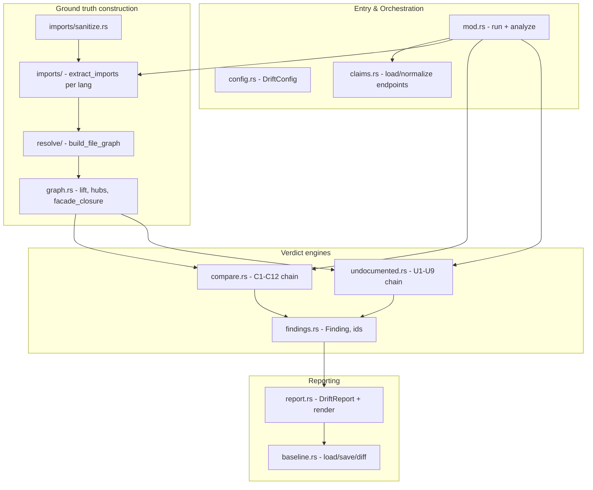
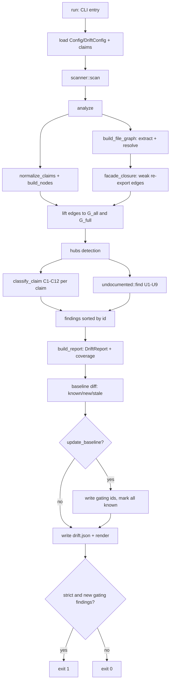

# Deep-dive: Drift Detection & Claim Verification (`src/drift`)

## 1. Mục đích của module

`src/drift` là engine xác minh chỉ-đọc đứng sau lệnh `agentwiki drift`. Trong khi pipeline generate dùng LLM để *suy ra* các quan hệ phụ thuộc giữa các module của codebase mục tiêu, drift làm việc ngược lại: nó **tái dựng ground truth** bằng cách trích xuất tĩnh đồ thị import thực tế (Rust, Python, JS/TS), resolve từng import thành cạnh file-level, rồi đối chiếu với các "dependency claim" do LLM sinh ra trong `research.json` / `agentwiki.claims.json`.

Ba đặc tính nền tảng:

- **Hoàn toàn read-only và LLM-free** — không gọi backend, không cần run lock, không ghi vào pipeline state; side-effect duy nhất là `<internal>/drift.json` và baseline file (khi `--update-baseline`).
- **Bất đối xứng có chủ đích về evidence** — verdict cho claim dùng đồ thị rộng nhất (`G_all`, gồm cả `mod` decl), còn phát hiện undocumented edge dùng đồ thị chặt nhất (chỉ strong evidence: `Import`, `InlinePath`, `ReExport`). Điều này làm verdict hào phóng và undocumented-edge detection cố ý conservative.
- **CI-gateable** — exit code deterministic: `0` ok/warning, `1` khi `--strict` gặp phantom/reversed mới không nằm trong baseline, `2` khi claims thiếu/không hợp lệ.

Module này là lớp verification đóng vòng chống lại failure mode chính của tài liệu do LLM sinh: dependency claim bịa hoặc đã cũ.

## 2. Cấu trúc nội bộ

| Sub-module | Files | Vai trò |
|---|---|---|
| Orchestration | `mod.rs`, `config.rs`, `claims.rs` | `run()` (CLI-facing, IO) và `analyze()` (pure core); `DriftConfig`; load + normalize claim endpoints |
| Import Extraction | `imports/{mod,sanitize,rust,python,js}.rs` | Sanitize comment/string rồi trích `RawImport` với byte-exact offsets |
| Resolution & Graph | `resolve/{mod,rust,python,js}.rs`, `graph.rs` | Resolve import → file, build `FileGraph`, `facade_closure`, lift lên node-level `NodeGraph` |
| Claim Classification | `compare.rs`, `findings.rs` | C1–C12 ordered verdict chain; `Finding`, `finding_id` |
| Undocumented Edges | `undocumented.rs` | U1–U9 suppression filter chain trên strict graph |
| Reporting | `report.rs`, `baseline.rs` | `DriftReport` versioned schema, render, baseline diff cho `--strict` |

## 3. Các interface chính

- **`run(project_path, config_path, &DriftArgs, verbose) -> i32`** (`mod.rs`): entry point do CLI gọi. Chịu trách nhiệm toàn bộ IO: load `Config`/`DriftConfig`, resolve claims path, scan, baseline diff, ghi `drift.json`, render, trả exit code.
- **`analyze(&DriftConfig, &root, &ScanData, &[CoreDependency], &[glob::Pattern]) -> Outcome`** (`mod.rs`): pure core, tách riêng để test không cần process-level IO. `Outcome` gồm `findings` (sorted by id), `filtered` (đếm theo U-filter), `hubs`.
- **`DriftArgs`** (`mod.rs`, clap): `--claims`, `--baseline`, `--max-depth`, `--strict`, `--update-baseline`, `--export-claims`, `--json`, `-p/-c/-o`.
- **`extract_imports` / `sanitize` / `expand_use_tree`** (`imports/`): extractor per-language; `sanitize` blank comment/string trước khi regex, giữ byte offset để ánh xạ line number.
- **`build_file_graph` / `resolve` / `RepoIndex::build`** (`resolve/`): dispatch `ImportSpec` → `Resolution::{Internal(Vec<PathBuf>), External, Unresolved}`.
- **`classify_claim` / `normalize_claims`** (`compare.rs`): verdict chain và dedupe claim theo `(from, to)`.
- **`find` / `reachable` / `hubs` / `facade_closure`** (`undocumented.rs`, `graph.rs`): undocumented-edge detection và tiện ích đồ thị.
- **`Baseline::load/save`, `build_report`, `render`, `strict_failures`** (`baseline.rs`, `report.rs`): persistence và output.

`DriftConfig` (`config.rs`) chứa các knob quan trọng: `max_transitive_depth` (mặc định 3), `min_language_coverage`, `min_undocumented_imports`, `max_undocumented_reported`, `hub_in_degree_ratio`, `hub_min_nodes`, `test_globs`, `ignore_nodes`/`ignore_files`, `claims_path`, `baseline_path`.

## 4. Luồng dữ liệu và điều khiển

### 4.1 Import extraction (`imports/`)

`imports/mod.rs` map extension → `Lang` rồi route source đã sanitize tới extractor tương ứng. `sanitize.rs` blank comment và string literal theo từng ngôn ngữ nhưng **giữ nguyên byte offset** để `line` trên `RawImport` chính xác. Mỗi extractor trả `RawImport { ImportSpec, EvidenceKind, test_only, line }`:

- **`rust.rs`**: expand `use` tree (`expand_use_tree`), `mod` decl, inline path `crate::`/`super::`/`self::`, đánh dấu `cfg(test)` → `test_only`.
- **`python.rs`**: `import x`, `from x import y`, relative `from .`/`..` (level), parenthesized/`as` names; re-export gắn `EvidenceKind::ReExport`.
- **`js.rs`**: regex cho 5 form ESM/CJS/dynamic import.

### 4.2 Resolution → `FileGraph` (`resolve/`, `graph.rs`)

`resolve/mod.rs` dispatch `ImportSpec` sang resolver ngôn ngữ, trả `Internal` / `External` / `Unresolved`:

- **`rust.rs`**: build `RustIndex` — mỗi `.rs` được gán `(crate, module path)` qua `find_pkg_root`/`classify`/`pkg_name` từ `Cargo.toml`; xử lý `crate::`, `self::`, `super::`, named root kiểu 2015, module descent.
- **`python.rs`**: `level > 0` → climb thư mục cha; `level = 0` → suffix-match module về `x.py` hoặc `x/__init__.py`.
- **`js.rs`**: normalize `./`/`../`, thử literal path, extension substitution (kể cả `.js`→`.ts`), `index.*` children.

`build_file_graph` tích lũy `FileEdges` cùng per-file total/unresolved counts (dùng cho C10). Sau đó `graph::facade_closure` thêm weak `Facade` edge xuyên qua re-export facade (`lib.rs`, `mod.rs`, `__init__.py`, `index.*`) tới depth 3 — để claim "A dùng B qua facade" vẫn confirm được.

`graph::lift` nâng file edges lên node-level `NodeGraph` **hai lần**:

- `G_all` — gồm `ModDecl` edges, chỉ dùng làm containment evidence (C4).
- `G_full` — loại `ModDecl`, dùng cho direct/transitive/reversed verdict và undocumented detection.

`NodeGraph::hubs` phát hiện hub node (in-degree ratio + min nodes) — hub bị chặn làm intermediate trong C6 và là suppression trong U5.

### 4.3 Claim classification — C1–C12 (`compare.rs`)

`normalize_claims` normalize endpoint (`claims::normalize_endpoint` → `Endpoint::File/Dir/Hidden/Empty/Unknown`), dedupe theo `(from, to)` giữ `importance` cao nhất; self-collapse thành self-loop cho C3.

`classify_claim` chạy chain **first-verdict-wins**, guard chạy trước evidence — cố ý, vì claim không-checkable là `unverifiable` bất kể code thể hiện gì:

| Order | Rule | Kết quả |
|---|---|---|
| C1/C2 | endpoint `Empty` / `Unknown` | `unverifiable` |
| C3 | self-loop | `structural` |
| C7 | `kind_not_checkable` (vd. `data_flow`) | `unverifiable` |
| C8 | `non_code_endpoint` | `unverifiable` |
| C9 | `language_coverage < min_language_coverage` | `unverifiable` |
| C10 | `resolver_confidence` (unresolved ratio cao hoặc 0 internal edge) | `unverifiable` |
| C4 | containment trên `G_all` | `confirmed` / `structural` |
| C5 | direct edge trên `G_full` | `confirmed` |
| C6 | transitive qua `NodeGraph::reachable` ≤ `max_transitive_depth`, chặn hub intermediate | `confirmed` |
| C11 | backward edge trên `G_full` | `reversed` |
| C12 | còn lại | `phantom` |

`Finding.id` là stable, kind-free: `class:from->to` (`findings.rs`) — cần thiết cho baseline diff.

### 4.4 Undocumented edges — U1–U9 (`undocumented.rs`)

Duyệt các node edge trên `G_full` chưa được claim, áp suppression chain; mỗi lượt suppress được đếm vào `filtered`:

- **U1**: endpoint chưa-claimed; **U2**: containment; **U3**: yêu cầu strong evidence non-test (`Import`/`InlinePath`/`ReExport` qua `strong_evidence`); **U4**: `ignore_nodes`/`ignore_files` globs; **U5**: target là hub; **U6**: đã có claim theo chiều ngược; **U7**: suppress khi claims đã nối `a⇝b` qua distance ≥ `MIN_COVERING_PATH = 3` (`claim_distance` BFS); **U8**: yêu cầu ≥ `min_undocumented_imports` distinct import sites; **U9**: cap `max_undocumented_reported`.

### 4.5 Reporting & baseline (`report.rs`, `baseline.rs`)

`build_report` sinh `DriftReport` versioned: `schema_version`, `claims_source`, `claims_total`, `counts` theo class, `coverage` (tỉ lệ `confirmed+reversed+phantom` trên các finding non-undocumented — tức mọi claim đã dedupe nhận verdict thật), `hubs`, `filtered`, `findings`.

`Baseline` là `BTreeSet` của gating finding ids (versioned file, mặc định `<project>/.agentwiki-drift-baseline.json`). `run()` diff: `known` (finding có trong baseline → `in_baseline=true`), `new`, `stale` (id trong baseline không còn xuất hiện). `--update-baseline` ghi toàn bộ gating ids và mark tất cả known → strict không bao giờ fire ngay sau đó. `strict_failures()` → exit 1 khi `--strict` và có gating finding mới.

## 5. Quyết định implementation đáng chú ý

- **Tách `run`/`analyze`**: toàn bộ IO (config, scan, baseline, file writes) nằm ở `run`; `analyze` là hàm thuần túy → test offline dễ dàng.
- **Hai đồ thị lifted**: một lần extract/resolve sinh `FileGraph`, nhưng verdict cần hai mức evidence khác nhau — `G_all` cho containment, `G_full` cho reachability. `ModDecl` chỉ confirm được parent→child containment, không bao giờ là direct dependency evidence.
- **Guard-first ordering**: C7–C10 chạy trước evidence rules (C4–C6) để claim không-checkable không bị confirm nhầm bởi hình dạng containment.
- **Heuristic, không AST**: import extraction là regex trên source đã sanitize — ranh giới đã biết (system boundary loại trừ full AST parsing). U-filters bù bằng cách chỉ báo cáo undocumented edge có strong evidence và đủ import sites.
- **Hub blocking**: hub node (file được import khắp nơi, vd. `lib.rs`) không được làm intermediate trong C6 và bị U5 suppress — tránh confirm giả qua transitive path đi qua "siêu nút".
- **Facade closure depth-3**: giới hạn cứng để closure qua re-export không bùng nổ.
- **Stable finding ids**: `class:from->to` không chứa kind → đổi `dependency_type` của claim không làm baseline lệch.
- **Config-degradation tolerance**: `run()` fallback về `Config::default()` nếu config hỏng (giống `doctor`) — read-only check không nên bị chặn bởi config lỗi; baseline không đọc được chỉ `warn`, không fail.
- **`--export-claims`** là standalone action thoát sớm trước khi cần claims file — cho phép commit `agentwiki.claims.json` làm artifact CI.

## 6. Exit code contract

| Code | Ý nghĩa |
|---|---|
| `0` | ok hoặc chỉ warning; cũng trả về sau `--update-baseline` và `--export-claims` thành công |
| `1` | `--strict` và có gating finding (phantom/reversed) mới không trong baseline |
| `2` | claims thiếu/invalid, project path không đọc được, scan fail, export fail |

## 7. Associated files

- `src/drift/mod.rs` — `run`, `analyze`, `DriftArgs`, `Outcome`, `build_report` (382 dòng)
- `src/drift/config.rs` — `DriftConfig` và defaults/thresholds (283)
- `src/drift/claims.rs` — load claims, `normalize_endpoint`, `Endpoint`, `export_claims` (221)
- `src/drift/compare.rs` — `ClaimedEdge`, `CompareCtx`, `normalize_claims`, `classify_claim` C1–C12 (458)
- `src/drift/graph.rs` — `NodeSet`/`NodeGraph`, `lift`, `hubs`, `facade_closure`, `reachable` (548)
- `src/drift/undocumented.rs` — `find`, U1–U9 filters, `claim_distance` (275)
- `src/drift/findings.rs` — `Finding`, `FindingClass`, `EvidenceRef`, `finding_id` (108)
- `src/drift/report.rs` — `DriftReport`, `Coverage`, `BaselineInfo`, `render`, `REPORT_VERSION` (251)
- `src/drift/baseline.rs` — `Baseline::load/save/from_ids` (82)
- `src/drift/imports/mod.rs` — `Lang::from_extension`, extractor dispatch (155)
- `src/drift/imports/sanitize.rs` — comment/string blanking giữ byte offsets (289)
- `src/drift/imports/rust.rs` — `use` tree, `mod`, inline paths, `cfg(test)` (444)
- `src/drift/imports/python.rs` — absolute/relative `import`/`from`, re-export (207)
- `src/drift/imports/js.rs` — ESM/CJS/dynamic forms (97)
- `src/drift/resolve/mod.rs` — `build_file_graph`, `Resolution`, `RepoIndex` (144)
- `src/drift/resolve/rust.rs` — `RustIndex`, Cargo layout, module descent (303)
- `src/drift/resolve/python.rs` — relative climbs, module suffix match (201)
- `src/drift/resolve/js.rs` — extension probing, `index.*` resolution (131)

Dependencies bên ngoài module: `scanner::scan`/`ScanData` (file set read-only), `agent::reports::CoreDependency`/`DependencyType` (claim schema), `config::Config`/`CliOverrides`, `util::write_atomic` (ghi `drift.json`).