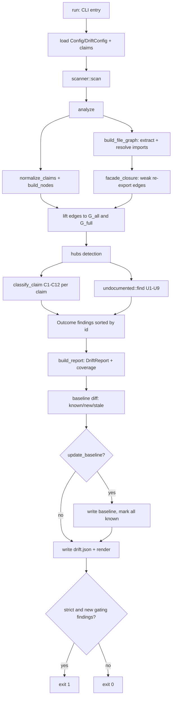

# Drift Detection & Claim Verification — Tài liệu kỹ thuật chuyên sâu

## 1. Mục đích của module

Module `drift` (thư mục `src/drift/`) là động cơ xác minh chỉ-đọc (read-only, hoàn toàn không gọi LLM) đứng sau lệnh `agentwiki drift`. Nhiệm vụ cốt lõi: **đối chiếu các khẳng định phụ thuộc (dependency claims) do LLM sinh ra trong tài liệu với đồ thị import tĩnh thực tế của repository**, nhằm phát hiện các chế độ thất bại điển hình của tài liệu do LLM tạo:

- **Phantom** — cạnh phụ thuộc được khẳng định nhưng không tồn tại bất kỳ bằng chứng mã nguồn nào (ảo giác của LLM).
- **Reversed** — phụ thuộc tồn tại nhưng ngược chiều với khẳng định.
- **Undocumented** — phụ thuộc thật trong code nhưng tài liệu bỏ sót.
- **Unverifiable** — khẳng định không thể kiểm chứng (endpoint rỗng/không xác định, kind không check được, ngôn ngữ ngoài phạm vi…).
- **Structural / Confirmed** — khẳng định đúng về mặt cấu trúc hoặc được xác nhận bởi bằng chứng import.

Module là một bounded context tách biệt: nó chỉ tái sử dụng `ScanData` từ scanner và các kiểu report, không chia sẻ logic với pipeline sinh tài liệu — đảm bảo tầng xác minh không bị "nhiễm" bởi logic sinh. Kết quả được xuất thành `DriftReport` versioned, hỗ trợ baseline diffing và exit code 0/1/2 để dùng làm CI gate (`--strict`).

## 2. Cấu trúc nội bộ

| Sub-module | Files | Vai trò |
|---|---|---|
| Import Extraction | `imports/mod.rs`, `imports/sanitize.rs`, `imports/rust.rs`, `imports/python.rs`, `imports/js.rs` | Trích xuất import thô theo ngôn ngữ trên source đã sanitize (xóa comment/string), với offset byte chính xác |
| Import Resolution & Graph Building | `resolve/mod.rs`, `resolve/rust.rs`, `resolve/python.rs`, `resolve/js.rs` + `graph.rs` | Resolve `ImportSpec` → file trong repo, xây `FileGraph`, áp facade re-export closure |
| Claim Classification | `compare.rs`, `claims.rs`, `findings.rs` | Chuỗi verdict C1–C12 có thứ tự: confirmed / structural / unverifiable / reversed / phantom |
| Undocumented Edge Detection | `undocumented.rs`, `graph.rs` | Chuỗi lọc U1–U9 trên đồ thị bằng chứng mạnh (strict) |
| Reporting & Baselining | `report.rs`, `baseline.rs`, `config.rs`, `mod.rs` | `DriftReport` schema versioned, render, baseline cho `--strict`, `DriftConfig` |

## 3. Các interface chính

- **`run(project_path, config_path, &DriftArgs, verbose) -> i32`** (`mod.rs`): entry point do CLI gọi. Trả exit code 0 (sạch/chỉ known findings), 1 (strict + có gating finding mới), 2 (lỗi).
- **`analyze(&DriftConfig, &root, &ScanData, &[CoreDependency], &[glob::Pattern]) -> Outcome`**: lõi thuần (pure core) — nhận claims đã load và `ScanData`, trả `Outcome` chứa toàn bộ findings. Tách `run`/`analyze` cho phép test offline không cần CLI.
- **`extract_imports` / `sanitize` / `expand_use_tree`** (`imports/*`): mỗi extractor sinh `RawImport { ImportSpec, EvidenceKind, test_only, line }`.
- **`build_file_graph` / `resolve` / `RepoIndex::build`** (`resolve/*`): `resolve` trả `Resolution::{Internal(Vec<PathBuf>), External, Unresolved}`.
- **`classify_claim` / `normalize_claims` / `phantom_and_reversed` / `finding_id`** (`compare.rs`, `claims.rs`, `findings.rs`).
- **`find` / `reachable` / `hubs` / `facade_closure`** (`undocumented.rs`, `graph.rs`).
- **`build_report` / `render` / `strict_failures` / `Baseline::load/save`** (`report.rs`, `baseline.rs`).

## 4. Luồng dữ liệu & điều khiển



### 4.1 Trích xuất import (deterministic, free)

`imports/mod.rs` map extension file → `Lang` và định tuyến source đã qua `sanitize` (blank comment/string theo ngôn ngữ, giữ nguyên offset byte) tới extractor tương ứng:

- **Rust** (`rust.rs`): expand `use` trees (`use a::b::{c, d}`), `mod` declarations, inline path `crate::`/`super::`/`self::`, đánh dấu `cfg(test)` → `test_only`.
- **Python** (`python.rs`): `import x` / `from x import y` absolute và relative (`from .. import`), gồm dạng ngoặc đơn và alias `as`, với `EvidenceKind::ReExport`.
- **JS/TS** (`js.rs`): regex-match 5 form import (ESM static, `export … from`, CJS `require`, dynamic `import()`, v.v.).

Đây là trích xuất heuristic bằng regex — **không phải full AST parsing** (ngoại trừ rõ trong system boundary), nên độ chính xác có giới hạn và được bù bằng chuỗi lọc bảo thủ ở phía undocumented.

### 4.2 Resolution → FileGraph

`resolve/mod.rs` dispatch `ImportSpec` tới resolver theo ngôn ngữ:

- **Rust**: `RustIndex` map crate + module path cho mọi `.rs` (qua `find_pkg_root`/`classify`/`pkg_name` từ `Cargo.toml`), xử lý `crate::`/`self::`/`super::`, named roots 2015-edition và module descent.
- **Python**: relative import `level>0` leo thư mục; `level=0` match suffix module → `x.py` hoặc `x/__init__.py`.
- **JS/TS**: normalize specifier `./`/`..`, thử literal path → thay extension (kể cả `.js`→`.ts`) → probe `index.*` con.

`build_file_graph` tích lũy `FileEdges` kèm đếm total/unresolved per-file (dùng cho C10 `resolver_confidence`). Sau đó `graph::facade_closure` thêm cạnh **Facade yếu** qua các facade re-export (`lib.rs`, `mod.rs`, `__init__.py`, `index.*`) tới độ sâu 3.

### 4.3 Hai đồ thị — bất đối xứng cố ý

Cạnh file-level được **lift** lên node do claims định nghĩa (file/dir) thành hai đồ thị:

- **`G_all`**: gồm cả `ModDecl` — dùng làm bằng chứng containment.
- **`G_full`**: loại `ModDecl` — dùng cho reachability và verdict.

**Quyết định thiết kế quan trọng**: verdict dùng đồ thị rộng nhất (khoan dung tối đa cho claims), còn undocumented-edge detection dùng đồ thị strict nhất (chỉ bằng chứng mạnh `Import`/`InlinePath`/`ReExport`). Cạnh `ModDecl` chỉ xác nhận containment parent→child.

### 4.4 Chuỗi verdict C1–C12 (first verdict wins)

Thứ tự trong `compare.rs` — **guard chạy trước evidence**:

| Code | Điều kiện | Verdict |
|---|---|---|
| C1/C2 | endpoint rỗng / unknown | unverifiable |
| C3 | self-loop | structural |
| C7 | `kind_not_checkable` (vd. `data_flow`) | unverifiable |
| C8 | `non_code_endpoint` | unverifiable |
| C9 | `language_coverage < min_language_coverage` | unverifiable |
| C10 | `resolver_confidence` (tỉ lệ unresolved cao / 0 internal edge) | unverifiable |
| C4 | containment trên `G_all` | confirmed, else structural |
| C5 | cạnh trực tiếp trên `G_full` | confirmed |
| C6 | transitive qua `NodeGraph::reachable` trong `max_transitive_depth`, hubs bị chặn làm intermediate | confirmed |
| C11 | cạnh ngược chiều trên `G_full` | reversed |
| C12 | fallback | phantom |

Việc đặt guard trước evidence đảm bảo claims về endpoint không phải code hoặc ngôn ngữ không hỗ trợ không bị đánh phantom oan.

### 4.5 Chuỗi lọc undocumented U1–U9

`undocumented::find` duyệt các cạnh trên `G_full` chưa được claim, áp suppression chain (mỗi lọc được đếm vào `filtered`):

- **U1** endpoint chưa-claim; **U2** containment (đã có cạnh cha→con); **U3** yêu cầu bằng chứng mạnh non-test (`strong_evidence`); **U4** glob `ignore_nodes`/`ignore_files`; **U5** target là hub; **U6** chiều ngược đã được claim; **U7** suppress khi claims đã nối a⇝b qua `claim_distance` BFS ≥ `MIN_COVERING_PATH=3`; **U8** yêu cầu ≥ `min_undocumented_imports` import site riêng biệt; **U9** cap `max_undocumented_reported`.

### 4.6 Report & baseline

- `findings.rs` gán finding id ổn định, không chứa kind: `class:from->to` — cho phép diff baseline bền với thay đổi phân loại.
- `report.rs::build_report` sinh `DriftReport` (schema_version, counts theo class, **coverage** = (confirmed+reversed+phantom)/findings không-undocumented, hubs, filtered, findings); `render` xuất human-readable hoặc `--json`.
- `baseline.rs` quản `BTreeSet` gating finding ids versioned: load → `mark in_baseline` → tính known/new/stale → `--update-baseline` ghi lại. Report được ghi atomic vào `<internal>/drift.json` qua `util::write_atomic`.
- `--export-claims` ghi file claims có thể commit mà không chạy phân tích.

```mermaid
sequenceDiagram
  participant CLI as run
  participant CLM as claims.rs
  participant RES as resolve::build_file_graph
  participant GPH as graph.rs
  participant CMP as compare.rs
  participant UND as undocumented.rs
  participant RPT as report/baseline
  CLI->>CLM: load_claims
  CLI->>CMP: normalize_claims (dedupe endpoints)
  CLI->>GPH: build_nodes (File/Dir/Hidden)
  CLI->>RES: extract + resolve per file
  RES-->>CLI: FileGraph (edges, unresolved)
  CLI->>GPH: lift -> G_all, G_full; hubs
  loop each ClaimedEdge
    CLI->>CMP: classify_claim (C1-C12)
    CMP-->>CLI: Finding
  end
  CLI->>UND: find (U1-U9 over G_strict)
  UND-->>CLI: undocumented findings + filtered
  CLI->>RPT: build_report, baseline diff
  RPT-->>CLI: DriftReport, exit code
```

## 5. Quyết định triển khai đáng chú ý

1. **Hoàn toàn deterministic & read-only**: không subprocess LLM, không ghi vào target repo — mọi output nằm trong `.agentwiki/` và thư mục docs. Đây là điều kiện để dùng làm CI gate.
2. **Bất đối xứng evidence có chủ đích**: verdicts dùng đồ thị rộng nhất, undocumented dùng strictest — khoan dung với claim, bảo thủ với cáo buộc "thiếu sót".
3. **Guard-first ordering** trong C1–C12 tránh phantom oan cho các loại claim vốn không kiểm chứng được.
4. **Facade closure depth-3** mô hình hóa re-export mà không cần phân tích semantic đầy đủ.
5. **Finding id kind-free** giữ baseline ổn định khi ngưỡng cấu hình đổi class.
6. **Claims path linh hoạt**: `--claims` explicit, fallback tìm trong `<internal>/research.json` rồi `<output>/agentwiki.claims.json`.
7. **Giới hạn đã biết**: extractor regex/heuristic → độ chính xác bị chặn; U-filters bù bằng cách suppress edge ít tin cậy, nên undocumented detection **cố ý conservative**. Mở rộng extractor cho ngôn ngữ mới là đòn bẩy chính cho repo đa ngôn ngữ.

## 6. Files liên quan

- `src/drift/mod.rs` — `run`, `analyze`, orchestration, exit codes
- `src/drift/compare.rs` — chuỗi verdict C1–C12, `CompareCtx`
- `src/drift/graph.rs` — `build_nodes`, `lift`, `NodeGraph::reachable`, `hubs`, `facade_closure`
- `src/drift/undocumented.rs` — chuỗi lọc U1–U9, `claim_distance` BFS
- `src/drift/claims.rs` — `load_claims`, `normalize_endpoint`, `normalize_claims`
- `src/drift/config.rs` — `DriftConfig` (thresholds, globs, caps)
- `src/drift/findings.rs` — `finding_id`, finding model
- `src/drift/report.rs` — `DriftReport`, `build_report`, `render`
- `src/drift/baseline.rs` — `Baseline::load/save`, known/new/stale diff
- `src/drift/imports/{mod,sanitize,rust,python,js}.rs` — extraction layer
- `src/drift/resolve/{mod,rust,python,js}.rs` — resolution layer, `RepoIndex`, `Resolution`