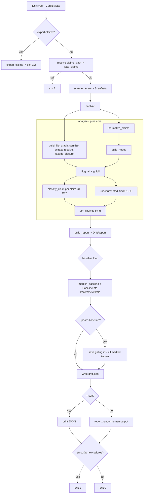

# Module Deep-Dive: Drift Verification (`src/drift`)

## 1. Mục đích của module

**Drift Verification** là domain xác minh *read-only* của agentwiki, hiện thực câu lệnh `agentwiki drift`. Module so sánh các cạnh phụ thuộc mà pipeline LLM *tuyên bố* (claims — `relationships.core_dependencies` trong `research.json` hoặc file export `agentwiki.claims.json`) với đồ thị import *thật* được trích xuất tĩnh từ mã nguồn, nhằm phát hiện ba loại lệch pha:

- **Phantom**: docs tuyên bố `A → B` nhưng code không có bằng chứng nào.
- **Reversed**: code có `B → A` nhưng docs ghi ngược chiều.
- **Undocumented**: cạnh thật (bằng chứng mạnh) chưa từng được docs nhắc đến.

Module được thiết kế cho CI gating: phát `drift.json` (machine-readable) + báo cáo dạng người đọc, hỗ trợ baseline để triệt tiêu các findings đã biết, và trả exit code `0/1/2`. Ràng buộc read-only là tuyệt đối: không gọi LLM, không ghi pipeline state, không chiếm run lock — side effect duy nhất là ghi `<internal>/drift.json` và (khi có `--update-baseline`) file baseline.

## 2. Cấu trúc nội bộ

| File | Vai trò |
|---|---|
| `src/drift/mod.rs` | `DriftArgs` (clap), entry point `run()`, core thuần `analyze()`, `build_report()` |
| `src/drift/config.rs` | `DriftConfig` + `DriftPartial` (merge TOML `[drift]`, clamp giá trị) |
| `src/drift/claims.rs` | `load_claims`, `export_claims`, `normalize_endpoint`, enum `Endpoint` |
| `src/drift/findings.rs` | `Finding`, `FindingClass`, `EvidenceRef`, `finding_id` |
| `src/drift/imports/mod.rs` | `Lang`, `EvidenceKind`, `ImportSpec`, `RawImport`, dispatcher `extract_imports` |
| `src/drift/imports/sanitize.rs` | Blanking comment/string bảo toàn offset |
| `src/drift/imports/{rust,python,js}.rs` | Trích xuất raw import per-language |
| `src/drift/resolve/mod.rs` | `Resolution`, `RepoIndex`, `resolve`, `build_file_graph` |
| `src/drift/resolve/{rust,python,js}.rs` | Resolver per-language (Rust index: crates/modules; Python: suffix match; JS: specifier) |
| `src/drift/graph.rs` | `NodeSet`, `FileGraph`, `NodeGraph`, `build_nodes`, `lift`, `facade_closure`, `hubs`, `reachable` |
| `src/drift/compare.rs` | `ClaimedEdge`, `CompareCtx`, `normalize_claims`, `classify_claim` (chuỗi C1–C12) |
| `src/drift/undocumented.rs` | `find` (chuỗi lọc U1–U9), `claim_distance`, `is_ancestor` |
| `src/drift/baseline.rs` | `Baseline` (load/save/`from_ids`), `BASELINE_VERSION = 1` |
| `src/drift/report.rs` | `DriftReport`, `Coverage`, `BaselineInfo`, `strict_failures`, `render` |

Lưu ý: `graph.rs` nằm ở `src/drift/graph.rs` — anh em với `resolve/`, được chia sẻ bởi cả nhánh compare và undocumented.

## 3. Interfaces chính

```rust
// Process-level entry (CLI layer gọi, trả exit code)
pub async fn run(project_path: Option<PathBuf>,
                 config_path: Option<PathBuf>,
                 args: &DriftArgs, verbose: bool) -> i32;

// Core thuần, IO-free — testable
pub fn analyze(cfg: &DriftConfig, root: &Path, scan: &ScanData,
               claims: &[CoreDependency],
               test_globs: &[glob::Pattern]) -> Outcome;
```

Các type trung tâm:

- **`Endpoint`** (`claims.rs`): `Empty | File(PathBuf) | Dir(PathBuf) | Unknown` — kết quả normalize một đầu claim.
- **`ClaimedEdge`** (`compare.rs`): claim đã normalize thành node id `(from, to)`, dedupe theo cặp, giữ `kind`/`importance` cao nhất.
- **`Finding`** (`findings.rs`): `{ id, class, from, to, kind?, importance?, reason, detail?, evidence, in_baseline }`. Id có dạng `<class>:<from>-><to>` — **kind-free** để việc LLM gán nhãn lại `dependency_type` không tạo finding mới.
- **`FindingClass`**: `Confirmed | Structural | Unverifiable | Undocumented | Reversed | Phantom`. `is_gating()` chỉ đúng cho `Undocumented | Reversed | Phantom`.
- **`Resolution`** (`resolve/mod.rs`): `Internal(Vec<PathBuf>) | External | Unresolved`.
- **`DriftReport`** (`report.rs`, `schema_version = 2`): `claims_source`, `claims_total`, `counts`, `coverage{checked,total,ratio}`, `hubs`, `filtered`, `findings`, `baseline?`.

## 4. Luồng dữ liệu / điều khiển



**Exit codes**: `0` = ok / chỉ warning; `1` = `--strict` và có phantom/reversed mới (không nằm trong baseline); `2` = claims thiếu/không hợp lệ/scan lỗi.

### 4.1. Pipeline phân tích trong `analyze()`

1. **`normalize_claims`** — mỗi `CoreDependency` được normalize hai đầu qua `normalize_endpoint` (trim → bỏ backtick → `\`→`/` → bỏ `./`/`/` thừa → cắt suffix free-text `( … )` → exact file → exact dir → unique path-suffix match → kiểm tra on-disk → `Unknown`). Dedupe theo `(from, to)`, giữ `importance`/`kind` cao nhất.
2. **`build_nodes`** — mỗi endpoint `File`/`Dir` thành node. Mỗi file code được scan gán về node sở hữu: chính nó nếu là file-node, ngược lại dir tổ tiên claimed sâu nhất, cuối cùng là node `Hidden` (tham gia reachability nhưng không bao giờ xuất hiện trong findings). Đếm `code_files`/`supported_files` cho node sở hữu **và mọi dir tổ tiên claimed**.
3. **`build_file_graph`** — với mỗi file `Lang::is_supported()` (Rust/Python/JS): đọc file → `sanitize` (blank comments/strings giữ offset) → `extract_imports` → `resolve` qua `RepoIndex` → `FileEdge { importer, target, kind, test_only, line }`. Sau đó `facade_closure` thêm cạnh `Facade` yếu: import vào facade (`lib.rs`, `mod.rs`, `__init__.py`, `index.*`) đi theo closure re-export (BFS ≤ 3 mức, chỉ facade lan truyền).
4. **Hai đồ thị node được lift** từ `FileGraph`:
   - `g_all` — gồm cả cạnh `ModDecl` (`mod x;`): chỉ dùng làm *bằng chứng containment*.
   - `g_full` — loại `ModDecl`: dùng cho direct/transitive/reversed/undocumented. Lý do: nếu `mod` decl tham gia reachability thì `lib.rs` làm mọi node reachable → không bao giờ có phantom.
   - Hub detection trên `g_full`: node có file-level in-degree ≥ `hub_in_degree_ratio × total_nodes` (gate bởi `hub_min_nodes`).

### 4.2. Chuỗi phân loại C1–C12 (`compare.rs`)

"First verdict wins" — thứ tự cố ý: **endpoint sanity → checkability guards → positive evidence → negatives**. Guard chạy trước evidence: claim không checkable thì `unverifiable` bất kể code thể hiện gì.

| Bước | Kiểm tra | Verdict |
|---|---|---|
| C1 | endpoint `Empty` | `Unverifiable` (`empty_endpoint`) |
| C2 | endpoint `Unknown` | `Unverifiable` (`unknown_endpoint`) |
| C3 | `from == to` | `Structural` (`self_loop`) |
| C7 | `data_flow` hoặc kind ∉ `checkable_kinds` | `Unverifiable` (`kind_not_checkable`) |
| C8 | endpoint không có code file | `Unverifiable` (`non_code_endpoint`) |
| C9 | coverage ngôn ngữ < `min_language_coverage` (0.8) | `Unverifiable` (`language_coverage`) |
| C10 | unresolved/total imports > `max_unresolved_ratio` (0.25) tại source, hoặc repo có 0 cạnh nội bộ | `Unverifiable` (`resolver_confidence`) |
| C4 | một đầu là tổ tiên của đầu kia: `g_all.has` → `Confirmed(containment)`, ngược lại → `Structural(containment)` | — |
| C5 | `g_full.has(from,to)` | `Confirmed` (`direct_evidence`) |
| C6 | `reachable(from,to, max_transitive_depth, hubs)` — BFS ưu tiên (depth, path) trả đường ngắn nhất, lexicographically nhỏ nhất; hub bị chặn làm trung gian | `Confirmed` (`transitive`, detail `via a -> b -> c`) |
| C11 | `g_full.has(to,from)` | `Reversed` |
| C12 | còn lại | `Phantom` |

### 4.3. Chuỗi lọc U1–U9 (`undocumented.rs`)

Duyệt mọi cạnh node trong `g_full` chưa có trong `claimed_pairs`; mỗi filter loại đều được đếm vào `filtered` để report hiển thị lượng noise đã triệt tiêu.

- **U1** `u1_unclaimed_end`: cả hai đầu phải là node claimed (`File`/`Dir`, không phải `Hidden`).
- **U2** `u2_containment`: cạnh cha→con là structural, không phải drift.
- **U3** `u3_weak_evidence`: cần `strong_evidence` — kind ∈ `{Import, InlinePath, ReExport}` và không `test_only`. (Cạnh `Facade`/`ModDecl` và test-only không đủ.)
- **U4** `u4_ignored`: node trong `ignore_nodes`, hoặc toàn bộ evidence chạm file match `ignore_files` globs (mặc định `utils.*`, `config.*`, `types.*`…).
- **U5** `u5_hub_target`: cạnh đi vào hub chủ yếu là fan-in cơ học.
- **U6** `u6_reverse_claimed`: chiều ngược đã được claim — phía claim sẽ flag `reversed`, tránh double-report.
- **U7** `u7_claimed_path`: claims đã nối `a ⇝ b` qua chuỗi độ dài ≥ `MIN_COVERING_PATH = 3` (≥2 intermediates = phụ thuộc hàm ý). Không có đường nào (`None`) thì *càng* undocumented, không bị lọc; layer-skip distance 2 vẫn báo.
- **U8** `u8_thin`: cần ≥ `min_undocumented_imports` (3) cặp `(importer, target)` file riêng biệt.
- **U9** `u9_capped`: cap `max_undocumented_reported` (20).

### 4.4. Baseline & gating

- `Baseline` = `{schema_version: 1, findings: BTreeSet<id>}` tại `<project>/.agentwiki-drift-baseline.json` (dấu chấm đầu giữ file ngoài scanner vì `include_hidden=false`).
- Load baseline → đánh dấu `in_baseline` → `BaselineInfo {path, known, new, stale}`.
- `--update-baseline`: chỉ ghi id của findings `is_gating()` (phantom/reversed/undocumented — confirmed/structural/unverifiable chỉ gây churn), rồi đánh dấu mọi finding là known → strict không bao giờ fire ngay sau update.
- `strict_failures()` = phantom/reversed và `!in_baseline` → quyết định exit 1.

## 5. Quyết định implementation đáng chú ý

- **Asymmetric evidence** (`graph.rs` doc): phantom/reversed chạy trên đồ thị *rộng nhất* (test imports, inline paths, facade-weak edges) để tránh false positive; undocumented chạy trên *strict nhất* (strong evidence only) để tránh noise. Cùng một `FileGraph`, hai cách lọc.
- **`mod x;` tách biệt**: containment evidence only — xác nhận claim parent→child nhưng không bao giờ tham gia reachability/undocumented.
- **Guard-before-evidence ordering** trong chuỗi C: claim `data_flow` vào fixture dir vẫn là `unverifiable` dù có containment shape.
- **`C10 resolver_confidence`**: nếu resolver hỏng (repo 0 internal edges) thì *mọi* claim sẽ trông phantom — guard này biến toàn bộ thành `unverifiable` thay vì flood phantom.
- **`load_claims` strict + sync**: cố ý không dùng `ResearchContext::get_typed` (nuốt lỗi parse) — claims hỏng phải thành exit 2 có hint, không âm thầm thành "no claims".
- **Finding id kind-free**: `phantom:src/a->src/b` ổn định qua các lần chạy và khi LLM đổi nhãn `dependency_type` — điều kiện để baseline hoạt động.
- **Claims discoverable trong CI**: `.agentwiki/` bị gitignore, nên pipeline ghi `{relationships:…}` sang `<output>/agentwiki.claims.json` (commit được); `claims_path` search order: `--claims` → `[drift].claims_path` → `<internal>/research.json` → `<output>/agentwiki.claims.json`.
- **`analyze()` tách khỏi `run()`**: core thuần (claims + ScanData → Outcome) để unit test không cần process IO — toàn bộ C/U chain được test bằng `FileGraph`/`NodeSet` dựng tay.
- **Config fallback**: config hỏng → `Config::default()` (giống `doctor`) — read-only check không bị block bởi config.
- **`Lang::UnsupportedCode` vs `Other`**: phân biệt "file code nhưng không extract được" (go, java…) với non-code để `code_files`/`supported_files` tính đúng coverage cho C9.
- **Extractor riêng với `scanner::insights`**: extractor của insights tuned cho prompt (capped, regex-only, ảnh hưởng prompt cache) — drift dùng pipeline riêng có sanitize offset-preserving và per-language resolver.

## 6. Cấu hình `[drift]` (DriftConfig, giá trị mặc định)

| Field | Default | Ý nghĩa |
|---|---|---|
| `claims_path` / `baseline_path` | — | Override đường claims/baseline (repo-relative) |
| `max_transitive_depth` | 3 | Số hop tối đa cho verdict `confirmed(transitive)`; CLI `--max-depth`, clamp ≥ 1 |
| `checkable_kinds` | import, function_call, inheritance, composition, module | `dependency_type` checkable bằng import evidence |
| `min_language_coverage` | 0.8 | C9 |
| `max_unresolved_ratio` | 0.25 | C10 |
| `hub_in_degree_ratio` / `hub_min_nodes` | 0.5 / 10 | Hub detection |
| `min_undocumented_imports` / `max_undocumented_reported` | 3 / 20 | U8 / U9 |
| `ignore_nodes`, `ignore_files`, `test_globs`, `exclude_cfg_test` | utility globs; tests/**…; true | U4; đánh dấu `test_only` |

`DriftPartial::apply` merge từng field có mặt trong TOML và clamp (`min_language_coverage`/`max_unresolved_ratio`/`hub_in_degree_ratio` ∈ [0,1]).

## 7. Quan hệ với các domain khác

- **Agent Orchestration** (data dependency): input contract là `CoreDependency` từ `crate::agent::reports` — claims do `relationships` agent sinh ra.
- **Repository Scanning** (service call): `scanner::scan(&cfg) -> ScanData` cung cấp file inventory cho extraction/resolution và `build_nodes`.
- **CLI & Runtime Infrastructure**: `drift::run` được dispatch từ `main.rs` như subcommand read-only (không run lock); dùng `Config::load`/`CliOverrides`, `util::write_atomic`, `Error::io`/`Error::Parse`; file lỗi cũng chỉ warn, không panic.

## 8. Danh sách file liên quan

```
src/drift/mod.rs            — DriftArgs, run(), analyze(), build_report()
src/drift/config.rs         — DriftConfig / DriftPartial
src/drift/claims.rs         — load_claims, export_claims, normalize_endpoint, Endpoint
src/drift/findings.rs       — Finding, FindingClass, EvidenceRef, finding_id
src/drift/compare.rs        — ClaimedEdge, CompareCtx, normalize_claims, classify_claim (C1–C12)
src/drift/undocumented.rs   — find() (U1–U9), claim_distance, is_ancestor
src/drift/graph.rs          — NodeSet, FileGraph, NodeGraph, lift, facade_closure, hubs, reachable
src/drift/baseline.rs       — Baseline load/save/from_ids
src/drift/report.rs         — DriftReport, Coverage, BaselineInfo, render, strict_failures
src/drift/imports/mod.rs    — Lang, EvidenceKind, ImportSpec, RawImport, extract_imports
src/drift/imports/sanitize.rs — offset-preserving comment/string blanking
src/drift/imports/rust.rs   — Rust use/mod/inline-path extraction
src/drift/imports/python.rs — Python import/from-import extraction
src/drift/imports/js.rs     — JS/TS import/require/export-from extraction
src/drift/resolve/mod.rs    — Resolution, RepoIndex, resolve, build_file_graph
src/drift/resolve/rust.rs   — RustIndex (crates/modules), Rust path resolution
src/drift/resolve/python.rs — Python module → file resolution
src/drift/resolve/js.rs     — JS specifier → file resolution
```