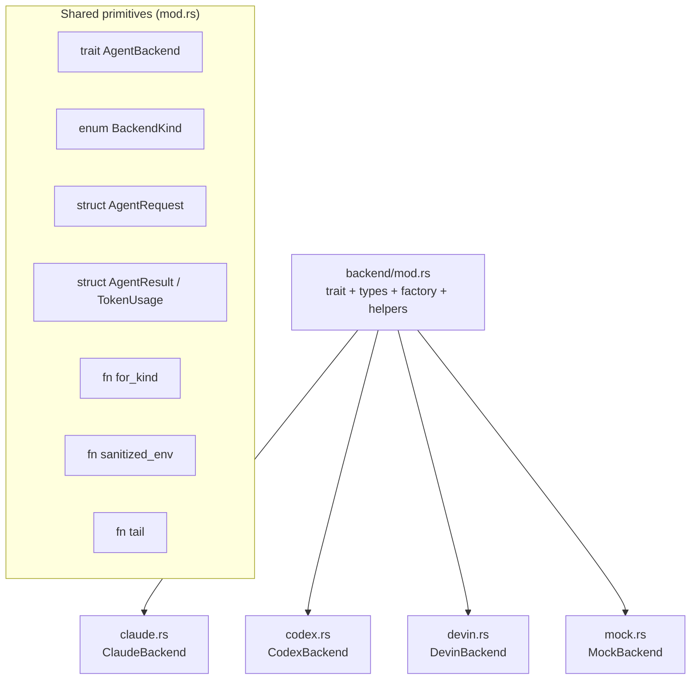
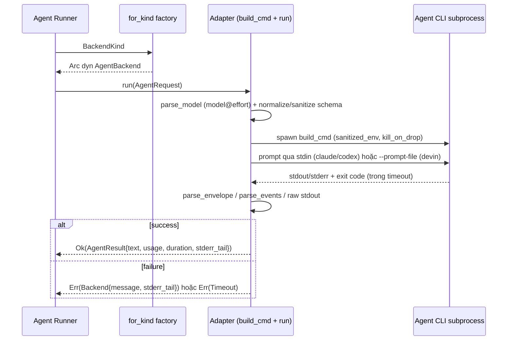
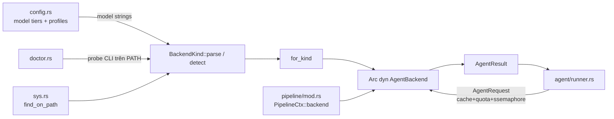

# LLM Backend Integration — Deep Dive

## 1. Mục đích của module

`src/backend` là tầng adapter có thể thay thế (pluggable adapter layer) biến các agent CLI đã xác thực sẵn trên máy người dùng — `devin`, `claude`, `codex` — thành các "LLM provider" sau một trait thống nhất `AgentBackend`. Thay vì gọi một HTTP LLM API (non-goal rõ ràng của thiết kế), agentwiki spawn subprocess, đưa prompt qua stdin hoặc file tạm, và chuẩn hoá output của từng CLI về cùng một kiểu `AgentResult`.

Module này chịu trách nhiệm:

- **Parse model string** dạng `"<backend>:<model>"` (mở rộng `"<model>@<effort>"` cho claude/codex).
- **Xây dựng command line** cho từng CLI trong một hàm `build_cmd` duy nhất.
- **Parse output**: JSON envelope (claude), event stream JSONL (codex), stdout thô (devin).
- **Chuẩn hoá JSON Schema** cho các CLI hỗ trợ structured output (`--json-schema` của claude, `--output-schema` của codex).
- **Sanitize môi trường** của tiến trình con để tránh rò rỉ sang metered billing.
- Cung cấp **MockBackend** in-process để toàn bộ pipeline test được offline.

Vai trò trong kiến trúc tổng thể: `agent/runner.rs` gọi `AgentBackend::run` cho mỗi agent instance (sau cache/quota), còn `PipelineCtx::backend(kind)` phân giải `Arc<dyn AgentBackend>` qua factory `for_kind`.

## 2. Cấu trúc nội bộ



| File | Adapter | Đặc điểm output | Structured schema |
|---|---|---|---|
| `mod.rs` | — | Trait, types, factory, `sanitized_env`, `tail` | — |
| `devin.rs` | `devin -p` | stdout thuần, trim | Không |
| `claude.rs` | `claude -p` | JSON envelope (`structured_output`/`result`, `usage`, `is_error`) | `--json-schema` inline |
| `codex.rs` | `codex exec` | JSONL event stream + file `-o` | `--output-schema` file |
| `mock.rs` | in-process | canned/handler closure | Bỏ qua |

Quy ước mở rộng: thêm một backend = một file mới + một arm trong `for_kind`. `for_kind` là **nơi duy nhất** có `match` trên `BackendKind`.

## 3. Giao diện chính

### 3.1 `AgentBackend` (trait trung tâm)

```rust
#[async_trait]
pub trait AgentBackend: Send + Sync {
    fn kind(&self) -> BackendKind;
    fn supports_fs(&self) -> bool;
    async fn run(&self, req: AgentRequest) -> Result<AgentResult>;
}
```

- `kind()` — định danh backend (dùng cho log, cache key, audit).
- `supports_fs()` — agent có đọc được file trong `cwd` không (agentic mode). Tất cả CLI thật trả `true`; `MockBackend` trả `false`.
- `run()` — một lần gọi prompt → `AgentResult`.

### 3.2 Kiểu dữ liệu trao đổi

```rust
pub struct AgentRequest {
    pub prompt: String,                 // prompt đã render xong
    pub model: Option<String>,          // id model truyền thẳng cho CLI
    pub cwd: PathBuf,                   // empty-cwd (embedded) hoặc project root (agentic)
    pub timeout: Duration,              // timeout theo call
    pub agent: String,                  // tên agent, dùng cho span/log
    pub json_schema: Option<Value>,     // schema cho structured agents
}

pub struct AgentResult {
    pub text: String,                   // message cuối / stdout
    pub backend: BackendKind,
    pub model: Option<String>,
    pub duration: Duration,
    pub usage: Option<TokenUsage>,      // { input, output } nếu CLI báo
    pub stderr_tail: String,            // 500 ký tự cuối stderr, giữ cả khi thành công
}
```

### 3.3 `BackendKind`

`BackendKind::parse` tách `"<backend>:<model>"` → `(kind, Option<model>)`; `"<backend>"` trần → `(kind, None)`; `"mock"` và `"test"` đều map về `Mock`. Backend lạ → `Error::BackendNotAvailable`.

- `as_str()` — id lowercase ổn định cho log/cache key/audit line.
- `default_models()` — cặp `(efficient, powerful)` mặc định theo backend, ví dụ `("claude:sonnet@low", "claude:sonnet@high")`, `("codex:gpt-5.6-sol@low", "codex:gpt-5.6-sol@high")`.
- `detect()` — tìm CLI đầu tiên trên `PATH` theo thứ tự ưu tiên **devin → codex → claude**, dùng cho profile mặc định.

## 4. Luồng điều khiển của một call



Ba bước chung mọi adapter chia sẻ:

1. **Spawn** — `tokio::process::Command` với stdio piped, `kill_on_drop(true)`, `sanitized_env`, `tokio::time::timeout` bao quanh `wait_with_output`/`output()`. `kill_on_drop` là quan trọng: khi timeout hoặc cancel làm drop `Child`, tiến trình CLI bị giết — một orphan sẽ tiếp tục "tiêu tiền" mà không ai cache kết quả.
2. **Parse** — mỗi adapter tự chịu trách nhiệm định dạng output của CLI mình.
3. **Lỗi** — đi qua `Error::Timeout { agent, secs }`, `Error::Backend { backend, message, stderr_tail }`, `Error::BackendNotAvailable`.

## 5. Chi tiết từng adapter

### 5.1 DevinBackend (`devin.rs`) — reference adapter

Command:

```
devin -p --prompt-file <tmpfile> --respect-workspace-trust false \
      --permission-mode auto [--model <m>]
```

- Prompt truyền qua **NamedTempFile** thay vì stdin để tránh giới hạn argv (stdin để `Stdio::null()`; lưu ý doc-comment trong module nói "stdin" nhưng implementation dùng file).
- `--permission-mode auto`: các tool read-only được auto-approve; lỗi print-mode hiện lên qua exit code ≠ 0 — phát hiện được thay vì treo lặng.
- Output: stdout trim; `usage = None` (devin không báo token).
- Đây là adapter tối giản nhất — không có envelope parsing, không schema.

### 5.2 ClaudeBackend (`claude.rs`)

Command:

```
claude -p --output-format json --no-session-persistence \
      --permission-mode bypassPermissions --setting-sources local \
      [--model <m>] [--effort <e>] [--json-schema <inline>]
```

- **Prompt qua stdin**; output là JSON envelope trên stdout.
- `--setting-sources local` bỏ qua CLAUDE.md/settings của user & project để prompt giữ sạch.
- `parse_model` tách `<model>@<effort>` với effort ∈ `{low, medium, high, xhigh, max}` — validate ngay trước spawn để typo fail sớm.
- `parse_envelope(stdout) -> (Option<text>, Option<usage>, Option<error>)`:
  - Ưu tiên `structured_output` (có khi `--json-schema` được truyền), fallback `result`.
  - `usage.input` cộng gộp `input_tokens + cache_creation_input_tokens + cache_read_input_tokens` để "input" = tổng prompt token, thống nhất với ngữ nghĩa của codex.
  - **`is_error` phải được kiểm tra tường minh** — claude có thể exit 0 dù turn thất bại. Khi `is_error`, detail lấy từ `errors[]` hoặc `result`, prefix bằng `subtype` nếu không phải `"success"`.
- Envelope không parse được → fallback dùng raw stdout (vẫn cho downstream extraction xử lý).
- `sanitize_schema` loại bỏ đệ quy mọi key `$schema` — `--json-schema` từ chối draft URI mà schemars phát sinh.

### 5.3 CodexBackend (`codex.rs`)

Command:

```
codex exec --skip-git-repo-check -s read-only --color never --ephemeral \
      --disable hooks -c project_doc_max_bytes=0 --json -o <outfile> \
      [-m <model>] [-c model_reasoning_effort="<e>"] \
      [--output-schema <file>] -
```

- `-` đọc prompt từ stdin; `-o` ghi last message của agent vào file.
- `--ephemeral` + `--disable hooks`: mỗi call một subprocess, không để lại session file, không kích hoạt user hook; `project_doc_max_bytes=0` giữ AGENTS.md của project ngoài prompt (materials là việc của agentwiki).
- Effort set qua `-c model_reasoning_effort="..."`; codex chấp nhận thêm `ultra` ngoài dải của claude.
- `parse_events(stdout)` duyệt từng dòng JSONL:
  - `item.completed` với `item.type == "agent_message"` → text fallback (lấy cái cuối).
  - `turn.completed` → usage; `output = output_tokens + reasoning_output_tokens`.
  - `turn.failed` / `error` → error message — **codex exec cũng exit 0 trên failed turn**, phải surface tường minh.
- Text kết quả ưu tiên file `-o`; event stream là fallback.
- `normalize_schema` viết lại schema do schemars sinh ra thành subset strict mà `--output-schema` chấp nhận:
  - `$ref` phải đứng một mình (drop sibling keywords; `allOf` bị cấm).
  - `oneOf` các const-variant → gộp thành `enum` (kèm `type` nếu tất cả cùng một type); ngược lại hạ xuống `anyOf`.
  - Mọi object: `additionalProperties: false` và `required` liệt kê **tất cả** property — field vốn optional được giữ optional bằng cách bọc thành `anyOf: [orig, {type: "null"}]` (kiểm tra qua `is_nullable`).
  - `--output-schema` nhận **file** (khác `--json-schema` inline của claude), nên schema được ghi ra NamedTempFile phải sống lâu hơn child.

### 5.4 MockBackend (`mock.rs`)

- Backend in-process deterministic cho test offline: `MockBackend::new(handler)` nhận closure `Fn(&AgentRequest) -> Result<String, String>` (trả `Err(String)` để giả lập CLI lỗi).
- `MockBackend::canned(&[(agent, body)])` map tên agent → response: match chính xác `req.agent`, hoặc prefix `name@target`; key thiếu → `"{}"`.
- `with_delay(d)` thêm latency bằng `tokio::time::sleep` — async nên cancellation vẫn ngắt được giữa chừng (cho phép test các đường mid-flight).
- `calls: Mutex<Vec<String>>` ghi lại mọi request phục vụ assertion.
- Inject vào pipeline qua model string `"mock:<anything>"` + `PipelineCtx::new` nhận map backend.
- `supports_fs() == false` — mock không đọc được repo.

## 6. Các quyết định implementation đáng chú ý

| Quyết định | Lý do / trade-off |
|---|---|
| **Subprocess thay vì HTTP API** | Tận dụng subscription auth sẵn có trong CLI; không quản lý API key. Cái giá: output format heterogenous → adapter phải normalize, và nhạy cảm với drift của CLI upstream. |
| **`kill_on_drop(true)` + timeout wrapper** | Timeout/cancel phải giết child; orphan CLI tiếp tục tốn quota mà kết quả không bao giờ được cache. |
| **`sanitized_env`** | Strip mọi env var có prefix `ANTHROPIC_`, `OPENAI_`, `CLAUDE_API`, `CODEX_API`, `DEVIN_API`, `OPENHANDS_` — tránh CLI con lật sang metered billing hoặc rối session state. Định nghĩa một lần trong `mod.rs`, dùng bởi mọi adapter. |
| **`tail(s, 500)` cho stderr** | Giữ phần cuối stderr cho diagnostics trong cả lỗi lẫn thành công, không phình log. |
| **`build_cmd` tập trung** | Toàn bộ flag của một CLI ở một hàm duy nhất — đổi flag upstream là sửa một điểm. |
| **Validate effort trước spawn** | `model@effort` sai fail ngay ở `parse_model` thay vì sau khi spawn CLI. |
| **Exit-0-is-not-success** | Cả claude (`is_error`) và codex (`turn.failed`/`error`) đều có thể exit 0 khi turn fail — adapter phải parse nội dung để surface lỗi. |
| **Prompt qua file cho devin, stdin cho claude/codex** | Tránh giới hạn argv với prompt lớn (devin); stdin khi CLI hỗ trợ tốt (`-`/`piped`). |
| **Schema normalization ở adapter** | Mỗi CLI chấp nhận subset JSON Schema khác nhau; runner chỉ phát sinh schema schemars chuẩn, adapter tự dịch — giữ schema contract một nguồn duy nhất. |
| **Mock qua model string** | `mock:<model>` đi qua cùng đường `BackendKind::parse`/`for_kind`, nên test dùng đúng code path production. |

## 7. Tương tác với các module khác



- `config.rs` sinh model string theo tier (`efficient`/`powerful`); `BackendKind::detect` feed default cho profile khi chưa cấu hình.
- `agent/runner.rs` là consumer chính: xây `AgentRequest` (prompt, model, cwd, timeout, tên agent, `json_schema` từ `SchemaSpec`), gọi `run`, đo `TokenUsage`/`CallRecord` đưa vào `quota.record`.
- `doctor.rs` probe sự tồn tại/version của các CLI trên PATH.
- Lỗi đi qua `crate::error::Error::{Timeout, Backend, BackendNotAvailable}` — runner dùng chúng cho retry-with-feedback và fallback tier.

## 8. Associated files

- `src/backend/mod.rs` — trait `AgentBackend`, `BackendKind`, `AgentRequest`/`AgentResult`/`TokenUsage`, `for_kind`, `sanitized_env`, `tail`
- `src/backend/devin.rs` — `DevinBackend` (`devin -p`, prompt-file, stdout)
- `src/backend/claude.rs` — `ClaudeBackend` (`claude -p`, JSON envelope, `sanitize_schema`)
- `src/backend/codex.rs` — `CodexBackend` (`codex exec`, event stream, `normalize_schema`)
- `src/backend/mock.rs` — `MockBackend` (canned/handler/delay/calls)

Điểm cần theo dõi: parsing envelope/event-stream phụ thuộc format output của các CLI bên ngoài — đây là rủi ro ổn định chính của module; lenient parsing ở runner + test suite trên `parse_envelope`/`parse_events`/`normalize_schema` là lớp giảm thiểu hiện có.