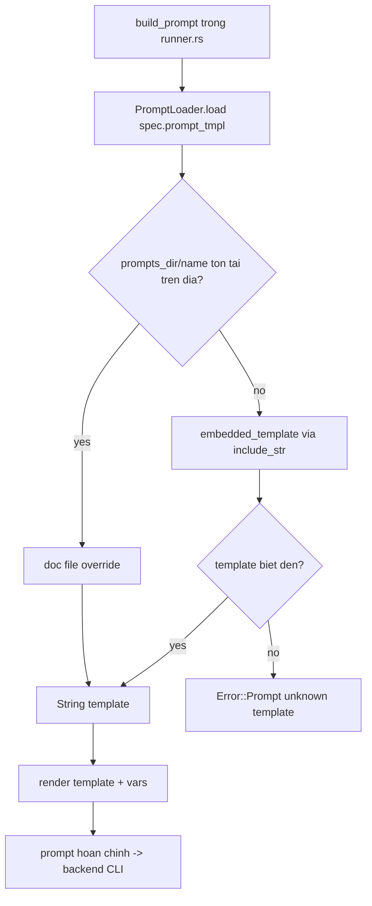

# Module Deep-Dive: Prompt Engineering Assets

## 1. Mục đích module

**Prompt Engineering Assets** là lớp chỉ dẫn (instruction layer) của pipeline phân tích trong agentwiki. Module này bao gồm hai phần bổ trợ lẫn nhau:

- **`prompts/`** — tập hợp các template Markdown định nghĩa "persona" của từng analyst agent (vai trò, cách suy luận), hợp đồng đầu ra (output contract — cấu trúc JSON/Markdown mà agent phải trả về), và các quy tắc an toàn Mermaid áp dụng cho mọi diagram được sinh ra.
- **`src/prompt.rs`** — một template engine tối giản cung cấp hai khả năng: thay thế placeholder dạng `{{key}}` (`render`) và nạp template theo tên tương đối với cơ chế **disk-override + embedded fallback** (`PromptLoader`).

Module thuộc nhóm *Supporting Domain* (độ quan trọng 7/10, độ phức tạp 4/10): nó không chứa logic nghiệp vụ phân tích, nhưng toàn bộ chất lượng đầu ra của hệ thống phụ thuộc vào nội dung các template. Điểm thiết kế cốt lõi là **binary phải tự chứa** — mọi template đều được nhúng vào binary qua `include_str!`, đồng thời cho phép contributor override trên đĩa mà không cần biên dịch lại.

## 2. Cấu trúc nội bộ

### 2.1. Phân nhóm template

Thư mục `prompts/` chứa 13 template, chia thành hai nhóm:

| Nhóm | File | Vai trò |
|---|---|---|
| **Analysis prompts** (research phase) | `dir_summary.md` | Analyst tóm tắt từng thư mục — chấm điểm importance, trích `key_files`, `file_insights`, `interfaces`, `dependencies` |
| | `relationships.md` | Phân tích quan hệ/dependency giữa các thành phần |
| | `system_context.md` | Analyst mức system context (C4 level 1) |
| | `domain_modules.md` | Analyst phân hoạch domain module (kiểu DDD) |
| | `architecture.md` | Analyst kiến trúc tổng thể |
| | `workflow.md` | Analyst luồng công việc |
| | `key_module.md` | Analyst đào sâu module then chốt (per-domain) |
| | `boundary.md` | Detector ranh giới hệ thống (boundary) |
| | `database.md` | Analyst schema cơ sở dữ liệu |
| **Editor prompts** (compose phase) | `editors/overview.md` | Editor viết tài liệu C4 SystemContext (`1.Overview.md`) |
| | `editors/architecture_doc.md` | Editor viết tài liệu Architecture |
| | `editors/workflow_doc.md` | Editor viết tài liệu Workflow |
| | `editors/deep_dive.md` | Editor viết tài liệu Deep-Exploration per-domain |

Lưu ý: hai tài liệu C4 còn lại — boundary và database — **không có editor prompt**, vì chúng được render deterministic bởi `boundary_doc`/`database_doc` trong `src/output/` (DetFn renderer), không qua LLM.

### 2.2. Giải phẫu một template

Các template theo một khuôn mẫu chung, minh họa qua `dir_summary.md`:

```markdown
You are a professional software analyst. Analyze the given directory ...

{{custom}}                      <- block riêng cho từng fan-out instance

Rate the importance of this directory based on: ...
Output requirements:            <- output contract (JSON schema dạng văn)
- "summary": 2–3 sentence ...
- "importance_score": 0.0–1.0 ...
- "file_insights": array of per-file insights, each with:
  - "code_purpose": one of Entry, Agent, Page, ... (taxonomy cố định)

{{language_instruction}}        <- chỉ dẫn ngôn ngữ đầu ra
{{schema_block}}                <- JSON schema chính thức do runner chèn
{{agentic_note}}                <- ghi chú cho chế độ agentic
```

Ba tầng nội dung trong mỗi template:

1. **Persona** — câu mở đầu định vai ("professional software analyst", "C4 architecture documentation expert"...).
2. **Output contract** — mô tả bằng văn các trường bắt buộc, taxonomy giá trị (ví dụ `code_purpose` chỉ được nhận một trong 23 giá trị liệt kê), quy ước trình bày (plain English, brevity, raw Markdown).
3. **Mermaid safety rules** — khối quy tắc bắt buộc trong các editor template: ID node chỉ ASCII `[A-Za-z0-9_]`, văn bản địa phương chỉ đặt trong label, chỉ dùng header chuẩn (`graph TD`, `flowchart TD`, `sequenceDiagram`, `erDiagram`...), cấm ký tự zero-width/smart quotes.

Contract dạng văn trong template được **cứng hóa** bởi `{{schema_block}}` — runner chèn JSON schema sinh từ `schemars` ở `src/agent/reports/`, tạo thành ràng buộc kép: prompt mô tả + schema kiểm chứng.

## 3. Template engine (`src/prompt.rs`)

Toàn bộ engine nằm trong ~88 dòng, gồm ba cơ chế.

### 3.1. `render` — thay thế `{{key}}`

```rust
pub fn render(template: &str, vars: &HashMap<&str, String>) -> String {
    let mut out = template.to_string();
    for (k, v) in vars {
        out = out.replace(&format!("{{{{{k}}}}}"), v);
    }
    out
}
```

Đây là quyết định thiết kế có chủ đích: **không dùng template engine thật** (Handlebars, Tera...). Lý do — các template chứa ví dụ JSON với dấu ngoặc kép (`{{"a": 1}}`), một engine cú pháp đầy đủ sẽ phá vỡ chúng. `render` chỉ thay đúng các key biết trước; **placeholder lạ được giữ nguyên**, nên ví dụ JSON và placeholder chưa khai báo đều sống sót qua vòng render. Unit test `render_replaces_known_leaves_unknown` khóa hành vi này.

### 3.2. `embedded!` macro và `embedded_template`

Macro `embedded!` sinh ra hàm `embedded_template(name) -> Option<&'static str>` dạng `match`, ánh xạ 13 tên template → `include_str!` path. Vì dùng `include_str!`, toàn bộ nội dung template được nhúng vào binary tại compile time — binary phát hành không cần kèm thư mục `prompts/`.

### 3.3. `PromptLoader` — disk override ưu tiên

```rust
pub struct PromptLoader { dir: Option<PathBuf> }

pub fn load(&self, name: &str) -> Result<String> {
    if let Some(dir) = &self.dir {
        let path = dir.join(name);
        if path.is_file() {
            return std::fs::read_to_string(&path).map_err(|e| Error::io(&path, e));
        }
    }
    embedded_template(name).map(str::to_string)
        .ok_or_else(|| Error::Prompt { name: name.to_string(), message: "unknown template".into() })
}
```

`dir` là `config.prompts_dir` (có thể `None`). Thứ tự nạp:

1. Nếu `prompts_dir/name` tồn tại trên đĩa → đọc file đó (override).
2. Ngược lại → tra bảng embedded.
3. Cả hai đều không có → `Error::Prompt { name, "unknown template" }`; lỗi đọc đĩa → `Error::io` kèm path context.

Điểm tinh tế: override chỉ cần file tồn tại — contributor có thể override **một** template bất kỳ mà không cần copy cả bộ.

## 4. Luồng dữ liệu và điều khiển

### 4.1. Vị trí trong pipeline



### 4.2. Các biến render từ runner

`build_prompt` (src/agent/runner.rs:298) nạp template theo `spec.prompt_tmpl` rồi điền 5 biến:

| Biến | Nguồn | Ghi chú |
|---|---|---|
| `materials` | `build_materials` — dep results (`#### <display_name>` blocks) + scan materials | Cắt theo `limits.materials_char_cap` |
| `custom` | `custom_block(spec, target)` | Block riêng per fan-out instance (thư mục/domain cụ thể) |
| `language_instruction` | `config.target_language.instruction()` | Ép ngôn ngữ đầu ra |
| `schema_block` | `schema_block(spec)` | JSON schema từ `SchemaSpec` (nếu agent có structured output) |
| `agentic_note` | `agentic_note(&config)` | Embedded mode injects scan materials; agentic mode tin vào repo-as-cwd |

### 4.3. Nạp một lần, dùng nhiều nơi

`PromptLoader` được khởi tạo một lần trong `PipelineCtx::new` (`PromptLoader::new(config.prompts_dir.clone())`) và lưu thành `pctx.prompts`. Mọi spec trong registry tham chiếu template bằng chuỗi `prompt_tmpl` (ví dụ `"dir_summary.md"`, `"editors/overview.md"`), nên việc đổi template của một agent chỉ là sửa spec hoặc đặt file override.

## 5. Quyết định triển khai đáng chú ý

- **String-replace thay vì template engine**: đánh đổi expressiveness lấy tính an toàn với nội dung JSON/brace trong prompt — đúng bối cảnh prompt engineering nơi template chứa nhiều ví dụ JSON.
- **`include_str!` embedding**: self-contained binary; đổi template embedded yêu cầu recompile, nhưng `prompts_dir` override giải quyết nhu cầu iterate nhanh của contributor.
- **Unknown placeholders giữ nguyên**: cho phép template "dư" placeholder mà không crash; runner không cần biết trước danh sách key của từng template.
- **Tên template là contract lỏng**: `load` nhận relative name tùy ý; chỉ các tên trong bảng `embedded!` mới có fallback — spec tham chiếu template lạ sẽ fail sớm tại `build_prompt` với `Error::Prompt` rõ ràng.
- **Tách analysis vs editor prompts**: phản ánh hai phase của DAG — research agents nhận schema_block cứng (structured JSON), editor agents nhận research reports làm materials và Mermaid rules (free-form Markdown).
- **Không có templating lồng/điều kiện**: mọi biến thể per-instance được đưa vào `{{custom}}` do runner dựng sẵn — template giữ thuần declarative.

## 6. Giới hạn đã biết

- Override trên đĩa chỉ hoạt động nếu file tồn tại; **không có reload nóng** — nhưng vì template được load mỗi lần `build_prompt` chạy (không cache), chỉnh sửa file override có hiệu lực ngay trong cùng một run.
- Contract dạng văn trong template chỉ là *gợi ý*; ràng buộc thật nằm ở `schema_block` + lenient deserializers phía runner.
- `render` là `replace` toàn cục: một `{{key}}` xuất hiện nhiều lần đều bị thay — chấp nhận được vì các key đều là block nội dung.

## 7. File liên quan

- `src/prompt.rs` — engine: `render`, `PromptLoader`, `embedded!`/`embedded_template`
- `prompts/` — 9 analysis templates: `dir_summary.md`, `relationships.md`, `system_context.md`, `domain_modules.md`, `architecture.md`, `workflow.md`, `key_module.md`, `boundary.md`, `database.md`
- `prompts/editors/` — 4 editor templates: `overview.md`, `architecture_doc.md`, `workflow_doc.md`, `deep_dive.md`
- `src/agent/runner.rs` — `build_prompt`, `build_materials`, `custom_block`, `schema_block`, `agentic_note` (phía tiêu thụ)
- `src/agent/spec.rs`, `src/agent/registry.rs` — `AgentSpec.prompt_tmpl` ánh xạ agent → template
- `src/pipeline/mod.rs` — khởi tạo `PromptLoader` trong `PipelineCtx`
- `src/config.rs` — `config.prompts_dir` cấu hình thư mục override
- `src/agent/reports/` — nguồn sinh `schema_block` (schemars/serde contracts)