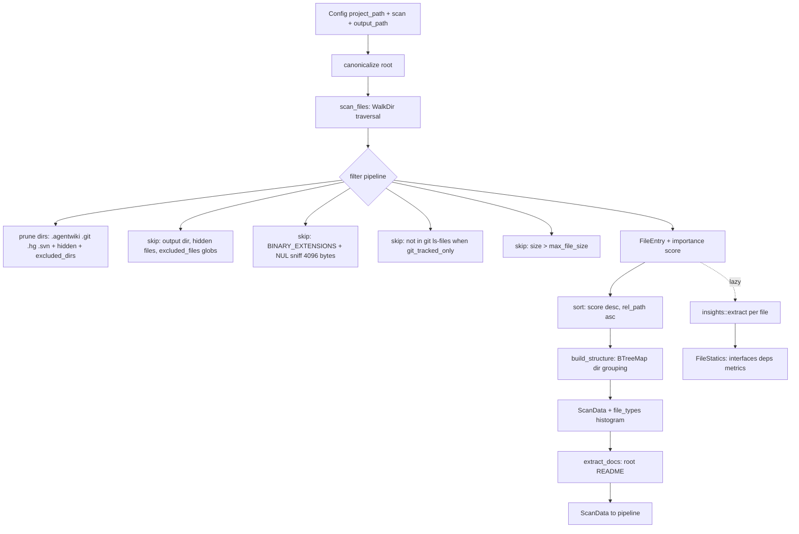
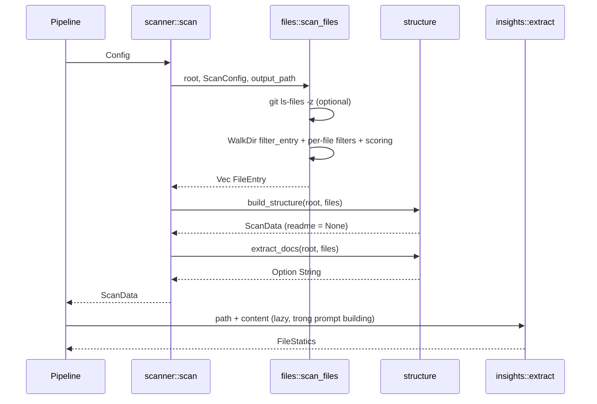

# Module Deep-Dive: Repository Scanning & Preprocessing (`src/scanner`)

## 1. Mục đích

Đây là **Phase 0 — giai đoạn tiền xử lý hoàn toàn deterministic (không gọi AI)** của pipeline `Preprocess → Research → Compose → Verify`. Module chịu trách nhiệm:

- Canonicalize thư mục gốc của repository mục tiêu và duyệt filesystem bằng `walkdir`.
- Áp dụng các luật loại trừ có thể cấu hình (thư mục/file bị loại, file ẩn, giới hạn độ sâu, giới hạn kích thước, binary).
- Tùy chọn giới hạn phạm vi về các file được git track (`git ls-files`).
- Chấm điểm mức độ quan trọng (importance score) cho từng file và sắp xếp kết quả.
- Nhóm file vào cấu trúc thư mục, đếm histogram extension, trích nội dung README gốc.
- Cung cấp bộ trích xuất "code insights" dựa trên regex theo ngôn ngữ (interfaces, dependencies, metrics), được tính **lazy** trong lúc build prompt.

Sản phẩm đầu ra là aggregate `ScanData` — artifact bất biến được tiêu thụ bởi hai downstream:

- **Materials assembly** (`src/agent/materials.rs`): render project structure, README excerpt, code insights thành các block prompt.
- **Drift verification** (`src/drift/`): dùng file inventory của `ScanData` làm nền để trích xuất đồ thị import tĩnh.

Entry point duy nhất là `scan(config: &Config) -> Result<ScanData>` tại [mod.rs:20-33](file:///home/ruan/datspace/agentwiki/src/scanner/mod.rs).

## 2. Cấu trúc nội bộ

| File | Trách nhiệm |
|---|---|
| `src/scanner/mod.rs` | Orchestrator: canonicalize root → `scan_files` → `build_structure` → `extract_docs` → log `tracing::info!`; re-export public API. |
| `src/scanner/files.rs` | Filesystem walk: exclusion rules, git-tracked filter, binary sniffing, importance scoring, sort. |
| `src/scanner/structure.rs` | `ScanData`/`DirectoryInfo`, nhóm file theo thư mục, `extract_docs` (README), tree formatters cho prompt, `read_capped`. |
| `src/scanner/insights.rs` | Trích xuất statics per-file bằng regex theo ngôn ngữ: `FileStatics` (interfaces + dependencies + metrics). |

## 3. Kiểu dữ liệu & interface chính

```rust
// files.rs
pub struct FileEntry {
    pub rel_path: PathBuf,          // path tương đối với repo root
    pub abs_path: PathBuf,
    pub name: String,
    pub size: u64,
    pub extension: Option<String>,  // lowercase
    pub importance_score: f64,      // heuristic 0.0–1.0
}

// structure.rs
pub struct DirectoryInfo {
    pub path: PathBuf,              // absolute
    pub rel_path: PathBuf,          // "." cho root
    pub name: String,
    pub files: Vec<FileEntry>,      // file trực tiếp trong dir
    pub subdirectory_count: usize,  // chỉ đếm subdir trực tiếp
}

pub struct ScanData {
    pub project_name: String,
    pub root: PathBuf,
    pub files: Vec<FileEntry>,               // đã sort theo importance
    pub directories: Vec<DirectoryInfo>,     // chỉ dir chứa ≥1 file
    pub file_types: HashMap<String, usize>,  // extension → count
    pub readme: Option<String>,
}

// insights.rs
pub struct FileStatics {
    pub interfaces: Vec<ExtractedInterface>,    // name, interface_type ("function"|"type"), signature
    pub dependencies: Vec<ExtractedDependency>, // name, dependency_type ("import"), is_external
    pub metrics: FileMetrics,                   // LOC, số hàm/lớp, cyclomatic_complexity
}
```

Public API được re-export từ `scanner`:

- `scan(config: &Config) -> Result<ScanData>` — điểm vào duy nhất của phase.
- `scan_files(root, &ScanConfig, output_path) -> Result<Vec<FileEntry>>`.
- `build_structure(root, files) -> ScanData`, `extract_docs`, `format_as_tree`, `format_as_directory_tree`, `read_capped`.
- `extract(path, content) -> FileStatics`.

Input cấu hình: `Config.project_path`, `Config.output_path`, và `Config.scan` (`ScanConfig`: `max_depth`, `include_hidden`, `excluded_dirs`, `excluded_files`, `git_tracked_only`, `max_file_size`).

## 4. Luồng dữ liệu & điều khiển



Sequence trong `scan()`:



### Chi tiết bộ lọc trong `scan_files`

Thứ tự áp dụng tại [files.rs:42-146](file:///home/ruan/datspace/agentwiki/src/scanner/files.rs):

1. **Prune directory** qua `WalkDir::filter_entry`: `ALWAYS_EXCLUDED_DIRS` = `.agentwiki`, `.git`, `.hg`, `.svn` (luôn loại, kể cả khi `include_hidden` bật — tránh tự ingest state của chính tool); hidden dirs khi `include_hidden=false`; `cfg.excluded_dirs` so sánh case-insensitive.
2. **Không follow symlink** (`follow_links(false)`) và giới hạn `max_depth`.
3. Bỏ qua mọi file nằm dưới `output_path` đã canonicalize — tránh đọc lại docs đã generate.
4. File ẩn (tên bắt đầu `.`), glob pattern `excluded_files` (match trên tên lowercase).
5. Extension trong `BINARY_EXTENSIONS` (~40 loại: ảnh, media, archive, native lib, font, bytecode).
6. `git_tracked_only`: lấy `HashSet<PathBuf>` từ `git ls-files -z`; nếu git không có sẵn/không phải repo → `None` (scan tất cả); nếu trả về rỗng → warn và fallback scan tất cả.
7. `size > max_file_size` → loại.
8. `is_binary_by_content`: đọc tối đa 4096 byte đầu, phát hiện NUL byte — bắt cả binary không có extension.
9. Tính `importance`, sort kết quả: `importance_score` giảm dần, tie-break `rel_path` tăng dần (thứ tự deterministic).

### Importance scoring (port từ deepwiki-rs)

`importance()` tại [files.rs:192-228](file:///home/ruan/datspace/agentwiki/src/scanner/files.rs) cộng dồn trọng số, cap 1.0:

- Keyword trong path: `cmd|internal|pkg` +0.3; `main|index` +0.15; `config|setup` +0.1; `database|schema|migrations` +0.15.
- Size band 1KB–50KB: +0.15 (file "vừa" thường giàu thông tin nhất).
- Extension tiers: ngôn ngữ chính (`rs py java kt cpp c go rb php m swift dart cs`) +0.4 → `sql` +0.3 → `jsx/tsx/vue/svelte`/`csproj/sln` +0.2 → `js/ts/gradle/pom` +0.15 → config (`toml yaml json xml ini`) +0.1 → style/markup +0.05.

### `build_structure` & `extract_docs`

`build_structure` ([structure.rs:42-110](file:///home/ruan/datspace/agentwiki/src/scanner/structure.rs)) gom `FileEntry` vào `BTreeMap<rel_dir, files>`, tính `subdirectory_count` bằng cách đếm distinct immediate children giữa các dir có file. Lưu ý có chủ đích: **thư mục rỗng (không chứa file nào qua filter) hoàn toàn vô hình** — vì `dir_summary` fan-out chỉ cần dir có nội dung. `extract_docs` tìm file ở root có tên bắt đầu bằng `readme` (case-insensitive) và đọc nội dung, bỏ qua nếu rỗng.

### Tree formatters & `read_capped`

`format_as_tree` (file + dir) và `format_as_directory_tree` (chỉ dir, dùng khi file count vượt giới hạn prompt) build một trie `PathNode` (`BTreeMap` children → thứ tự alphabet deterministic), render dirs-trước-files-sau với glyph `├──`/`└──`. `read_capped` cắt nội dung tại `max_chars` (theo char, không phải byte) và gắn marker `\n[truncated]`.

### `insights::extract` — statics dựa trên regex

[insights.rs](file:///home/ruan/datspace/agentwiki/src/scanner/insights.rs) định nghĩa `LangRules` (funcs/types/imports regex + branch keywords) cho 8 nhóm extension: `rs`, `py`, JS/TS family, `go`, `java/kt/scala`, `c/cpp/cs`, `rb/php/swift/dart/m/sh/sql`, và fallback default. Đặc điểm:

- **Compiled-regex cache**: `CAP_CACHE` là `LazyLock<Mutex<HashMap<String, Regex>>>` toàn cục — mỗi pattern compile một lần.
- **Dedup** qua `HashSet` với key prefix `f:`/`t:`/`d:`; caps 60 funcs, 40 types, 40 imports mỗi file.
- `signature`: dòng chứa match, trim, cap 160 chars.
- `is_external`: heuristic — không bắt đầu bằng `.`, `crate`, `self`, `super`.
- `cyclomatic_complexity` = tổng số lần xuất hiện của branch keywords (`content.matches`) — xấp xỉ thô, không phải phân tích CFG.
- `lines_of_code` = số dòng non-empty.

## 5. Quyết định implementation đáng chú ý

- **Determinism toàn phần**: không AI call, mọi sort qua `BTreeMap`/comparator tường minh → `ScanData` là artifact ổn định, replayable.
- **Laziness của insights**: `extract` không chạy trong `scan()`; nó được gọi per-file trong `materials`/prompt building, tránh chi phí regex cho file không bao giờ vào prompt.
- **Self-exclusion**: `.agentwiki` nằm trong `ALWAYS_EXCLUDED_DIRS` và output dir được kiểm tra riêng qua canonicalize — pipeline không bao giờ đọc lại output/state của chính nó.
- **Binary detection hai lớp**: extension list (nhanh) + NUL-sniff 4KB (bắt file không extension) — đủ rẻ để chạy trên mọi file.
- **Graceful git fallback**: `git_tracked_only` degrade nhẹ nhàng khi git vắng mặt hoặc repo rỗng, chỉ warn chứ không fail.
- **Bounded-scope static analysis**: regex thay AST là trade-off có chủ đích (phù hợp mục tiêu "không full semantic analysis" trong system boundary); độ chính xác giới hạn được chấp nhận vì insights chỉ seed prompt, còn drift dùng bộ extractor riêng chặt hơn trong `src/drift/imports`.
- **Sai khác nhỏ so với comment**: docstring `mod.rs` nhắc `FileStatics::for_entry`, nhưng API thực tế là hàm tự do `insights::extract(path, content)`.

## 6. Associated files

- [mod.rs](file:///home/ruan/datspace/agentwiki/src/scanner/mod.rs) — entry point `scan`, re-exports.
- [files.rs](file:///home/ruan/datspace/agentwiki/src/scanner/files.rs) — walk, filters, scoring.
- [structure.rs](file:///home/ruan/datspace/agentwiki/src/scanner/structure.rs) — `ScanData`, `DirectoryInfo`, README, tree formatters.
- [insights.rs](file:///home/ruan/datspace/agentwiki/src/scanner/insights.rs) — `FileStatics` extraction.
- Consumers: `src/agent/materials.rs` (prompt blocks), `src/drift/resolve` + `src/drift/imports` (file inventory → import graph), `src/pipeline/mod.rs` (gọi `scanner::scan` khi build `PipelineCtx`).