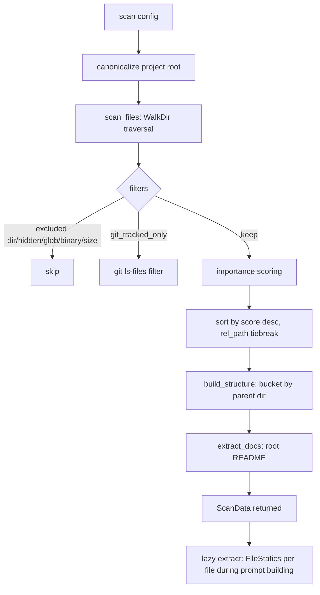
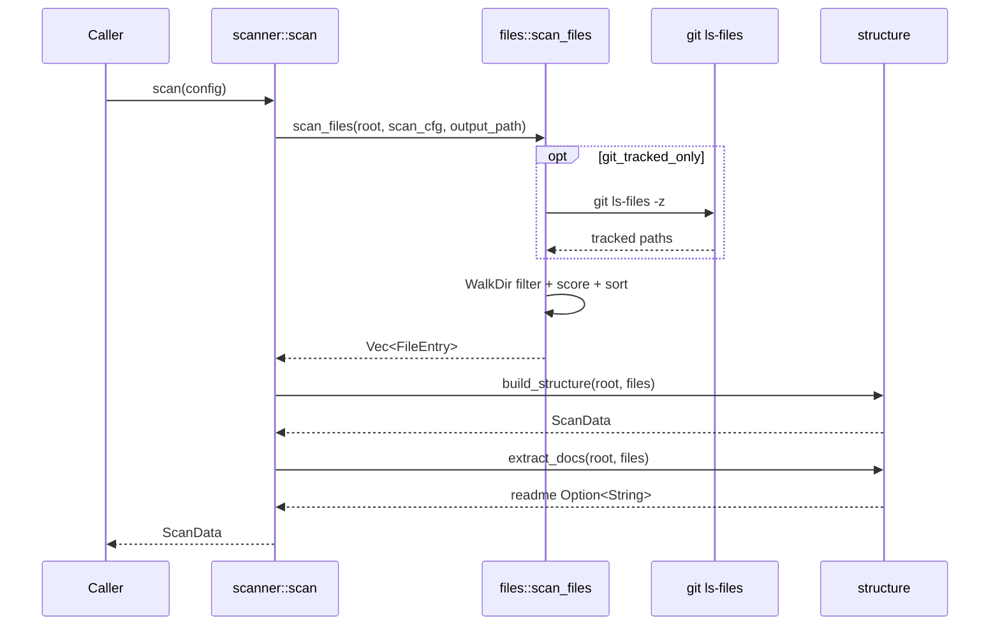

# Module Deep-Dive: Repository Scanning (`src/scanner`)

## 1. Mục đích của module

`src/scanner` hiện thực **Phase 0** của pipeline `agentwiki` — bước tiền xử lý hoàn toàn **deterministic** (xác định, không gọi LLM) chạy trước mọi tác vụ nghiên cứu. Module chịu trách nhiệm:

- Duyệt cây thư mục của **repository mục tiêu** (read-only) với hệ thống luật loại trừ nhiều lớp.
- Xây dựng mô hình cấu trúc dự án (`ScanData`, `DirectoryInfo`) làm đầu vào cho fan-out `dir_summary` và cho drift analyzer.
- Trích xuất README/docs ở thư mục gốc để seed prompt.
- Tính **statics theo từng file** (interfaces, dependencies, metrics) bằng regex — lazy, chỉ khi prompt building cần.

Vì toàn bộ công đoạn này miễn phí và deterministic, nó nằm **trước ranh giới chi phí** (cache/quota/audit chỉ áp dụng cho runner LLM). Đây là một supporting domain quan trọng: mọi thứ downstream (manifest fingerprint, prompt materials, drift ground-truth scan) đều tiêu thụ `ScanData`.

## 2. Cấu trúc nội bộ

| File | Vai trò |
|---|---|
| `src/scanner/mod.rs` | Facade: re-export public API và hàm điều phối `scan(config)` duy nhất. |
| `src/scanner/files.rs` | Filesystem walk: luật loại trừ, filter git-tracked, chấm điểm importance, sắp xếp. |
| `src/scanner/structure.rs` | Gom file theo thư mục → `ScanData`; render cây thư mục cho prompt; `read_capped`. |
| `src/scanner/insights.rs` | Phân tích tĩnh theo file bằng regex (đa ngôn ngữ), lazy — gọi trong lúc build prompt. |

## 3. Interface chính

Re-export từ `mod.rs`:

```rust
pub fn scan(config: &Config) -> Result<ScanData>
```

Kiểu dữ liệu xuất ra:

- **`FileEntry`** — `rel_path`, `abs_path`, `name`, `size`, `extension` (lowercase), `importance_score` (0.0–1.0).
- **`DirectoryInfo`** — `path`, `rel_path` (`.` cho root), `name`, `files` (file trực tiếp), `subdirectory_count` (đếm thư mục con trực tiếp). Mỗi `DirectoryInfo` là một fan-out target cho `dir_summary`.
- **`ScanData`** — `project_name`, `root`, `files` (đã sort theo importance), `directories`, `file_types` (histogram extension → count), `readme: Option<String>`.
- **`FileStatics`** (từ `insights.rs`) — `interfaces: Vec<ExtractedInterface>`, `dependencies: Vec<ExtractedDependency>`, `metrics: FileMetrics`; kèm `extract(path, content)`.

Public nhưng không re-export: `format_as_tree`, `format_as_directory_tree`, `read_capped` trong `structure.rs` — phục vụ prompt building.

Dependencies: `crate::config::{Config, ScanConfig}`, `crate::error::{Error, Result}`; external crates: `walkdir`, `glob`, `regex`, `tracing`.

## 4. Luồng điều khiển





`scan()` (`mod.rs`) canonicalize `config.project_path`, gọi `scan_files(&root, &config.scan, &output_path)`, rồi `build_structure`, rồi `extract_docs`, log `tracing::info!` với số files/dirs. Lỗi canonicalize → `Error::io`.

## 5. Chi tiết triển khai

### 5.1 `files.rs` — walk & filter chain

`scan_files` dùng `WalkDir` với `max_depth` từ config và `follow_links(false)`. `filter_entry` prune ngay tại mức directory qua `is_excluded_dir`:

- **`ALWAYS_EXCLUDED_DIRS`**: `.agentwiki`, `.git`, `.hg`, `.svn` — state của chính tool + VCS, không bao giờ quét.
- Hidden dirs (khi `include_hidden = false`) và `cfg.excluded_dirs` (so sánh `eq_ignore_ascii_case`).

Với mỗi file sống sót, chuỗi filter theo thứ tự:

1. **Output-path exclusion**: file nằm dưới `output_path` (canonicalized) bị bỏ — tool không bao giờ nuốt output của chính nó.
2. **Hidden file**: tên bắt đầu bằng `.` bị skip khi `include_hidden = false`.
3. **Glob exclusion**: `cfg.excluded_files` compile thành `glob::Pattern` (lowercase, pattern không hợp lệ bị bỏ qua lặng lẽ).
4. **Binary extension**: `BINARY_EXTENSIONS` (~45 ext: ảnh, media, archive, compiled artifact, font, db…).
5. **Git-tracked filter**: khi `git_tracked_only`, chỉ giữ path có trong `git ls-files -z` (NUL-separated → `HashSet<PathBuf>`). Nếu git không khả dụng hoặc repo trống (`None` hoặc set rỗng) → fallback scan toàn bộ kèm `tracing::warn!`.
6. **Size cap**: `size > cfg.max_file_size` → skip.
7. **NUL-sniff**: `is_binary_by_content` đọc tối đa 4KB đầu, tìm byte `0` — bắt file binary không có extension.

Sau filter, `importance()` chấm điểm heuristic cộng dồn (ported từ deepwiki-rs): keyword trong path (`cmd`/`internal`/`pkg` +0.3, `main`/`index` +0.15, `config`/`setup` +0.1, `database`/`schema`/`migrations` +0.15), kích thước hợp lý (1KB–50KB +0.15), và trọng số extension (`.rs`/`.py`/`.go`… +0.4, `.sql` +0.3, config formats +0.1…), cap tại `1.0`. Kết quả sort desc theo score, tiebreak bằng `rel_path` — deterministic.

### 5.2 `structure.rs` — mô hình cấu trúc & tree rendering

- `build_structure` gom `FileEntry` vào `BTreeMap<PathBuf, Vec<FileEntry>>` keyed theo parent `rel_path` → thứ tự bucket deterministic. `subdirectory_count` đếm distinct immediate children giữa các dir có file; **thư mục rỗng trên disk vô hình** (by design — `dir_summary` chỉ cần dir có nội dung). `project_name` lấy basename của root.
- `extract_docs` tìm file ở root (`parent` rỗng) có tên bắt đầu `readme` (case-insensitive), đọc content; bỏ qua file rỗng/whitespace.
- `format_as_tree` / `format_as_directory_tree`: insert path vào `PathNode` trie (`BTreeMap` children), render theo convention `tree` Unix — directories trước, files sau, connector `├──`/`└──`, thư mục có suffix `/`. Variant directories-only dùng khi số file vượt ngưỡng prompt.
- `read_capped` cắt nội dung file theo **char count** (an toàn UTF-8, không cắt giữa codepoint) và thêm marker `\n[truncated]`.

### 5.3 `insights.rs` — per-file statics

`extract(path, content) -> FileStatics` chọn `LangRules` qua `rules_for(ext)` — bảng luật regex cho `rs`, `py`, `js/ts` family, `go`, `java/kt/scala`, C-family (`c/cpp/cs`), nhóm `rb/php/swift/dart/sh/sql`, cộng fallback rỗng. Mỗi `LangRules` gồm 4 danh sách: `funcs`, `types`, `imports` (regex với capture group cho tên), `branches` (keyword đếm cho complexity).

Điểm đáng chú ý:

- **Regex cache toàn cục**: `CAP_CACHE` là `LazyLock<Mutex<HashMap<String, Regex>>>` — compile một lần, `Regex` clone rẻ (Arc bên trong), an toàn qua các agent song song.
- **Cap capture**: tối đa 60 functions, 40 types, 40 imports mỗi file — giới hạn kích thước prompt material.
- **Dedup**: `HashSet` `seen` với key `f:`/`t:`/`d:` + tên — tránh trùng khi nhiều pattern match cùng symbol.
- **External heuristic**: import là external trừ khi bắt đầu `.`, `crate`, `self`, `super`.
- **Metrics**: `lines_of_code` đếm dòng non-empty; `cyclomatic_complexity` là tổng số lần xuất hiện của branch keywords (ước lượng thô, không phải CFG thật).
- `signature_line` trích dòng source chứa match (qua byte offset → line boundary), cap 160 chars.

Đây là **stand-in có ý thức cho `language_processors` của deepwiki-rs** — regex thay vì AST (AST parsing nằm ngoài system boundary). Đủ tốt để seed `dir_summary` prompt với tên symbol; không dùng cho drift ground-truth (drift có extractor riêng trong `src/drift/imports/`).

## 6. Quyết định thiết kế đáng chú ý

- **Statics lazy**: `scan()` không tính `FileStatics` — việc này xảy ra trong prompt building (`FileStatics::for_entry`), tránh phân tích file không bao giờ vào prompt.
- **Deterministic hoàn toàn**: `BTreeMap` ordering, sort với tiebreak, không hash-iteration vào output — quan trọng cho manifest fingerprinting và incremental regeneration.
- **Fail-soft**: git unavailable → fallback full scan + warn; glob pattern xấu → skip; binary sniff fail → không binary. Lỗi cứng duy nhất: canonicalize root và lỗi walker.
- **Self-exclusion**: output dir và `.agentwiki` luôn bị loại — scan không bao giờ tự nuốt artifact của mình, giữ determinism giữa các run.
- **Config surface**: `ScanConfig` gồm `max_depth`, `max_file_size`, `git_tracked_only`, `include_hidden`, `include_tests`, `excluded_dirs`, `excluded_files`.

## 7. Tiêu thụ downstream

- **Prompt materials**: `DirectoryInfo` → fan-out targets của `dir_summary`; `FileStatics` seed tên symbol; `format_as_tree`/`read_capped` nhúng cấu trúc và source vào prompt.
- **Manifest**: fingerprint đầu vào scan để phân loại thay đổi cosmetic vs structural.
- **Drift engine**: lấy file set (read-only) làm nền cho import extraction/resolution.

## 8. Associated files

- `src/scanner/mod.rs`
- `src/scanner/files.rs`
- `src/scanner/structure.rs`
- `src/scanner/insights.rs`