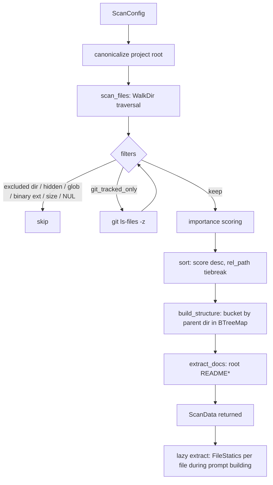
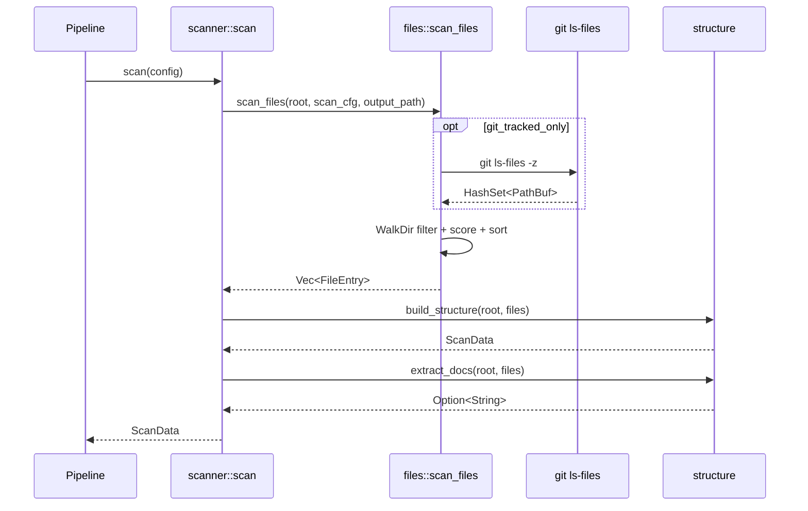

# Repository Scanning — Tài liệu kỹ thuật chi tiết

## 1. Mục đích của module

`src/scanner` là **Phase 0** của pipeline `agentwiki` — giai đoạn tiền xử lý hoàn toàn **deterministic** (xác định, không dùng AI). Module này chịu trách nhiệm:

- Duyệt cây thư mục của repository mục tiêu (WalkDir), áp dụng toàn bộ quy tắc loại trừ.
- Xây dựng metadata cấu trúc thư mục (`ScanData` / `DirectoryInfo`) — đây là đầu vào cho cả **research fan-out** (mỗi thư mục là một target `dir_summary`) lẫn **drift analyzer** (import extraction).
- Trích xuất README ở thư mục gốc để làm ngữ cảnh cho prompt.
- Chấm điểm heuristic `importance_score` cho từng file và sắp xếp kết quả.
- Cung cấp **statics theo từng file** (interfaces, dependencies, metrics) được tính **lazy** trong lúc build prompt — vẫn không có bất kỳ LLM call nào.

Tính chất "không AI" là cốt lõi: toàn bộ chi phí của phase này là I/O đĩa + regex, nên nó chạy được trước khi quota/cache/checkpoint của pipeline có hiệu lực, và được tái sử dụng bởi cả `drift` (read-only) mà không vi phạm ranh giới LLM-free.

## 2. Cấu trúc nội bộ

| File | Vai trò | Thành phần chính |
|---|---|---|
| `src/scanner/mod.rs` | Facade của module | `scan(config)` — entry point duy nhất; re-export `FileEntry`, `scan_files`, `FileStatics`, `extract`, `DirectoryInfo`, `ScanData`, `build_structure` |
| `src/scanner/files.rs` | Filesystem walk + filtering + scoring | `FileEntry`, `scan_files`, `importance`, `git_tracked_files`, `is_binary_by_content`, hằng `BINARY_EXTENSIONS` / `ALWAYS_EXCLUDED_DIRS` |
| `src/scanner/structure.rs` | Nhóm file theo thư mục, render cây cho prompt | `DirectoryInfo`, `ScanData`, `build_structure`, `extract_docs`, `format_as_tree`, `format_as_directory_tree`, `read_capped`, `PathNode` |
| `src/scanner/insights.rs` | Static analysis heuristic per-file (lazy) | `FileStatics`, `FileMetrics`, `ExtractedInterface`, `ExtractedDependency`, `extract`, `rules_for`, `cached_regex` |

`mod.rs` mỏng (33 dòng) — chỉ điều phối ba bước `scan_files → build_structure → extract_docs` rồi log `tracing::info!` số file/thư mục. Toàn bộ logic nằm ở ba file con.

## 3. Key interfaces

```rust
// mod.rs — entry point duy nhất của phase 0
pub fn scan(config: &Config) -> Result<ScanData>

// files.rs
pub struct FileEntry {
    pub rel_path: PathBuf,
    pub abs_path: PathBuf,
    pub name: String,
    pub size: u64,
    pub extension: Option<String>,      // lowercase
    pub importance_score: f64,          // 0.0–1.0
}
pub fn scan_files(root: &Path, cfg: &ScanConfig, output_path: &Path) -> Result<Vec<FileEntry>>

// structure.rs
pub struct DirectoryInfo {              // 1 dir = 1 dir_summary fan-out target
    pub path: PathBuf, pub rel_path: PathBuf, pub name: String,
    pub files: Vec<FileEntry>, pub subdirectory_count: usize,
}
pub struct ScanData {
    pub project_name: String, pub root: PathBuf,
    pub files: Vec<FileEntry>,          // đã sort theo importance desc
    pub directories: Vec<DirectoryInfo>,
    pub file_types: HashMap<String, usize>,
    pub readme: Option<String>,
}
pub fn build_structure(root: &Path, files: Vec<FileEntry>) -> ScanData
pub fn format_as_tree / format_as_directory_tree(scan: &ScanData) -> String
pub fn read_capped(path: &Path, max_chars: usize) -> Result<String>

// insights.rs
pub struct FileStatics { interfaces, dependencies, metrics }
pub fn extract(path: &Path, content: &str) -> FileStatics
```

**Consumers**: prompt building (`materials.rs`) dùng `DirectoryInfo` làm fan-out axis và `FileStatics` để seed tên symbol vào prompt `dir_summary`/`key_module`; drift engine dùng lại file set từ `scan_files` để build FileGraph. `ScanData` cũng là input cho manifest fingerprinting.

## 4. Data flow / Control flow





### Chi tiết pipeline bên trong `scan_files`

Chuỗi filter áp dụng theo thứ tự:

1. **Directory pruning** (qua `filter_entry` của WalkDir): `ALWAYS_EXCLUDED_DIRS` = `.agentwiki`, `.git`, `.hg`, `.svn` luôn bị cắt nhánh; thêm `cfg.excluded_dirs` (so sánh `eq_ignore_ascii_case`) và hidden dirs khi `include_hidden = false`.
2. **Output-dir exclusion**: file nào `canonicalize` xong `starts_with(out_abs)` bị bỏ — tránh ingest chính output docs của agentwiki.
3. **Hidden file**, **glob pattern** (`excluded_files`, lowercase `Pattern`), **binary extension** (bảng ~45 ext: ảnh, media, archive, font, compiled artifact).
4. **Git-tracked filter**: nếu `git_tracked_only`, shell `git ls-files -z` → `HashSet<PathBuf>`; khi git không có sẵn hoặc trả rỗng → warn và fallback scan toàn bộ (không fail).
5. **Size cap** (`max_file_size`) và **NUL-sniffing**: đọc tối đa 4096 byte đầu, tìm byte `0` — bắt binary không có extension.
6. `WalkDir` còn chịu `max_depth` và `follow_links(false)` (không theo symlink).

Kết quả được **sort ổn định**: `importance_score` giảm dần, tiebreak theo `rel_path` — đảm bảo output deterministic cho manifest diff.

## 5. Những quyết định triển khai đáng chú ý

### 5.1 Importance heuristic (port từ deepwiki-rs)

`importance()` là hàm cộng dồn cap ở 1.0, kết hợp tín hiệu đường dẫn và extension:

- **Path keywords**: `cmd`/`internal`/`pkg` (+0.3 — convention của Go/Rust project layout), `main`/`index` (+0.15), `config`/`setup` (+0.1), `database`/`schema`/`migrations` (+0.15).
- **Size sweet spot**: file 1–50 KiB (+0.15) — quá nhỏ thường là stub, quá lớn thường là generated.
- **Extension tiers**: ngôn ngữ compiled chính (`rs`,`py`,`java`,`go`,… +0.4) > `sql` (+0.3) > `jsx`/`tsx`/`vue`/`svelte` (+0.2) > `js`/`ts` thuần (+0.15) > config `toml`/`yaml`/`json` (+0.1) > style/markup (+0.05).

Điểm này quyết định thứ tự files trong prompt material — file quan trọng xuất hiện trước khi prompt bị truncate.

### 5.2 `build_structure` — BTreeMap bucketing

- Files được bucket vào `BTreeMap<PathBuf, Vec<FileEntry>>` theo `rel_path.parent()` → directories tự nhiên được duyệt theo thứ tự từ điển.
- `subdirectory_count` chỉ đếm **immediate children** có file — thư mục rỗng trên disk "vô hình" by design (comment trong code), vì `dir_summary` chỉ cần dir có content.
- `project_name` lấy basename của root, fallback `"project"`.
- `file_types` là histogram extension → count, phục vụ report và prompt context.

### 5.3 `PathNode` trie + tree rendering

`format_as_tree` / `format_as_directory_tree` chèn paths vào trie `BTreeMap` children, render dirs-first với connector `├──`/`└──`/`│   ` — output giống `tree(1)`, tối ưu cho LLM đọc. Hai biến thể: full file tree và directories-only (dùng khi số file vượt limit để giảm token).

`read_capped` truncate theo **char count** (không phải byte — an toàn UTF-8) và gắn marker `\n[truncated]` để model biết nội dung bị cắt.

### 5.4 `insights.rs` — regex statics thay AST

Đây là stand-in có ý thức cho `language_processors` của deepwiki-rs:

- **`rules_for(ext)`**: bảng `LangRules { funcs, types, imports, branches }` cho `rs`, `py`, `js/ts` family, `go`, `java/kt/scala`, C-family, `rb/php/swift/dart/m/sh/sql`, và fallback rỗng vẫn đếm branch cơ bản.
- **Regex cache toàn cục**: `CAP_CACHE: LazyLock<Mutex<HashMap<String, Regex>>>` — compile một lần, dùng chung qua `extract` gọi song song cho nhiều file.
- **Dedup**: `HashSet` keyed `f:`/`t:`/`d:` tránh trùng symbol giữa các pattern; caps 60 funcs / 40 types / 40 imports mỗi file.
- **is_external heuristic**: import được coi là external trừ khi bắt đầu `.`, `crate`, `self`, `super` — phân tách dependency nội bộ vs bên ngoài cho prompt.
- **Metrics**: `lines_of_code` = non-empty lines; `cyclomatic_complexity` là đếm **branch keyword** thô (`if `, `for `, `match `, `?`…) — chỉ là tín hiệu tương đối, không phải metric chuẩn.
- `signature_line` lấy dòng nguồn chứa match, cap 160 chars — đủ để model thấy signature mà không đọc body.

### 5.5 Error handling & determinism

- Lỗi WalkDir được map sang `Error::io` (fail-fast); mọi fallback khác (`git` vắng, README không đọc được, output path chưa canonicalize) đều **degrade nhẹ** thay vì panic — phù hợp vai trò phase 0 phải robust.
- Không `unwrap()`; sort có tiebreak → output byte-stable giữa các lần chạy, điều kiện cần cho manifest fingerprinting phát hiện cosmetic vs structural change.

## 6. Vị trí trong hệ thống

- **Upstream**: `crate::config::{Config, ScanConfig}` (`max_depth`, `excluded_dirs`, `excluded_files`, `include_hidden`, `git_tracked_only`, `max_file_size`) và `crate::error`.
- **Downstream**: pipeline orchestrator (Phase 0 → manifest diff), agent fan-out (`DirectoryInfo` → `dir_summary` instances), prompt materials (`format_as_tree`, `FileStatics`), drift engine (file set cho import extraction), `status` command (fresh scan để diff).
- **External deps**: `walkdir`, `glob`, `regex`, `tracing`; subprocess duy nhất là `git ls-files -z` khi `git_tracked_only` bật.

## 7. Associated files

- `src/scanner/mod.rs` — facade, `scan()` orchestration, re-exports
- `src/scanner/files.rs` — `scan_files`, exclusion rules, git filter, `importance`
- `src/scanner/structure.rs` — `ScanData`/`DirectoryInfo`, `build_structure`, `extract_docs`, tree renderers, `read_capped`
- `src/scanner/insights.rs` — `FileStatics`, `LangRules` table, `extract`, regex cache