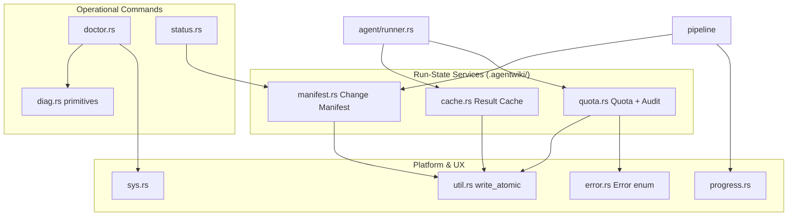
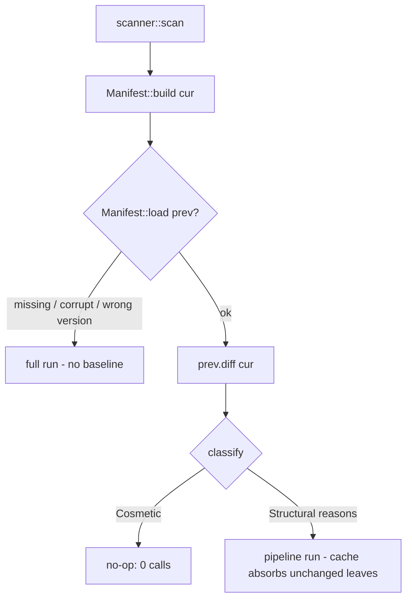
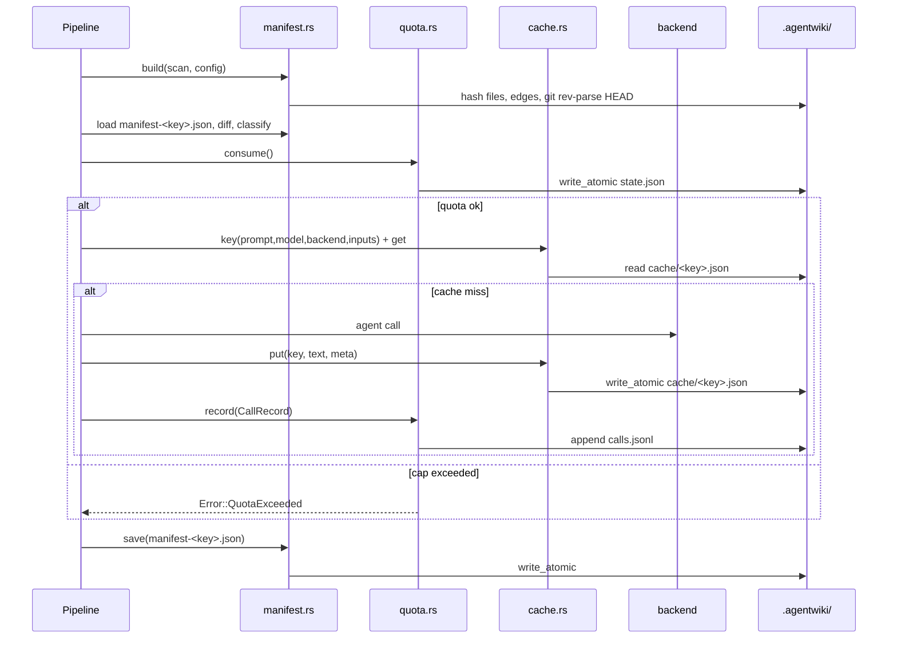

# Runtime Governance & Operations — Module Deep-Dive

## 1. Mục đích và vị trí trong hệ thống

Module **Runtime Governance & Operations** là tầng hạ tầng (infrastructure domain) xuyên suốt của agentwiki — một CLI Rust (v0.5.0) sinh tài liệu kiến trúc C4 bằng cách điều phối các agent CLI bên ngoài (`devin`, `claude`, `codex`) thay vì gọi LLM API trực tiếp.

Vì mỗi lời gọi agent là một lời gọi **trả phí qua subprocess**, module này tập trung toàn bộ các dịch vụ run-state nằm đúng tại ranh giới chi phí:

| Thành phần | File | Vai trò |
|---|---|---|
| Result Cache | `src/cache.rs` | Cache content-hash cho kết quả agent — tránh gọi lại tốn phí |
| Change Manifest | `src/manifest.rs` | Fingerprint đầu vào, phân loại thay đổi cosmetic/structural để gate incremental run |
| Quota & Audit | `src/quota.rs` | Giới hạn số call/ngày + audit log `calls.jsonl` |
| Operational Commands | `src/doctor.rs`, `src/status.rs` | Lệnh read-only: health check môi trường và báo cáo độ tươi của docs |
| Diagnostics primitives | `src/diag.rs` | `Status`/`Report` dùng chung cho doctor và drift |
| Progress display | `src/progress.rs` | Spinner indicatif theo dõi các agent instance đang chạy |
| Platform utilities | `src/sys.rs` | Liệt kê process, kiểm tra PID liveness, tra cứu PATH — không phụ thuộc crate ngoài |
| Filesystem helpers | `src/util.rs` | `write_atomic` — ghi file an toàn crash |
| Error taxonomy | `src/error.rs` | Enum `Error` toàn crate (thiserror) |

Nguyên tắc thiết kế xuyên suốt: **fail-open về trạng thái** (manifest/cache hỏng → coi như "chưa có trạng thái trước" → full run), **fail-closed về chi phí** (quota cạn → `Error::QuotaExceeded`), và **mọi ghi state đều atomic** để reader không bao giờ thấy file rách.

## 2. Cấu trúc nội bộ



### 2.1 Result Cache — `src/cache.rs`

Cache filesystem tại `.agentwiki/cache/<key>.json`.

**Cấu trúc dữ liệu:**

- `CacheEntry { text, meta }` — bản ghi on-disk: text thô trả về từ backend + provenance.
- `CacheMeta { agent, backend, model, created_at, secs }` — metadata nguồn gốc, dùng `secs` để tính thời gian tiết kiệm khi cache hit.
- `CacheStats { hits, misses, saved }` — bookkeeping cho run summary report.
- `SCHEMA_VERSION = "3"` — hằng số nằm trong mọi cache key; bump khi semantics prompt/schema đổi (v3 thêm PerDomain dep projection và agentic-mode input fingerprints). Thay đổi version sẽ **vô hiệu hóa toàn bộ cache cũ** một cách tự nhiên vì key đổi.

**Key derivation** — `Cache::key(prompt, model, backend, inputs)`:

```
sha256(prompt ‖ 0x00 ‖ model ‖ 0x00 ‖ backend ‖ 0x00 ‖ inputs ‖ 0x00 ‖ SCHEMA_VERSION)
```

Separator `\x00` ngăn ambiguity khi nối chuỗi. `inputs` là fingerprint nội dung của những gì agent *có thể đọc* nhưng prompt không embed: trong agentic mode đó là `subtree_fingerprint(dir)` cho `dir_summary` hoặc `fingerprint_all()` cho agent đọc cả repo; trong embedded mode prompt là toàn bộ input nên `inputs = ""`.

**Chính sách hai cờ:**

- `disabled` (`--no-cache`): skip cả read lẫn write — `get` trả `None`, `put` là no-op `Ok(())`.
- `no_read` (`--force-regenerate`): skip read nhưng vẫn write — rerun ghi đè cache để các lần chạy sau dùng được.

`put` serialize `CacheEntry` ra JSON rồi ghi qua `util::write_atomic` — một `get` đang đọc sẽ thấy hoặc bản cũ hoặc bản mới, không bao giờ thấy file viết dở.

### 2.2 Change Manifest — `src/manifest.rs`

Manifest là **fingerprint store, không phải source of truth** — nội dung vẫn nằm trong content-hash cache. File thiếu/hỏng/sai version đều được xử lý thống nhất: "không có prior state" → full run.

**Manifest format** (`MANIFEST_VERSION = 1`, mismatch → bỏ qua chứ không migrate):

```rust
pub struct Manifest {
    pub version: u32,
    pub created_at: String,                 // RFC3339
    pub env: String,                        // env_fingerprint
    pub git_head: Option<String>,           // git rev-parse HEAD
    pub files: BTreeMap<String, String>,    // rel_path → sha256(content)
    pub dirs: BTreeMap<String, String>,     // rel_dir → hash of member signatures
    pub edges: Vec<(String, String)>,       // resolved internal import edges, sorted
}
```

**`Manifest::build(scan, config)`** fingerprint toàn bộ đầu vào tại đầu pipeline:

1. `files`: đọc từng file trong `ScanData`, sha256 nội dung, key theo `display_path(rel_path)`.
2. `dirs`: với mỗi directory, sort các `path:hash` của member files trực tiếp rồi hash — phát hiện thay đổi membership của thư mục.
3. `edges`: tái sử dụng `drift::resolve::build_file_graph` để resolve internal import edges — **đây là tín hiệu kiến trúc mà classifier diff**, vì thay đổi dependency mới thực sự làm docs cũ đi.
4. `env`: `env_fingerprint(config)` — hash của SCHEMA_VERSION, binary version (`CARGO_PKG_VERSION`), mode, target language, output path (qua `stable_abs`), model strings, toàn bộ `limits.*` và `scan.*`, excluded dirs/files, và **nội dung đã resolve của mọi prompt template** (cover cả edit embedded lẫn `prompts_dir` override).

Chi phí build tỉ lệ với kích thước repo (một lần đọc + sanitize mỗi file) — không đáng kể so với một LLM call, và chỉ trả một lần mỗi run.

**Slot theo output directory:** file manifest là `manifest-<sha12>.json` trong đó `sha12 = sha256(stable_abs(output_path))[..12]` — repo sinh `docs/en` và `docs/vi` theo dõi freshness độc lập. `stable_abs` là chi tiết tinh tế: `canonicalize` thuần trả kết quả khác nhau cho `./docs` trước/sau khi thư mục tồn tại, gây fork manifest slot và `env_changed` giả; hàm resolve `.`/`..` lexically rồi canonicalize ancestor tồn tại sâu nhất và nối phần đuôi còn thiếu.

**`diff` + `classify` — incremental gate:**



`classify` **fail-open**: mọi thứ có thể làm docs thay đổi — env, directory set, file set, import edges — đều là `Structural(Vec<String>)` kèm reasons cho `status`/logs. Chỉ pure content edit trong file hiện có là `Cosmetic`. Đây là trade-off đúng: classify nhầm theo hướng structural chỉ tốn thêm call (cache vẫn hấp thụ leaf không đổi), còn classify nhầm theo hướng cosmetic sẽ để docs stale âm thầm.

`ManifestDiff::cosmetic_dirs()` trả về tập thư mục chứa file cosmetic-changed — `status` surface chúng như "pending edits chưa phản ánh vào docs".

**Cache-key bridge:** `fingerprint_all()` và `subtree_fingerprint(dir)` chính là `inputs` truyền vào `Cache::key` — manifest và cache dùng chung nguồn fingerprint, đảm bảo "manifest key ⊇ cache key": cache key không thấy gì mà manifest không fingerprint.

### 2.3 Quota & Audit — `src/quota.rs`

Hai trách nhiệm tách biệt nhưng share một `tokio::sync::Mutex`:

**Quota — `.agentwiki/state.json`:** `DayState { date, count }`. `consume()` là async, check-and-increment dưới mutex để các agent song song (semaphore-bounded trong `PipelineCtx`) không overrun cap:

```rust
if state.date != today() { state = DayState { date: today, count: 0 }; }
if state.count >= self.cap { return Err(Error::QuotaExceeded { cap }); }
state.count += 1;
write_atomic(&self.state_path, ...)
```

Counter reset theo ngày UTC (`today()` = `YYYY-MM-DD`). Ghi atomic — `state.json` corrupt chỉ làm reset count, không panic. `today_count()` đọc count cho summary report và doctor.

**Audit — `.agentwiki/calls.jsonl`:** `record(CallRecord)` append một JSON line mỗi call thật, với `ts` (RFC3339), `agent`, `backend`, `model`, `prompt_chars`, `secs`, `status` (`ok`/`error`/`timeout`), và `input_tokens`/`output_tokens` khi backend report usage (`skip_serializing_if = None`). Cố ý **best-effort**: mọi lỗi serialize/mở file đều nuốt — logging failure không được phép fail pipeline. `consume` reserve slot trước khi gọi backend, `record` ghi sau — nên call thất bại vẫn tốn quota (đúng: chi phí đã trả) và vẫn được audit.

### 2.4 Operational Commands — `doctor.rs` + `status.rs` + `diag.rs`

**`diag.rs`** cung cấp primitives chung:

- `Status` enum **có thứ tự** (`Info < Ok < Warn < Fail`) để `Report.worst = max(status)` tự động cho kết quả tổng; `tag()` render `[  ok  ]`, `[ info ]`, `[ warn ]`, `[ FAIL ]`.
- `Report { lines, worst, fixes }` — `add()` cập nhật worst; `fixed()` ghi hành động `--fix` đã làm.
- `print_section(name, &Report)` — render một section có tên.

**`doctor::run(project, config, fix) -> i32`** — health check read-only, exit `1` nếu bất kỳ section nào `Fail`, `0` nếu chỉ ok/warn. Năm section:

1. **config**: load Config (fallback defaults để các check khác vẫn chạy), report nguồn (global file / `agentwiki.toml` / defaults), profile/lang/mode; parse `models.efficient`/`powerful` qua `BackendKind::parse` → tập backend **required**; model string lỗi → `Fail`.
2. **agent CLIs**: với devin/claude/codex — `sys::find_on_path` + `probe_version` (`<cli> --version` với timeout 5s, lấy dòng đầu không rỗng của stdout/stderr). Không có trên PATH + required → `Fail`; không required → `Info`; có nhưng `--version` fail → `Warn`. Check thêm `mermaid-fixer` nếu `verify.mermaid_fixer` bật.
3. **processes**: `sys::list_processes()` + `agent_name` — `agentwiki` alive khác pid hiện tại → `Warn` (concurrent run); `devin`/`claude`/`codex` alive → `Warn` (orphan từ run bị kill, gợi ý `kill <pid>`).
4. **state (`.agentwiki/`)**: `run.lock` — pid live → `Info` (run đang hoạt động, bật cờ `run_active`); pid chết/không đọc được → `Warn` stale lock (`--fix` xóa ngay). Sau đó `quota_state` (count/cap hôm nay, corrupt → `Warn` sẽ reset), `cache_state` (số entry + MB), `research_state` (có `research.json` → `--skip-research` usable), `calls_state` (số record + record cuối). `temp_state` quét `$TMPDIR/agentwiki-*` **file** (không đụng directory — đó có thể là user output); `--fix` xóa chúng **trừ khi `run_active`** vì có thể thuộc run đang chạy.
5. **project**: project path là dir; `git_tracked_only` mà không phải git repo hoặc thiếu `git` → `Warn` fallback full-tree; `writable_probe` thử tạo `NamedTempFile` trong dir hoặc ancestor gần nhất tồn tại → `Fail` nếu không writable.

**`status::run(project, config, output, json) -> i32`** — freshness report, exit `0`, `2` khi scan thất bại hẳn. Flow: `scanner::scan` → `Manifest::build` hiện tại → `Manifest::load` slot `manifest-<sha12>.json` → `build_report` → render text hoặc `--json`.

`StatusReport` (serializable) gồm: `classification` (`cosmetic`|`structural`|`no-baseline`), `reasons`, đếm file/dir/edge delta, `commits_since` (git `rev-list --count <manifest_head>..HEAD`), `research_age_secs`, `pending_cosmetic_dirs`, và per-doc `DocStatus { path, age_secs, state }` với `state ∈ fresh|stale|missing`.

**Doc staleness** phân hai lớp:

- Global docs (`output::writer::DOCS`) — stale khi có bất kỳ delta nào.
- Deep-dive docs (`DEEP_DIVE_DIR/*.md`) — map filename ngược về domain qua `sanitize_filename` (cùng transform writer dùng), đọc `domain_modules` từ `research.json` để lấy `code_paths`; doc stale khi `code_paths` giao với changed paths (so sánh `contains` hai chiều) — **hoặc bất cứ khi nào classification là structural**, vì domain map có thể tự dịch chuyển. Doc không khớp domain nào → leftover, `touched = false`.

Render kết thúc bằng prediction hữu ích: `cosmetic` → "`--incremental` would no-op (0 calls)"; `structural` → "the next run regenerates research"; không có baseline → ghi chú rằng baseline được ghi bởi `--incremental`/agentic runs.

### 2.5 Platform & UX Utilities

**`sys.rs`** — dependency-free platform layer:

- `list_processes()`: Unix gọi `ps -eo pid=,etime=,args=` (fallback `pid=,args=` nếu `etime` không hỗ trợ); Windows gọi `tasklist /FO CSV /NH` và parse CSV. Probe fail → trả `Vec` rỗng (degrade nhẹ, không crash).
- `ProcInfo { pid, name, script, etime }`: `name` là basename argv[0] lowercase, strip `.exe` (`basename_lc` xử lý cả separator `/` và `\`). Khi argv[0] là interpreter (`node`, `bun`, `deno`, `python*`, `sh`, `bash`, `zsh`, `env`), `script` = basename argv[1] — vì `codex` cài qua npm hiện dưới dạng `node /path/to/codex`.
- `agent_name(p)`: match `name` hoặc `script` với `AGENT_PROCS = ["agentwiki","devin","claude","codex"]` → canonical name. Test case `vim devin.md` xác nhận argv[0]=vim không match.
- `pid_alive(pid)`: membership trong snapshot — dùng cho run-lock liveness.
- `find_on_path(name)`: duyệt `PATH`, Unix check mode bit `0o111`, Windows thử đuôi `.exe`/`.cmd`/`.bat`.

**`progress.rs`** — một `indicatif::ProgressBar` spinner duy nhất:

- Draw target = stderr nếu TTY, **hidden** khi pipe/CI/test — caller không cần check.
- `add_total(n)` tăng `len` khi fan-out phát hiện thêm instance; `finish(key)` tăng `pos`.
- `running: Mutex<BTreeSet<String>>` giữ tập key in-flight; `sync_message()` join các key vào message, truncate ở 72 ký tự với suffix `… +N`.
- `done()` / `fail(err)` (`abandon_with_message("failed: …")`) / `cancel()` (`"cancelled — rerun resumes from cache"` — thông điệp đúng vì cache + manifest làm rerun cheap).

**`util.rs`** — `write_atomic(path, bytes)`: `tempfile::NamedTempFile::new_in(dir)` (cùng filesystem với target để `rename` atomic) → `write_all` → `persist(path)`. Crash để lại hoặc content cũ hoặc mới. Được dùng bởi `Cache::put`, `Manifest::save`, `Quota::consume`.

**`error.rs`** — `Error` enum thiserror toàn crate: `Config`, `Io { path, source }` (kèm constructor `Error::io(path, source)` wrap path vào mọi io error), `Backend { backend, message, stderr_tail }`, `BackendNotAvailable`, `Parse`, `Validation`, `QuotaExceeded { cap }`, `Timeout`, `Prompt`, `DepFailed`, `Cancelled`, `AlreadyRunning { pid }`, `Pipeline`. Alias `Result<T>`. Binary entry wrap trong anyhow.

## 3. Luồng điều khiển

Vòng governance áp cho mọi paid call — đây là control point xác định hành vi chi phí của tool:



## 4. Quyết định implementation đáng chú ý

- **Version gating bằng key, không migration**: `SCHEMA_VERSION` nằm trong cache key và `MANIFEST_VERSION` trong file manifest — đổi format không cần code migrate, artifact cũ tự vô hiệu.
- **Fail-open state, fail-closed cost**: mọi state corrupt/missing → "no prior state" (full run, lãng phí nhưng đúng); duy nhất quota vượt cap mới là hard error. Audit log là best-effort để không bao giờ fail pipeline vì lỗi logging.
- **Fingerprint shared giữa manifest và cache**: `subtree_fingerprint`/`fingerprint_all` vừa là diff input vừa là `inputs` của cache key — một nguồn truth cho "content mà agent đọc".
- **Import edges như tín hiệu kiến trúc**: manifest tái dùng `drift::resolve::build_file_graph` — thay đổi dependency (kể cả khi chỉ sửa dòng import trong file) classify structural, còn comment-only edit là cosmetic. Đây là lý do `import os` external trong test vẫn cosmetic.
- **Mutex async check-and-increment**: quota lock bao trọn đọc state + increment + ghi, đảm bảo N agent parallel không vượt cap.
- **An toàn `--fix`**: doctor không dọn tempfile khi `run_active` — tránh xóa file của run đang sống; run.lock chỉ bị xóa khi pid chết.
- **Interpreter-aware process detection**: `script` field bắt được `node /path/to/codex`, tránh miss orphan agent.
- **Hidden-by-default progress**: quyết định UX gói trong draw target, giữ call site sạch.

## 5. Giới hạn đã biết

- Cache key bao cả prompt → sửa prompt template invalidate rộng (được `env_fingerprint` bù bằng cách khiến run classify structural anyway — nhất quán nhưng hit-rate thấp sau prompt edit).
- `sys.rs` parse output `ps`/`tasklist` — format thay đổi theo platform là rủi ro, được giảm bởi fallback không-`etime` và degrade-to-empty.
- `status` map deep-dive file ngược về domain qua `sanitize_filename` + substring `contains` — heuristic, có thể miss/overshoot cho tên domain gần giống nhau.

## 6. Associated files

- `src/cache.rs` (116 dòng) — `Cache`, `CacheEntry`, `CacheMeta`, `CacheStats`, `SCHEMA_VERSION`
- `src/manifest.rs` (593 dòng) — `Manifest`, `ManifestDiff`, `Significance`, `classify`, `output_key`, `manifest_path`, `stable_abs`, `git_head`, `commits_since`, `env_fingerprint` + unit tests
- `src/quota.rs` (132 dòng) — `Quota`, `CallRecord`, `DayState`, `today`, `now_rfc3339`
- `src/doctor.rs` (514 dòng) — `run`, `probe_version`, `quota_state`, `cache_state`, `research_state`, `calls_state`, `temp_state`, `writable_probe` + tests
- `src/status.rs` (375 dòng) — `run`, `StatusReport`, `DocStatus`, `build_report`, `doc_statuses`, `domain_paths`, `render`, `human_age`
- `src/diag.rs` (54 dòng) — `Status`, `Report`, `print_section` (crate-private, share với drift)
- `src/progress.rs` (104 dòng) — `Progress` trên indicatif
- `src/sys.rs` (201 dòng) — `ProcInfo`, `AGENT_PROCS`, `list_processes`, `pid_alive`, `agent_name`, `find_on_path` + tests
- `src/util.rs` (17 dòng) — `write_atomic`
- `src/error.rs` (118 dòng) — `Error`, `Result`, `Error::io`