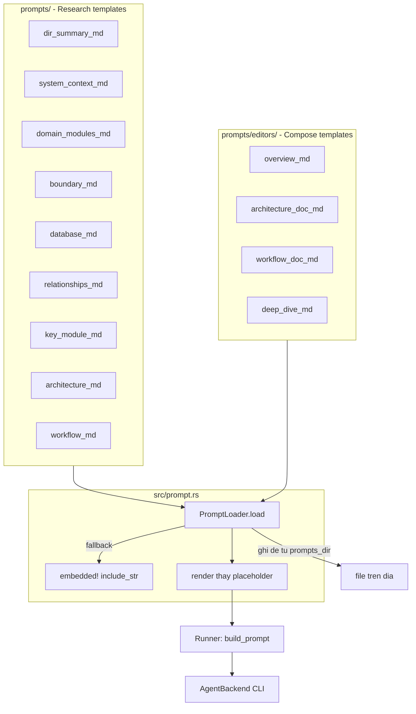
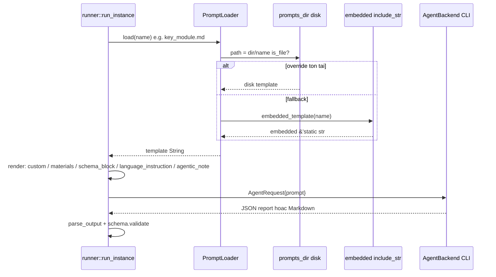

# Tri thức Prompt Phân tích — Tài liệu Deep-Dive

## 1. Mục đích module

`prompts/` là kho tri thức dạng template Markdown định nghĩa **vai trò phân tích** (persona), **nhiệm vụ** và **ràng buộc đầu ra** cho từng node trong DAG agent của agentwiki. Module này không chứa logic thực thi — nó là dữ liệu cấu hình văn bản, được nhúng tĩnh vào binary qua `include_str!` và cho phép ghi đè lúc chạy bằng thư mục `prompts_dir` trên đĩa.

Hai nhóm template phục vụ hai pha của pipeline:

- **Research** (9 template tại `prompts/`): định nghĩa các tác vụ phân tích trả về JSON có schema — `dir_summary`, `system_context`, `domain_modules`, `boundary`, `database`, `relationships`, `key_module`, `architecture`, `workflow`.
- **Compose / Editors** (4 template tại `prompts/editors/`): định nghĩa các tác vụ sinh tài liệu Markdown cấp C4 — `overview`, `architecture_doc`, `workflow_doc`, `deep_dive`.

Các template sinh sơ đồ đều nhúng mục **Mermaid Diagram Safety Rules** bắt buộc, đảm bảo sơ đồ hợp lệ trong strict parser.

## 2. Cấu trúc nội bộ

| Template | Số dòng | Placeholder | Đầu ra |
|---|---|---|---|
| `dir_summary.md` | 28 | `{{custom}}`, `{{language_instruction}}`, `{{schema_block}}`, `{{agentic_note}}` | JSON dossier thư mục + `file_insights` |
| `system_context.md` | 46 | `{{materials}}`, `{{language_instruction}}`, `{{schema_block}}`, `{{agentic_note}}` | `SystemContextReport` JSON |
| `domain_modules.md` | 29 | tương tự | `DomainModulesReport` JSON (DDD, bounded context) |
| `boundary.md` | 55 | tương tự | `BoundaryAnalysisReport` JSON (CLI/API/router) |
| `database.md` | 38 | tương tự | `DatabaseOverviewReport` JSON (tables/views/procs/flows) |
| `relationships.md` | 27 | tương tự | `RelationshipAnalysis` JSON |
| `key_module.md` | 32 | `{{custom}}`, `{{language_instruction}}`, `{{schema_block}}`, `{{agentic_note}}` | `KeyModuleReport` JSON per-domain (fan-out) |
| `architecture.md` | 28 | có Mermaid rules | JSON phân tích kiến trúc |
| `workflow.md` | 45 | có Mermaid rules | JSON workflow |
| `editors/overview.md` | 54 | `{{materials}}`, `{{custom}}`, `{{language_instruction}}`, `{{agentic_note}}` | Markdown C4 SystemContext (`1.Overview.md`) |
| `editors/architecture_doc.md` | 48 | tương tự | Markdown `2.Architecture.md` |
| `editors/workflow_doc.md` | 46 | tương tự | Markdown `3.Workflow.md` |
| `editors/deep_dive.md` | 25 | `{{materials}}` + per-domain | Markdown `4.Deep-Exploration/<domain>.md` |

Thống kê placeholder trên toàn kho: `{{agentic_note}}` ×13, `{{language_instruction}}` ×13, `{{custom}}` ×11, `{{materials}}` ×10, `{{schema_block}}` ×7.

## 3. Giao diện chính

Module được tiêu thụ qua `PromptLoader` trong [prompt.rs](../../../src/prompt.rs):

- **`PromptLoader::new(dir: Option<PathBuf>)`** — `dir` là `config.prompts_dir` (thư mục ghi đè trên đĩa), có thể `None`.
- **`PromptLoader::load(name) -> Result<String>`** — nhận tên tương đối (`"system_context.md"`, `"editors/deep_dive.md"`); ưu tiên file trong `prompts_dir`, fallback sang bản nhúng `include_str!`; tên lạ trả `Error::Prompt`.
- **`render(template, &HashMap<&str, String>) -> String`** — thay chuỗi thuần `{{key}}` bằng `String::replace`; placeholder không biết được giữ nguyên để ví dụ JSON trong template (dạng `{{"a": 1}}`) không bị phá. Không escape, không điều kiện, không vòng lặp — đủ cho prompt một lần dùng.

Macro `embedded!` ánh xạ 13 tên template sang `include_str!`, khiến binary self-contained: chạy được kể cả khi thiếu thư mục `prompts/` trên đĩa.

Ánh xạ spec → template nằm ở `src/agent/registry.rs`: `key_module` → `key_module.md`, `overview` → `editors/overview.md`, `architecture_doc` → `editors/architecture_doc.md`, `workflow_doc` → `editors/workflow_doc.md`, `deep_dive` → `editors/deep_dive.md` (phụ thuộc kết quả `key_module`).

## 4. Luồng dữ liệu / điều khiển

Điểm điền placeholder do runner/materials chuẩn bị:

- `{{materials}}` — các block từ `materials.rs` (`project_structure`, `readme_block`, `code_insights_block`, `relationships_block`); chỉ chèn ở `Mode::Embedded`. Ở `Mode::Agentic`, scan materials bị bỏ và thay bằng `{{agentic_note}}` hướng dẫn agent tự đọc file trong `cwd`.
- `{{custom}}` — block per-instance do `dir_summary_custom`, `key_module_custom`, `boundary_custom`, `database_custom`, `relationships_custom` sinh (ví dụ `key_module@<domain>` nhận domain + dossiers).
- `{{schema_block}}` — JSON schema canonical từ `SchemaSpec::json_schema` (schemars), nhúng vào prompt để buộc cấu trúc đầu ra.
- `{{language_instruction}}` — `TargetLanguage::instruction()` từ config.
- `{{agentic_note}}` — ghi chú chế độ agentic.

## 5. Quyết định triển khai đáng chú ý

1. **Nhúng tĩnh + ghi đè đĩa**: `include_str!` đảm bảo binary tự chứa; `prompts_dir` cho phép tinh chỉnh prompt không cần build lại — khớp mục tiêu vận hành "template là dữ liệu, không phải code".
2. **Render thuần, không template engine**: `String::replace` giữ nguyên placeholder lạ, tránh phá ví dụ JSON/JSON-schema nằm trong chính template — có unit test `render_replaces_known_leaves_unknown` kiểm chứng.
3. **Mermaid Safety Rules chỉ ở template sinh sơ đồ**: mục quy tắc (node ID ASCII `[A-Za-z0-9_]`, header chuẩn `graph TD`/`flowchart TD`/`sequenceDiagram`/`erDiagram`, text đa ngôn ngữ chỉ trong label, không ký tự ẩn/smart quote) xuất hiện trong `architecture.md`, `workflow.md`, `editors/overview.md`, `architecture_doc.md`, `workflow_doc.md`, `deep_dive.md` — không phải quy tắc chung toàn kho. `key_module.md` cũng yêu cầu ASCII node ID trong field `flowchart_mermaid`/`sequence_diagram_mermaid`.
4. **Persona nhất quán**: mọi template mở đầu bằng định nghĩa vai trò ("software development expert" / "software architecture analyst"), kèm danh mục phân tích và "CRITICAL RULES" cho output JSON (ví dụ `system_boundary` phải là OBJECT, `confidence_score` phải là number) — giảm tỷ lệ JSON "bẩn" trước khi lenient deserializer phải can thiệp.
5. **Fan-out qua `{{custom}}`**: `dir_summary` (PerDir) và `key_module`/`deep_dive` (PerDomain) tái dùng một template duy nhất; biến đổi per-instance nằm hết trong `{{custom}}` do runner build — giữ template ổn định.
6. **Chênh lệch Embedded vs Agentic**: cùng một template phục vụ cả hai mode nhờ `{{materials}}`/`{{agentic_note}}` — mode quyết định dữ liệu scan nhúng sẵn hay agent tự đọc.

## 6. File liên quan

- `prompts/dir_summary.md`, `system_context.md`, `domain_modules.md`, `boundary.md`, `database.md`, `relationships.md`, `key_module.md`, `architecture.md`, `workflow.md`
- `prompts/editors/overview.md`, `architecture_doc.md`, `workflow_doc.md`, `deep_dive.md`
- `src/prompt.rs` — `PromptLoader`, `render`, macro `embedded!`
- `src/agent/registry.rs` — ánh xạ `AgentSpec.prompt_tmpl` → tên template
- `src/agent/materials.rs` — sinh nội dung `{{materials}}` / `{{custom}}`
- `src/agent/runner.rs` — `build_prompt`, `build_materials`, chèn `schema_block`/`language_instruction`/`agentic_note`
- `src/agent/spec.rs` — `SchemaSpec` cung cấp `json_schema` cho `{{schema_block}}`