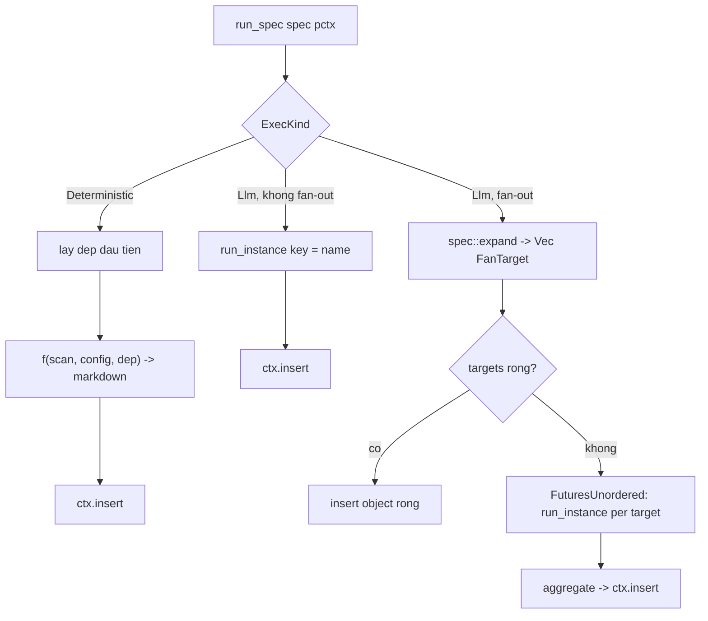
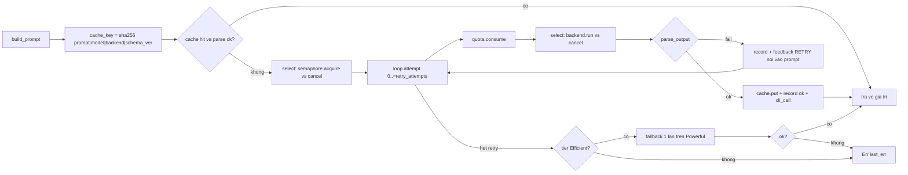

# Điều phối Agent & Vòng lặp LLM (`src/agent/`)

## 1. Mục đích

Module `src/agent/` là lõi business-logic của agentwiki — nơi biến `ScanData` thành các báo cáo nghiên cứu có cấu trúc và tài liệu Markdown cuối cùng. Module chịu trách nhiệm:

- **Định nghĩa DAG tác vụ**: khai báo tĩnh toàn bộ node research/compose (`AgentSpec`), trục fan-out, phụ thuộc, model tier và hợp đồng đầu ra (`registry.rs`, `spec.rs`).
- **Vòng lặp agentic per-node**: render prompt từ materials → tra cache → consume quota → gọi backend CLI → parse JSON đa chiến lược → retry kèm feedback → fallback model tier → ghi audit (`runner.rs`).
- **Kho ngữ cảnh chia sẻ**: `ResearchContext` truyền kết quả giữa các node của DAG và persist ra `research.json` (`context.rs`).
- **Render materials**: biến `ScanData`, dossier, insights thành block văn bản chèn vào `{{materials}}`/`{{custom}}` của prompt (`materials.rs`).

Ranho giới trách nhiệm: `pipeline/` quyết định *khi nào* spec chạy (tầng topo, run-lock, cancel); `agent/` quyết định *chạy thế nào* (prompt, cache, retry, validate). `agent/reports/` là lớp anti-corruption cho JSON "bẩn" của LLM — nằm trong cùng cây module nhưng là domain riêng.

## 2. Cấu trúc nội bộ

| File | Vai trò | Kích thước |
|---|---|---|
| `mod.rs` | Khai báo submodule, re-export `ResearchContext`, `run_spec`, các kiểu spec | 13 dòng |
| `spec.rs` | Kiểu dữ liệu DAG: `AgentSpec`, `Phase`, `ExecKind`, `Material`, `FanOut`, `FanTarget`, `SchemaSpec`, `expand`, `schema_spec` | 186 dòng |
| `registry.rs` | Khai báo tĩnh 9 research specs + 6 compose specs, `display_name`, `topo_levels` (Kahn) | 250 dòng |
| `runner.rs` | Engine: `run_spec` → `run_instance` → `run_instance_inner`; `build_prompt`, `extract_json`, `aggregate`, `record` | 517 dòng |
| `context.rs` | `ResearchContext` = `RwLock<HashMap<String, Value>>` async, save/load | 83 dòng |
| `materials.rs` | Render `{{materials}}`/`{{custom}}`: project structure, readme, code insights, relationships, per-instance custom blocks, `dossier_from` | 310 dòng |

## 3. Các kiểu dữ liệu và interface chính

### 3.1 `AgentSpec` — một node trong DAG

[spec.rs:106-126](../../../src/agent/spec.rs)

Mỗi spec mô tả:

- `name`: định danh duy nhất (`dir_summary`, `system_context`, …), đồng thời là key trong `ResearchContext`.
- `prompt_tmpl`: file template dưới `prompts/` (hoặc bản nhúng `include_str!`).
- `schema: Option<SchemaSpec>`: hợp đồng JSON — `json_schema` (fn pointer sinh JSON schema qua `schemars` để nhúng vào prompt) và `validate` (deserialize → re-serialize ra canonical form). `None` = output markdown thô.
- `tier: ModelTier`: `Efficient` hoặc `Powerful`, ánh xạ sang chuỗi model `<backend>:<model>` qua `Config::model_for`.
- `deps`: danh sách node phải hoàn thành trước; kết quả của chúng được inject tự động vào `{{materials}}` dưới dạng `#### <Display Name>` + fenced block.
- `fan_out: Option<FanOut>`: `PerDir` (một instance per thư mục đã scan — `dir_summary`) hoặc `PerDomain` (một instance per domain từ `domain_modules` — `key_module`, `deep_dive`).
- `materials`: các `Material` block bổ sung (`ProjectStructure`, `CodeInsights`, `Relationships`, `Readme`, `Custom`).
- `exec`: `ExecKind::Llm` (render prompt → backend → parse) hoặc `ExecKind::Deterministic(DetFn)` — hàm thuần `(ScanData, Config, dep_result) -> Result<String>`, dùng cho `boundary_doc`/`database_doc` (không tốn cuộc gọi CLI).

`instance_key(target)` sinh key dạng `name@target` cho fan-out instance.

### 3.2 `SchemaSpec` và `schema_spec<T>()`

[spec.rs:21-54](../../../src/agent/spec.rs)

`schema_spec::<T>()` là factory generic: `json_schema` trả `schemars::schema_for!(T)` dưới dạng `Value` để nhúng vào `{{schema_block}}`; `validate` thực hiện `serde_json::from_value::<T>` rồi re-serialize — nhờ đó giá trị lưu trong context luôn là canonical form của struct report. Có một chi tiết khoan dung: nếu model bọc object trong array một phần tử, `validate` thử sole element trước khi trả `Error::Validation` kèm tail 300 ký tự của raw JSON phục vụ chẩn đoán.

### 3.3 Fan-out: `expand`

[spec.rs:149-185](../../../src/agent/spec.rs)

- `PerDir` → mỗi `DirectoryInfo` trong `scan.directories` thành một `FanTarget` (key = rel_path, `"."` cho root).
- `PerDomain` → đọc `DomainModulesReport` đã lưu trong ctx dưới key `domain_modules`, mỗi `DomainModule` thành một `FanTarget` (key = domain name). Đây là điểm DAG *phụ thuộc dữ liệu động*: số instance của `key_module`/`deep_dive` chỉ biết sau khi `domain_modules` chạy xong.

### 3.4 `ResearchContext`

[context.rs:16-53](../../../src/agent/context.rs)

Store async đơn giản bọc `tokio::sync::RwLock<HashMap<String, Value>>`. API: `insert`, `get`, `get_typed<T>` (deserialize qua `serde_json::from_value`, nuốt lỗi thành `None`), `contains`, `keys` (sorted), `snapshot`. `save`/`load` persist ra `research.json` qua `write_atomic` — nền tảng cho cờ `--skip-research` của pipeline.

## 4. DAG tác vụ (registry)

`research_specs()` khai báo 9 node, `compose_specs()` khai báo 6 node. Bảng phụ thuộc:

| Spec | Phase | Tier | Fan-out | Deps | Schema |
|---|---|---|---|---|---|
| `dir_summary` | Research | Efficient | PerDir | — | `DirectorySummaryResponse` |
| `relationships` | Research | Efficient | — | `dir_summary` | `RelationshipAnalysis` |
| `system_context` | Research | Efficient | — | `dir_summary` | `SystemContextReport` |
| `domain_modules` | Research | Efficient | — | `dir_summary`, `system_context`, `relationships` | `DomainModulesReport` |
| `database` | Research | Efficient | — | `dir_summary` | `DatabaseOverviewReport` |
| `architecture` | Research | Powerful | — | `system_context`, `domain_modules` | none (text) |
| `workflow` | Research | Powerful | — | `system_context`, `domain_modules` | none (text) |
| `key_module` | Research | Efficient | PerDomain | `system_context`, `domain_modules` | `KeyModuleReport` |
| `boundary` | Research | Efficient | — | `system_context`, `relationships` | `BoundaryAnalysisReport` |
| `overview` | Compose | Efficient | — | `system_context`, `domain_modules` | none |
| `architecture_doc` | Compose | Powerful | — | `system_context`, `domain_modules`, `architecture`, `workflow` | none |
| `workflow_doc` | Compose | Powerful | — | `system_context`, `domain_modules`, `workflow` | none |
| `boundary_doc` | Compose | — | — | `boundary` | Deterministic |
| `database_doc` | Compose | — | — | `database` | Deterministic |
| `deep_dive` | Compose | Powerful | PerDomain | `system_context`, `domain_modules`, `architecture`, `workflow`, `key_module` | none |

`topo_levels()` dùng Kahn level-ordering: `levels[i]` chứa các spec mà mọi dep đã nằm ở tầng trước; pipeline spawn song song trong từng tầng. `debug_assert` ở cuối phát hiện chu trình phụ thuộc khi build debug. Deps trỏ tới spec ngoài danh sách (ví dụ compose spec dep vào research spec) được coi là đã hoàn thành — `topo_levels` chỉ xếp tầng trong phạm vi danh sách được truyền vào.

## 5. Luồng điều khiển của Runner

### 5.1 `run_spec` — entrypoint per-node



Điểm thiết kế đáng chú ý: fan-out dùng **`FuturesUnordered` chứ không phải `JoinSet`** — các future sống trong cùng task, nên khi task bị abort (cancel từ pipeline) chúng bị drop đồng bộ, kéo theo drop `Child` process và giết CLI con nhờ `kill_on_drop` (tránh orphan process tốn quota). Một instance fan-out lỗi làm cả spec fail (`r?` trong vòng drain) — không có partial success.

### 5.2 `aggregate` — gom kết quả fan-out

[runner.rs:77-120](../../../src/agent/runner.rs)

- `dir_summary`: mỗi response được deserialize thành `DirectorySummaryResponse`, merge với metadata scanner qua `materials::dossier_from` (điền `file_path` — model chỉ trả tên file, `purpose` phân loại heuristic theo tên thư mục) → ctx lưu `Vec<DirectoryDossier>`.
- PerDomain khác: ctx lưu map `{domain_name: result}`; `key_module` được tự stamp `domain_name` vì model không echo ổn định.

### 5.3 `run_instance_inner` — vòng lặp LLM



Chi tiết quan trọng:

- **Cache được re-validate**: hit cache vẫn chạy `parse_output`; entry parse hỏng bị coi là stale và regenerate — bảo vệ khỏi cache ghi từ schema cũ.
- **Semaphore bọc toàn bộ retry loop**, acquire qua `tokio::select!` với `biased` — cancel unwind ngay cả khi đang xếp hàng.
- **`biased` select ở `backend.run`**: response vừa đến vẫn được cache kể cả khi cancel đến cùng tick — không mất kết quả đã trả tiền.
- **Retry-with-feedback**: mỗi lần fail nối chuỗi `\n\n**RETRY**: Your previous response failed: {err}...` vào prompt — biến validation error thành tín hiệu cho lần gọi sau.
- **Fallback một lần**: chỉ tier `Efficient` được fallback lên model `Powerful` (với prompt gốc + feedback cuối). Fallback cũng consume quota và ghi cache nếu thành công.
- **Audit**: mọi cuộc gọi thật (kể cả lỗi) ghi `CallRecord` vào `calls.jsonl` qua `quota.record` (best-effort) và tăng `stats.cli_call`.

### 5.4 `extract_json` — ba chiến lược trích xuất

[runner.rs:398-438](../../../src/agent/runner.rs)

1. **Strict**: `serde_json::from_str` trên toàn bộ response đã trim.
2. **Fenced**: tìm block ```` ```json ```` đầu tiên, parse body tới ```` ``` ```` kế tiếp.
3. **Prose-wrapped**: scanner đếm depth từ `{`/`[` đầu tiên, tôn trọng string/escape (`\\`, `"`), parse substring tới depth = 0 — cứu output dạng "Sure! {…} done".

Sau extraction, `schema.validate` (lenient deserializers + sole-array unwrap) normalize về canonical form. Spec `schema: None` chỉ yêu cầu response non-empty và lưu `Value::String`.

### 5.5 `build_prompt` / `build_materials` / `custom_block`

Prompt được render qua `prompt::render` (thay `{{key}}` thuần chuỗi) với các biến:

- `{{materials}}`: **kết quả deps lên đầu** (`dep_block` render `#### <display_name>` + fenced JSON — display name map qua `registry::display_name`), sau đó là scan materials. Ở `Mode::Agentic` chỉ có dep blocks + `{{agentic_note}}` (repo là cwd của CLI, tự explore read-only); Ở `Mode::Embedded` mới chèn `ProjectStructure`/`CodeInsights`/`Readme`/`Relationships` từ scanner. Tổng độ dài bị cắt bởi `limits.materials_char_cap` (mặc định 192k chars).
- `{{custom}}`: block per-instance — `dir_summary_custom` (metadata dir + metrics/interfaces/source preview per file qua `scanner::extract` + `read_capped`), `relationships_custom` (dossier summaries), `key_module_custom` (domain detail + insights lọc theo `code_paths`), `deep_dive` (header `**Module**/**Description**/**Code paths**`), `boundary_custom`/`database_custom` (insights lọc theo `CodePurpose`).
- `{{schema_block}}`: JSON Schema pretty-printed kèm chỉ thị "single valid JSON object, no fences".
- `{{language_instruction}}`: từ `config.target_language`.

`materials.rs` áp nhiều giới hạn: README 16k chars, code insights top-N (`code_insights_limit`, mặc định 25), key_module 50 insights, database 50 insights × 10k chars summary, source preview `file_source_chars` (mặc định 500). `filtered_insights` match path hai chiều (`fp.contains(p) || p.contains(fp)`) để chịu được `code_paths` do LLM sinh không khớp chính xác.

## 6. Các quyết định triển khai đáng chú ý

1. **Schema bằng fn pointers**: `SchemaSpec` giữ hai `fn` pointer thay vì trait object — `AgentSpec` giữ được `Clone + Copy`-friendly cho field, `schema_spec::<T>()` monomorphize per report type.
2. **Deps → prompt tự động**: spec không cần biết cách format dep; runner inject `dep_block` cho mọi dep có trong ctx. Spec thiếu dep chỉ nhận materials mỏng hơn, không fail.
3. **Canonical form trong ctx**: `validate` re-serialize sau deserialize nên mọi consumer đọc ctx (`get_typed`, deterministic renderers, `expand`) luôn thấy đúng shape struct report.
4. **Deterministic renderers trong DAG**: `boundary_doc`/`database_doc` được lập lịch như node thường (deps, topo, progress, stats) nhưng không qua LLM — render `BoundaryAnalysisReport`/`DatabaseOverviewReport` thành Markdown tất định, giảm một cuộc gọi CLI và đảm bảo định dạng ổn định.
5. **Ba lớp bảo vệ chi phí trong một vòng lặp**: cache sha256 trước semaphore, `quota.consume` trước mỗi attempt (kể cả retry), và retry-with-feedback tối đa hoá xác suất thành công của một cuộc gọi đã trả giá.
6. **Không partial-success ở fan-out**: một instance hỏng fail cả spec — đơn giản hoá reasoning về ctx (không có map rỗng nửa vời), đổi lại một directory lỗi có thể kéo sập `dir_summary`.

## 7. Tương tác với các module khác

- `pipeline::run_level_order` gọi `agent::run_spec` cho từng spec trong từng tầng topo; mọi tài nguyên runner cần đi qua `PipelineCtx` (`ctx`, `cache`, `quota`, `semaphore`, `cancel`, `progress`, `stats`, `prompts`, `scan`, `config`, `backend()`).
- `backend::AgentBackend::run` là điểm duy nhất runner gọi LLM; `BackendKind::parse` tách chuỗi `<backend>:<model>` từ `config.model_for(tier)`.
- `agent::reports::*` cung cấp các kiểu `T` cho `schema_spec::<T>()` và cho `aggregate`/`expand`.
- `scanner` cung cấp `ScanData`/`DirectoryInfo` cho fan-out PerDir và `extract` cho `dir_summary_custom`.
- `output::boundary_doc`/`database_doc` được registry gắn vào `ExecKind::Deterministic`.

## 8. File liên quan

- `src/agent/mod.rs`, `src/agent/spec.rs`, `src/agent/registry.rs`, `src/agent/runner.rs`, `src/agent/context.rs`, `src/agent/materials.rs`
- `src/agent/reports.rs` + `src/agent/reports/` — schema và lenient deserializers (domain riêng: "Hợp đồng Báo cáo & Chống phá vỡ")
- `src/pipeline/mod.rs` — caller (`run_level_order`, `PipelineCtx`)
- `src/backend/mod.rs` — `AgentRequest`/`AgentResult`/`BackendKind`
- `src/cache.rs`, `src/quota.rs`, `src/prompt.rs` — cache/quota/prompt loader
- `prompts/` + `prompts/editors/` — template được `prompt_tmpl` tham chiếu
- `tests/pipeline_offline.rs` — test offline end-to-end qua `MockBackend`, bao phủ retry và cache của runner