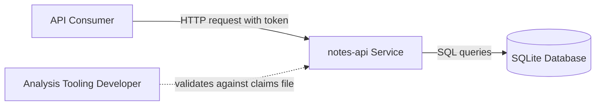
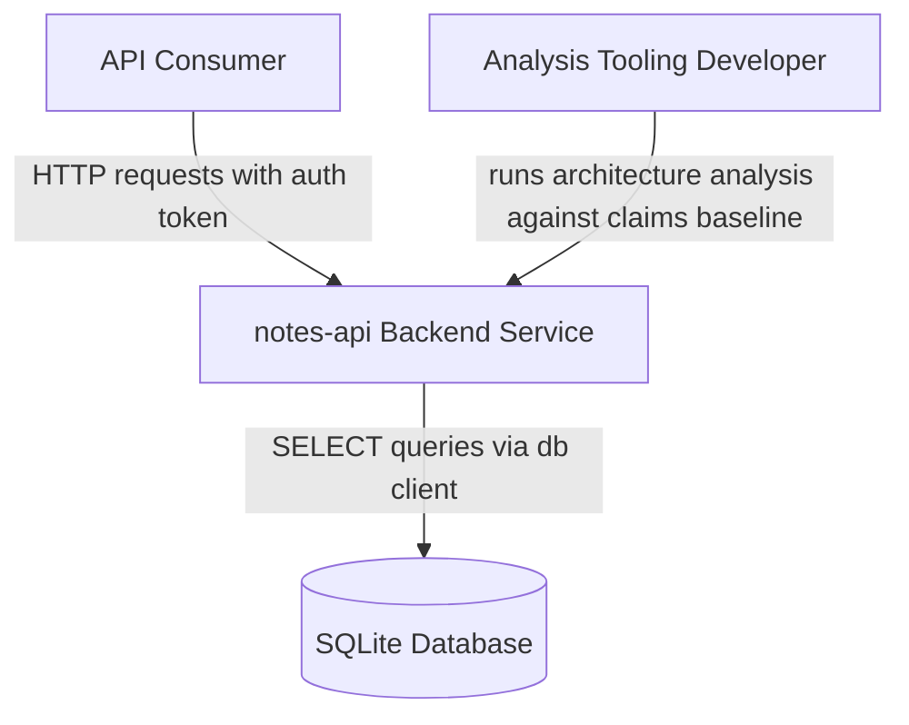
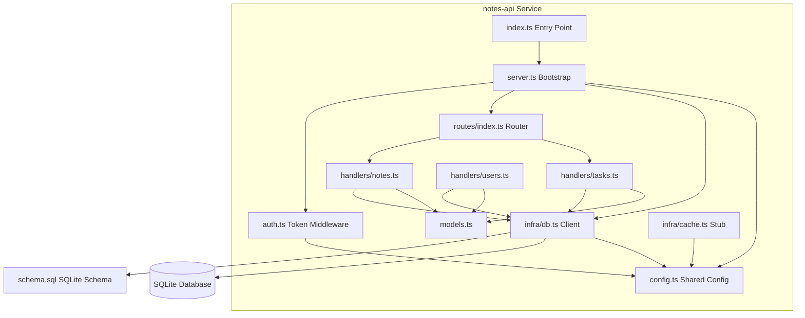

# System Context Overview

## 1. Project Introduction

**notes-api** is a small TypeScript REST API skeleton for managing notes, with stub handlers for tasks and users. It is classified as a **BackendService** and exhibits a classic layered architecture: an entry point boots an HTTP server on port 8080, applies token-based authentication middleware, and routes requests to per-entity handlers that query a SQLite database.

### Core Objectives

- Expose a minimal HTTP API for listing note records (with parallel stub surfaces for tasks and users).
- Demonstrate a clean layered composition: bootstrap → auth middleware → router aggregation → entity handlers → shared database client → SQLite schema.

### Business Value

The project provides a minimal HTTP API for storing and listing notes. Notably, the presence of a `handwritten.claims.json` file strongly suggests this repository is a **spike or fixture project**: it exists to validate architecture-analysis and dependency-graph tooling against a known, predictable codebase rather than to serve production traffic.

### Technical Characteristics

- **Single-process TypeScript service** — all components run in-process within one runtime.
- **Layered architecture** — presentation (server, router, middleware), domain (handlers, models), infrastructure (db client, cache, schema), and a shared kernel (config).
- **Stubbed infrastructure** — the database client, cache, and router `listen`/`use` methods are stubs; the system is a structural skeleton rather than a functional service.
- **Centralized configuration** — `src/config.ts` holds the port (8080), a hardcoded dev token, and the SQLite database URL, making it the highest fan-in module.

## 2. Target Users

| User Role | Description | Needs |
|---|---|---|
| **API consumers** | Client applications or developers calling the REST endpoints with an auth token. | List notes, tasks, and users over HTTP; authenticate requests with a static token. |
| **Analysis tooling developers** | Developers using this repo as a fixture to validate dependency-graph or architecture-analysis output against `handwritten.claims.json`. | A known, small codebase with predictable structure; a baseline claims file for verification. |

### Usage Scenarios

- **Primary flow — List Notes:** an authenticated consumer calls the notes route; the request passes token validation, is dispatched to the notes handler, which runs `SELECT * FROM notes` via the shared db client and returns a typed `Note[]`.
- **Secondary flow — List Tasks:** mirrors the notes flow through the tasks handler (`SELECT * FROM tasks`).
- **Tooling validation:** analysis tooling developers run architecture analyzers over the repository and compare output to the handwritten claims baseline.

## 3. System Boundaries

### Scope

The system covers HTTP server bootstrap, token authentication, routing, and list handlers for notes, tasks, and users backed by a SQLite store. Everything is in-process within a single TypeScript service.

### Included Components

| Component | Path | Responsibility |
|---|---|---|
| Entry point | `src/index.ts` | Process entry; invokes server bootstrap. |
| Server bootstrap | `src/server.ts` | `startServer()`: connects db, registers auth middleware, starts HTTP listener. |
| Central config | `src/config.ts` | Port, dev token, DB URL — shared kernel. |
| Domain models | `src/models.ts` | `Note`, `Task`, `User` type contracts. |
| Route aggregation | `src/routes/index.ts` | Mounts entity routers into a unified router (`use`, `listen`, `mount`). |
| Entity handlers | `src/handlers/` | `notesRouter`, `tasksRouter`, `usersRouter` list handlers. |
| Auth middleware | `src/middleware/auth.ts` | `checkAuth()` static token validation. |
| Database client | `src/infra/db.ts` | `db.connect()`, `db.query<T>(sql)` — stubbed. |
| Cache | `src/infra/cache.ts` | `cache.get(key)` — stub placeholder. |
| SQLite schema | `db/schema.sql` | Canonical `notes` table (`id INTEGER PRIMARY KEY AUTOINCREMENT`, `body TEXT NOT NULL`). |

### Excluded Components

- Any frontend or UI
- Real authentication/authorization service (only a static token check)
- Write/update/delete operations (only list handlers exist)
- Production database engine beyond local SQLite
- Real caching implementation
- Deployment, CI, and packaging (no scripts or dependencies declared)

### Known Boundary Gaps

- The **users handler is implemented but never mounted** by the route aggregator.
- Only the **notes table has a canonical schema**; tasks and users tables are referenced by queries but not defined in `schema.sql`.
- All infrastructure integrations are **stubs**, consistent with the fixture nature of the project.

## 4. External System Interactions

The system has a single external dependency:

| External System | Interaction | Description |
|---|---|---|
| **SQLite database** | SQL queries via the `src/infra/db.ts` client (currently stubbed) | Local SQLite database holding the `notes` table (`id`, `body`) defined in `db/schema.sql`. Connection target comes from `config.dbUrl`. |

There are no external network services, message brokers, third-party APIs, or identity providers. Authentication is a static token comparison against `config.token` — entirely internal.

### Request/Dependency Flow

## 5. System Context Diagram

### Key Context Information

- **System under description:** `notes-api` — the only software system inside the boundary.
- **Actors:** API consumers (runtime users) and analysis tooling developers (development-time users).
- **External system:** local SQLite database — the sole persistence dependency.
- **Trust boundary:** the HTTP edge, guarded by `checkAuth` token middleware; all requests must carry the configured dev token.

## 6. Technical Architecture Overview

The system is organized into four domains, mapped to a layered/DDD architecture:

| Domain | Type | Importance | Key Modules |
|---|---|---|---|
| **Notes Management** | Core Business Domain | 9.0 | Notes Handler, Tasks Handler, Users Handler, Domain Models |
| **API Gateway & Security** | Application / Interface Domain | 8.0 | Server Bootstrap, Route Aggregation, Authentication Middleware |
| **Data Persistence & Infrastructure** | Infrastructure Domain | 6.0 | Database Client, Data Schema, Cache |
| **Configuration** | Shared Kernel / Supporting Domain | 6.0 | Application Config |

### Internal Structure (Container-Level Preview)

### Domain Relations

| From | To | Type | Description |
|---|---|---|---|
| API Gateway & Security | Notes Management | Composition | Router mounts notes/tasks feature routers; bootstrap wires the handler surface. |
| Notes Management | Data Persistence & Infrastructure | Data Dependency | All handlers funnel `SELECT * FROM <entity>` through `db.query<T>` typed by domain models. |
| API Gateway & Security | Data Persistence & Infrastructure | Service Call | `startServer()` calls `db.connect()` before accepting traffic. |
| API Gateway & Security | Configuration | Configuration Dependency | Entry reads `config.port`; auth reads `config.token`. |
| Data Persistence & Infrastructure | Configuration | Configuration Dependency | db client reads `config.dbUrl`; cache references shared config. |

### Primary Business Flow — List Notes

1. **Server Bootstrap** (`src/server.ts startServer()`): connect database, apply auth middleware, start HTTP listener on configured port.
2. **Authentication Middleware** (`src/middleware/auth.ts checkAuth()`): validate request token against the configured static token.
3. **Route Aggregation** (`src/routes/index.ts router.mount()`): dispatch request to the mounted notes feature router.
4. **Notes Handler** (`src/handlers/notes.ts notesRouter.list()`): run `SELECT * FROM notes` via the shared db client and map to the `Note` type.
5. **Database Client** (`src/infra/db.ts db.query<Note>()`): execute the typed query against the notes table and return rows.

### Architecture Insights

- **Single integration point:** all persistence traffic funnels through `db.query<T>` — swapping the stub for a real SQLite driver localizes change to `src/infra/db.ts`.
- **Highest fan-in:** `config.ts` is depended on by bootstrap, auth, and infra; changes there have the widest blast radius.
- **Wiring gaps as fixture signals:** the unmounted users router, missing tasks/users schema, and stubbed infrastructure are deliberate structural markers for validating analysis tooling against `handwritten.claims.json` — not production defects to fix.
- **Not production-ready:** no write operations, static token auth, no dependency declarations or deployment packaging — the boundary is intentionally minimal.