# Architecture Overview

## 1. Architecture Overview

`notes-api` is a minimal TypeScript REST API skeleton organized as a **classic layered architecture**. A single in-process service composes, at startup:

1. An entry point that reads centralized configuration and boots an HTTP listener on port `8080`.
2. A token-auth middleware guarding the request edge.
3. A central router aggregating per-entity feature routers (`notes`, `tasks`; `users` is implemented but not mounted).
4. Handlers that issue typed queries through a single shared `db` client backed by a SQLite schema.
5. A `config` shared kernel — the highest fan-in module — supplying port, dev token, and database URL to every layer.

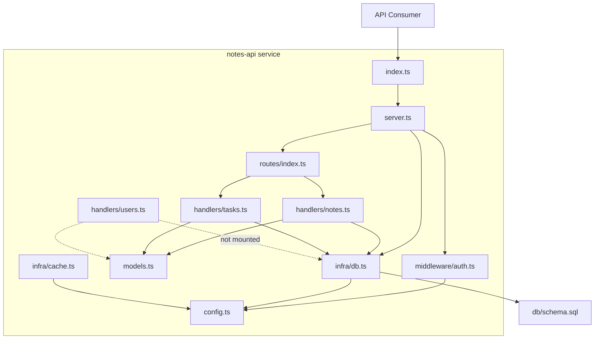

**Important context:** this codebase is almost certainly a **fixture/spike project**. Nearly all infrastructure (`db.query`, `cache.get`, `router.use/listen`, each handler's `register()`) is stubbed, and the presence of `handwritten.claims.json` indicates the repository exists to validate architecture-analysis tooling rather than serve production traffic. The architecture encodes the *shape* of a layered REST service without its runtime behavior — the stubs are deliberate seams, not defects in intent.

**Layering direction** (strictly respected, no cycles):

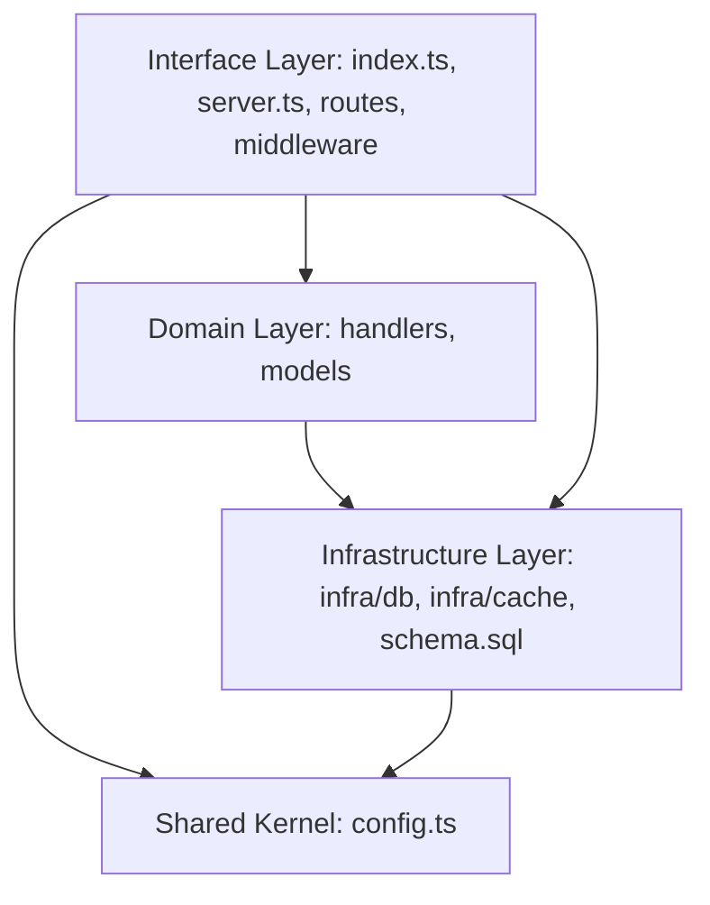

## 2. System Context

### 2.1 System Boundary

| In scope | Out of scope |
|---|---|
| Entry point (`src/index.ts`) | Any frontend or UI |
| Server bootstrap (`src/server.ts`) | Real authN/authZ (static token check only) |
| Central config (`src/config.ts`) | Write/update/delete operations (list-only surface) |
| Domain models: `Note`, `Task`, `User` | Production database beyond local SQLite |
| Route aggregation (`src/routes/index.ts`) | Real caching implementation |
| Entity handlers (`src/handlers/`) | Deployment, CI, packaging (no scripts/dependencies declared) |
| Token auth middleware (`src/middleware/auth.ts`) | |
| DB client stub + cache stub (`src/infra/`) | |
| SQLite schema (`db/schema.sql`) | |

### 2.2 External Systems

| System | Interaction |
|---|---|
| SQLite database | SQL queries via `src/infra/db.ts` (`db.query<T>`), holding the `notes(id, body)` table defined in `db/schema.sql`. Currently stubbed. |

### 2.3 Users

- **API consumers** — clients calling REST endpoints with a static token to list notes/tasks/users.
- **Analysis-tooling developers** — use the repo as a fixture to validate dependency-graph output against `handwritten.claims.json`.

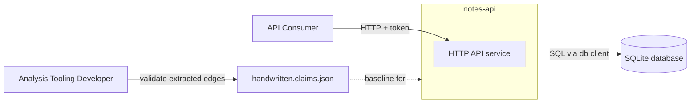

## 3. Container View

The system is a **single deployable container** — one TypeScript process — plus the local SQLite file it queries. There are no external services, message brokers, or remote dependencies.

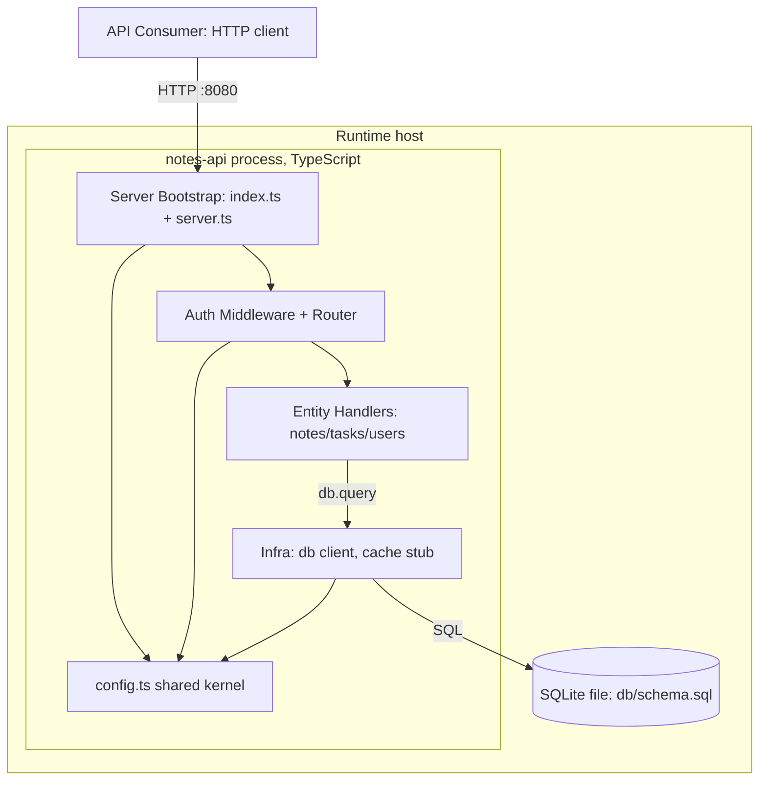

| Container | Technology | Responsibility | State |
|---|---|---|---|
| notes-api process | TypeScript, Node-style runtime | HTTP server, auth gate, routing, list handlers, persistence client | **Stubbed seams**: `db.query` returns empty results; `router.use/listen` are no-ops |
| SQLite database | SQLite via `db/schema.sql` | Persist `notes(id INTEGER PRIMARY KEY AUTOINCREMENT, body TEXT NOT NULL)` | Only `notes` table has a canonical schema |

**Runtime prerequisites gap:** `package.json` declares no scripts or dependencies, so the service as documented cannot actually be compiled or started — consistent with its fixture role.

## 4. Component View

### 4.1 Domain Decomposition

| Domain | Type | Code paths | Role |
|---|---|---|---|
| **Notes Management** | Core business | `src/handlers/{notes,tasks,users}.ts`, `src/models.ts` | Entity routers + shared `Note`/`Task`/`User` contracts |
| **API Gateway & Security** | Interface layer | `src/index.ts`, `src/server.ts`, `src/routes/index.ts`, `src/middleware/auth.ts` | Bootstrap, route composition, token gate |
| **Data Persistence & Infrastructure** | Infrastructure | `src/infra/db.ts`, `src/infra/cache.ts`, `db/schema.sql` | Single persistence gateway, cache placeholder, schema |
| **Configuration** | Shared kernel | `src/config.ts` | `port=8080`, dev `token`, `dbUrl` — highest fan-in |

### 4.2 Component Detail

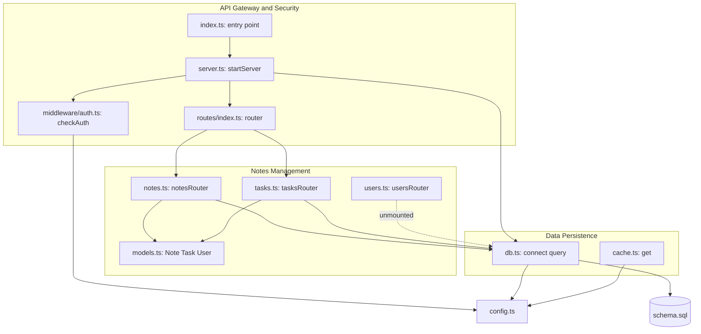

| Component | Key exports | Responsibility | Notes |
|---|---|---|---|
| `index.ts` | — | Composition-root entry: calls `startServer(config.port)` | Thin shell |
| `server.ts` | `startServer()` | `db.connect()` → `router.use(checkAuth)` → mount routers → `listen(8080)` | Startup orchestration |
| `routes/index.ts` | `router` (`use`, `listen`, `mount`) | Aggregates `notesRouter` + `tasksRouter` | `usersRouter` **not mounted** |
| `middleware/auth.ts` | `checkAuth()` | Compares request token vs `config.token`; boolean gate | Advisory only — `router.use` is a no-op, so nothing is actually rejected |
| `handlers/notes.ts` | `notesRouter.list`, `.register` | `SELECT * FROM notes` → `Note[]` | Primary flow |
| `handlers/tasks.ts` | `tasksRouter.list`, `.register` | `SELECT * FROM tasks` → `Task[]` | No `tasks` table in schema |
| `handlers/users.ts` | `usersRouter.list`, `.register` | `SELECT * FROM users` → `User[]` | Dead code: unmounted + no table |
| `models.ts` | `Note`, `Task`, `User` interfaces | Typed query results | Shared contract across layers |
| `infra/db.ts` | `db.connect()`, `db.query<T>(sql)` | Single persistence gateway | Stub: returns empty results; the deliberate swap-point for a real SQLite client |
| `infra/cache.ts` | `cache.get(key)` | Reserved caching seam | Unreferenced by any handler |
| `db/schema.sql` | `CREATE TABLE IF NOT EXISTS notes` | Canonical schema | Idempotent; `tasks`/`users` absent |
| `config.ts` | `config` | `port`, `token`, `dbUrl` | Hardcoded dev token — must not ship |

### 4.3 Domain Relations

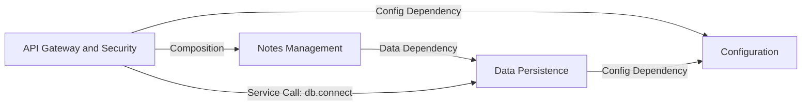

## 5. Key Processes

### 5.1 Primary Flow — List Notes (Authenticated Read)

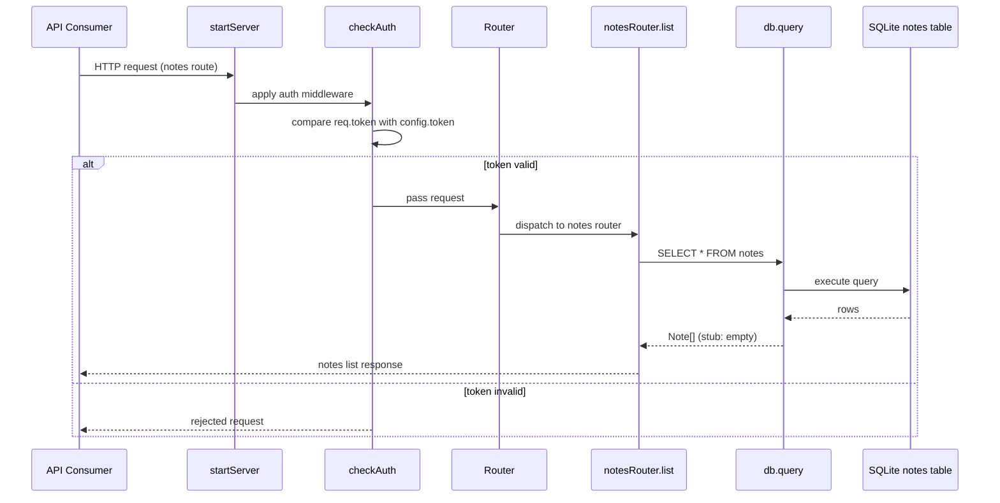

Steps: bootstrap (`index.ts` → `server.ts`) → auth (`checkAuth`) → dispatch (`router.mount` registered `notesRouter`/`tasksRouter`) → handler (`notesRouter.list` → `db.query<Note>`) → persistence (SQLite `notes` table).

### 5.2 List Tasks — identical pipeline

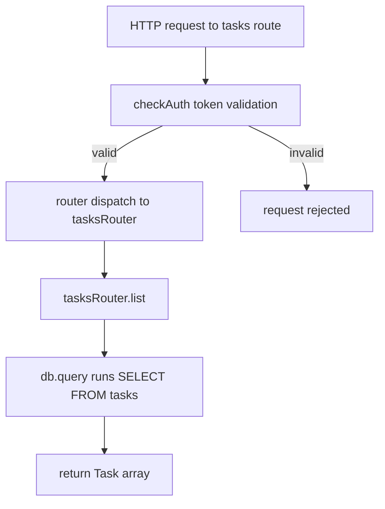

Same four-stage pattern — but no `tasks` table exists in `schema.sql`, so a real db would error.

### 5.3 List Users — wiring gap

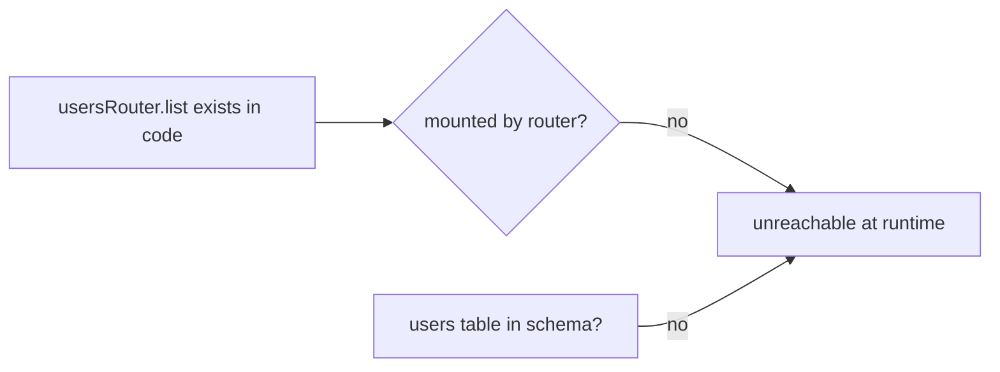

### 5.4 Server Bootstrap

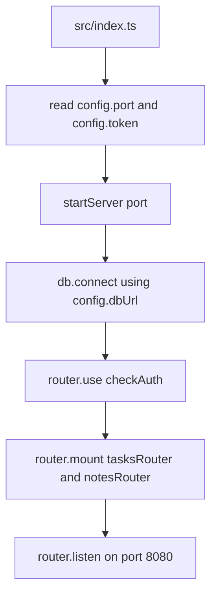

### 5.5 Fixture Validation Flow (meta)

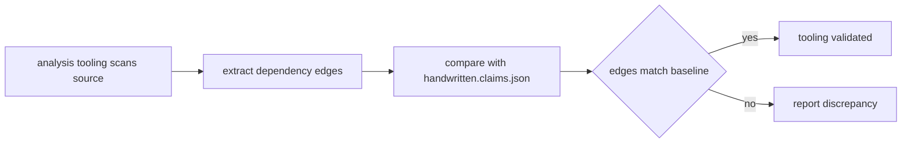

## 6. Technical Implementation

### 6.1 Design Patterns

- **Composition root**: `index.ts` + `server.ts` assemble all dependencies — nothing self-wires.
- **Feature router per entity**: uniform `XRouter { register(), list() }` shape; handlers depend only on `db` + `models`.
- **Shared kernel**: `config.ts` is imported by entry, auth, db, and cache — highest fan-in, zero dependencies of its own.
- **Single persistence gateway**: all SQL funnels through `db.query<T>` — one seam to implement/replace.
- **Typed gateway generics**: `db.query<Note>` maps rows to `models.ts` contracts at the type level.

### 6.2 Key Interfaces

| Interface | Shape | Consumers |
|---|---|---|
| `db` | `connect(): void`, `query<T>(sql: string): T[]` (stub → `[]`) | all handlers, `startServer` |
| `router` | `use(mw)`, `mount(featureRouter)`, `listen(port)` | `server.ts`, handlers' routers |
| `checkAuth` | `(req) => boolean` vs `config.token` | `router.use` |
| `config` | `{ port: 8080, token: <dev token>, dbUrl: <sqlite path> }` | entry, auth, db, cache |

### 6.3 Scalability / Performance / Security Assessment

- **Scalability**: Stateless, single-process design — horizontally scalable *in principle*; SQLite is the inherent bottleneck and should graduate to a networked engine for real use. The `cache.ts` seam anticipates a read-through cache but is unused.
- **Performance**: Uniform read-only pipeline (`auth → route → list → query`) is cheap; `db.query` returning empty stubs means no real cost today.
- **Security**: `checkAuth` is advisory (returns a boolean; `router.use` is a no-op), and `config.token` is a **hardcoded dev secret** — acceptable for a fixture, unacceptable to ship. No rate limiting, input validation, or TLS concerns are addressed.

### 6.4 Known Gaps & Drift

| # | Finding | Severity |
|---|---|---|
| 1 | `users.ts` is dead code — never mounted by `routes/index.ts` | Medium |
| 2 | Schema/handler mismatch — only `notes` table exists; `tasks`/`users` queries target nonexistent tables | High |
| 3 | Static dev token committed in `config.ts` | Medium |
| 4 | All infrastructure stubbed (`db.query`, `cache.get`, `router.*`, `register()`) | High (by design) |
| 5 | Read-only surface — no create/update/delete | Low |
| 6 | No build/run tooling in `package.json` | Medium |
| 7 | `cache.ts` unreferenced outside config | Low |

## 7. Deployment Architecture

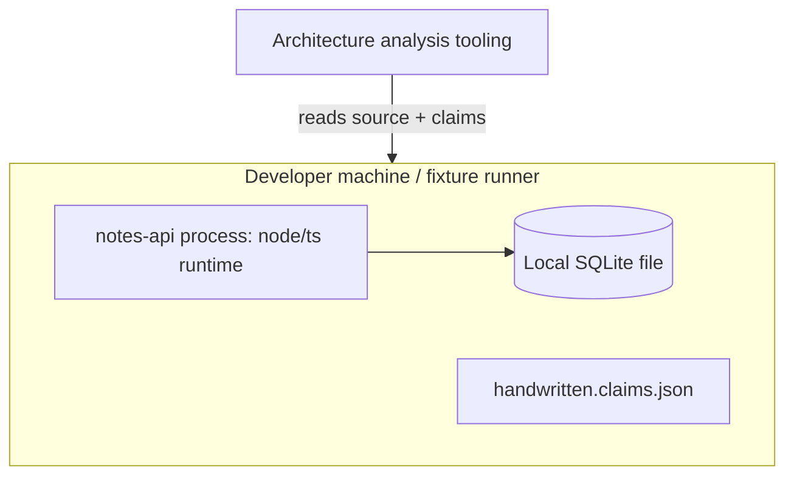

- **Runtime**: intended as a single Node-style TypeScript process listening on `0.0.0.0:8080` (or localhost), reading a local SQLite file at `config.dbUrl`.
- **Infrastructure**: none — no Docker, CI, environment variables, or packaging. Config is compiled-in constants.
- **Deployment strategy**: none exists; this is a source-level fixture. To operationalize: add `package.json` scripts/deps, implement `db.query` against SQLite, externalize the token via env var, mount or delete `usersRouter`, and extend `schema.sql` for `tasks` (and `users`).

**Overall assessment**: a coherent, conventionally layered REST skeleton whose stubs and asymmetries (unmounted users router, missing tables, dead cache) are consistent with an intentional analysis fixture for `handwritten.claims.json` rather than accidental rot. Confidence: ~8/10.