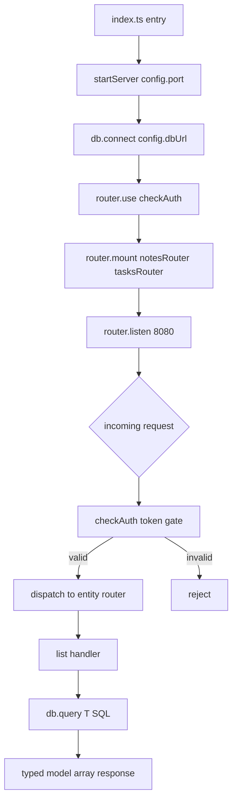
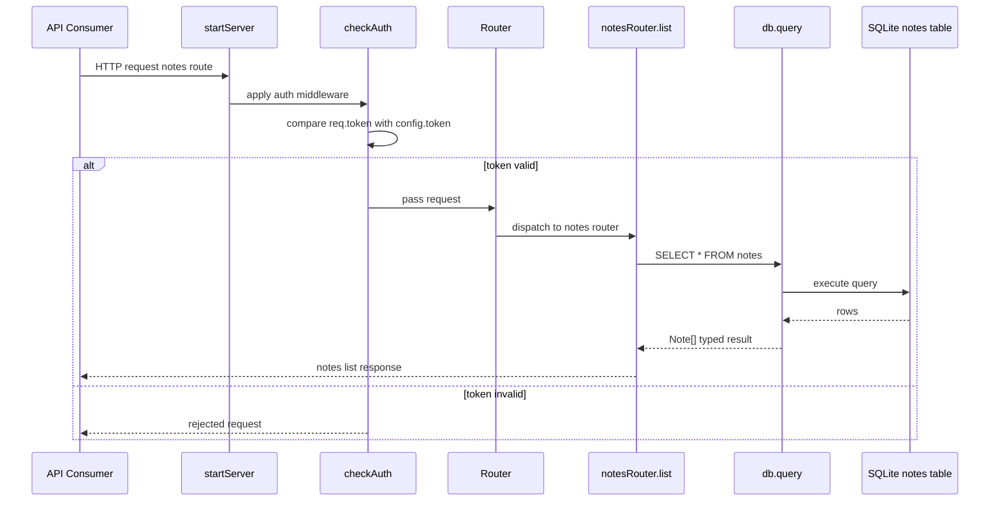
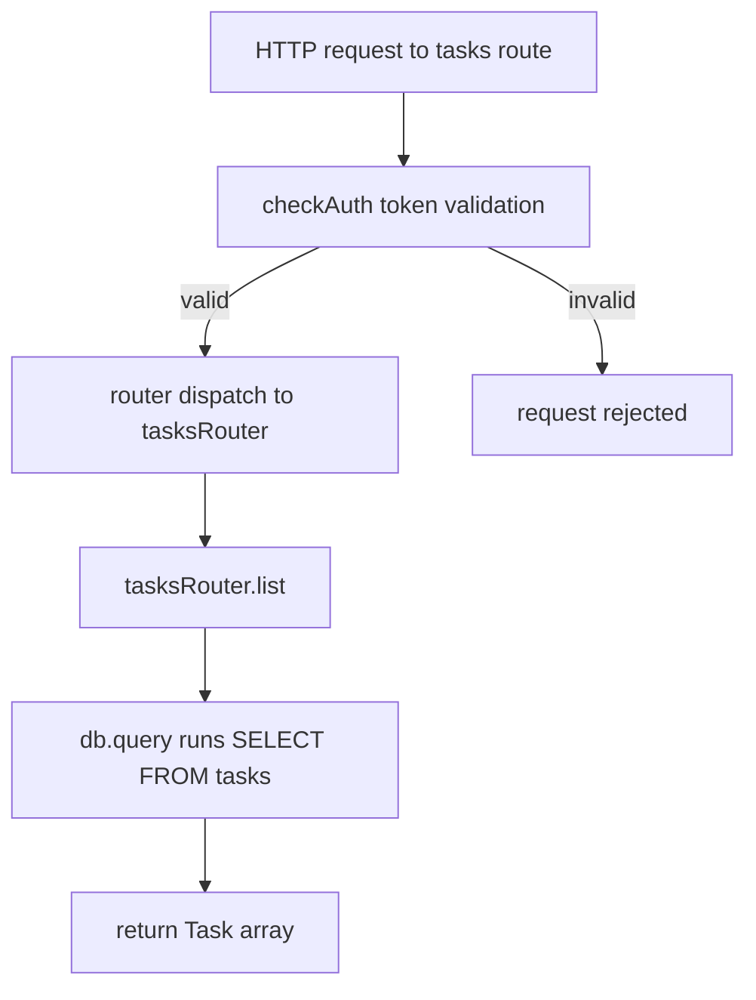
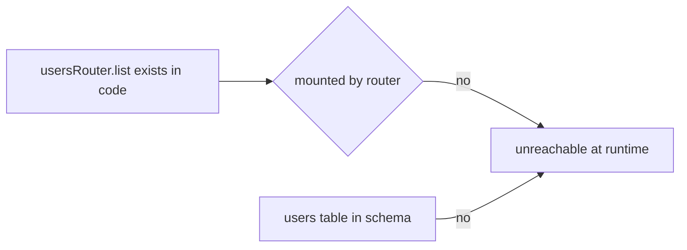
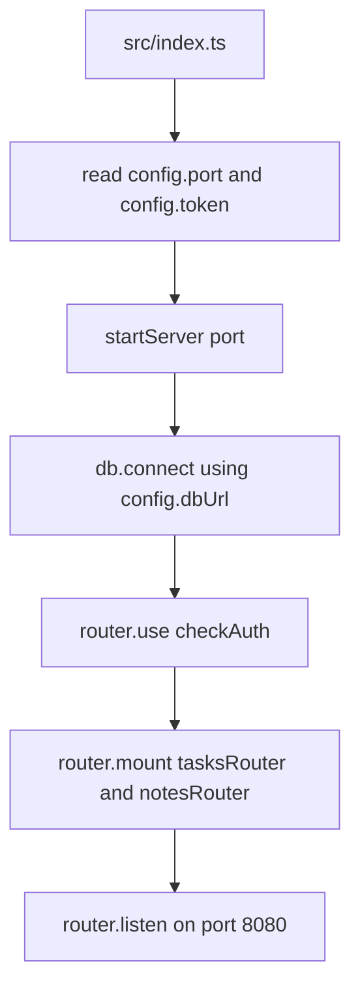
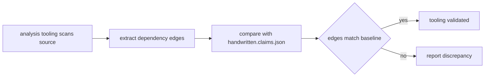
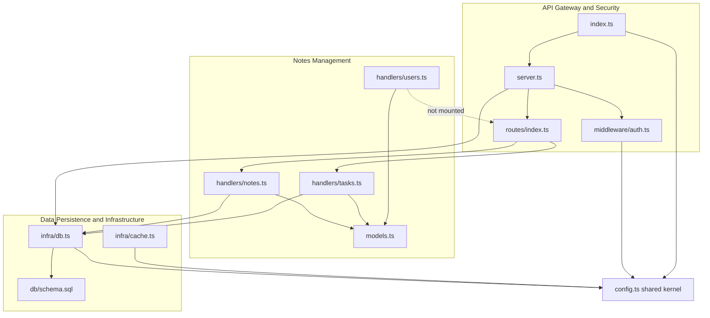

# Core Workflows

## 1. Workflow Overview

`notes-api` is a minimal TypeScript REST API skeleton that exposes read-only list endpoints for notes, tasks, and users behind a static-token auth gate, backed by a SQLite store. All runtime behavior flows through a single uniform pipeline:

**bootstrap → auth → route → handler → typed query → response**

The codebase is a spike/fixture: every infrastructure seam (`db.connect`, `db.query`, `cache.get`, `router.use`, `router.listen`, each `register()`) is a no-op stub, so the workflows below describe the *encoded* execution paths — the shape a real implementation would follow — rather than live runtime behavior.

### Workflow inventory

| Workflow | Entry point | Status | Importance |
|---|---|---|---|
| List Notes | HTTP → notes route | Wired end-to-end | Primary (9.0) |
| List Tasks | HTTP → tasks route | Wired, no schema | Secondary (6.0) |
| List Users | `usersRouter.list()` | Implemented but unmounted — dead code | Gap (4.0) |
| Server Bootstrap | `src/index.ts` | Composition root | Startup |
| Claims Validation | `handwritten.claims.json` | Meta-level fixture workflow | Tooling |

### Key execution paths



## 2. Main Workflows

### 2.1 List Notes (primary flow)

The canonical business transaction: an authenticated consumer requests all note records and receives a `Note[]` typed by `src/models.ts`.



**Step details:**

1. **Bootstrap** — `src/index.ts` imports `config` and calls `startServer(config.port)`; `src/server.ts` runs `db.connect()`, registers `checkAuth` via `router.use`, and binds the listener on port 8080.
2. **Authentication** — `src/middleware/auth.ts::checkAuth` performs a strict equality check `req.token === config.token` and returns a boolean decision.
3. **Dispatch** — `src/routes/index.ts::router.mount` registered `notesRouter` (and `tasksRouter`) at startup; the router forwards matching requests to the feature router.
4. **List handler** — `src/handlers/notes.ts::notesRouter.list()` issues `SELECT * FROM notes` through `db.query<Note>` and maps rows to the `Note` interface (`id`, `body`).
5. **Persistence** — `src/infra/db.ts::db.query<T>` executes against the `notes` table defined in `db/schema.sql` (`id INTEGER PRIMARY KEY AUTOINCREMENT`, `body TEXT NOT NULL`, idempotent `CREATE TABLE IF NOT EXISTS`).

### 2.2 List Tasks (secondary flow)

Identical pipeline, different entity: `tasksRouter.list()` runs `SELECT * FROM tasks` → `Task[]` (`id`, `title`).



**Caveat:** `schema.sql` defines only `notes`. The tasks flow is wired at the routing layer but has no canonical backing table — in a real implementation it would fail at query time.

### 2.3 List Users (unwired flow)

`usersRouter.list()` exists and follows the same pattern (`SELECT * FROM users` → `User[]`), but `src/routes/index.ts` never mounts it and no `users` table exists. It is unreachable at runtime.



### 2.4 Server Bootstrap (startup composition)



Ordering matters: persistence connects *before* middleware registration and listener binding, so the service never accepts traffic against an uninitialized store — the correct composition contract even though `db.connect()` is currently a no-op.

### 2.5 Claims Validation (meta workflow)

The repository doubles as an analysis fixture: `handwritten.claims.json` records expected dependency edges (`index → server → routes → handlers`, with `dependency_type` and `importance`), against which tooling output is verified.



## 3. Flow Coordination and Control

### 3.1 Layered coordination model



### 3.2 Coordination mechanisms

- **Composition root**: `startServer` is the single point that wires middleware, routers, and persistence. No module self-registers; all coordination is explicit and top-down.
- **Shared kernel**: `src/config.ts` is the highest-fan-in module — consumed by the entry point (`port`), auth middleware (`token`), db client (`dbUrl`), and cache stub. Configuration is centralized, static, and compile-time.
- **Single persistence seam**: every handler funnels through `db.query<T>`. Swapping the stub for a real SQLite client activates all handlers simultaneously — a deliberate fixture seam.
- **Type contracts**: `src/models.ts` interfaces (`Note`, `Task`, `User`) parameterize `db.query<T>`, coupling handler output types to persistence results with no intermediate mapping layer.
- **State management**: none. The service is stateless per request; the only shared state is the `config` constant and the implicit SQLite connection owned by `db`.

### 3.3 Data flow

Request-scoped data flows in one direction: token → boolean gate → route key → SQL string → `T[]` rows → response. No mutation, caching, or transformation occurs in the current skeleton (`cache.get` exists but is never invoked by any handler).

## 4. Exception Handling and Recovery

The skeleton defines no explicit error handling — no `try/catch`, no error middleware, no rejection responses. The *designed* failure boundaries are:

| Boundary | Designed behavior | Current stub behavior |
|---|---|---|
| Auth failure | `checkAuth` returns `false` → request rejected | `router.use` is a no-op; nothing is actually rejected |
| Unknown route | Router has no match → no dispatch | `mount`/`listen` are no-ops |
| Missing table (tasks, users) | SQL error propagates to handler | `db.query` returns `[]`, masking it |
| DB connect failure | `startServer` fails before `listen` | `connect` is a no-op; always "succeeds" |
| Query failure | Handler rejects, 5xx to consumer | Always resolves to empty array |

**Fault-tolerance posture:** the empty-array return from `db.query<T>` makes all read flows "succeed" vacuously — safe for a fixture, but it silently masks every real failure mode. Recovery concerns (retry, connection lifecycle, backpressure) are absent by design; they arrive with a real `db` implementation.

**Key insight for implementers:** `checkAuth` is advisory, not enforced — it returns a boolean but no caller acts on it in the stub layer. Enforcement must be added when `router.use` becomes real.

## 5. Key Process Implementation

### 5.1 The uniform entity pipeline

All three handlers are structurally identical — the template for adding a resource:

```text
export const <entity>Router = {
  register() { /* no-op stub */ },
  async list() { return db.query<<Entity>>('SELECT * FROM <entity>s'); }
};
```

To activate a new entity end-to-end: (1) add the interface in `models.ts`, (2) create the handler, (3) mount it in `routes/index.ts`, (4) add the table to `schema.sql`. The users handler demonstrates the failure case: steps 3 and 4 were skipped, leaving dead code.

### 5.2 Implementation-critical seams

- **`db.query<T>(sql)`** — the single integration point. Implement it against `config.dbUrl` and the entire read surface goes live at once.
- **`router.use` / `router.listen` / `router.mount`** — currently no-ops; a real router (Express, Hono, etc.) activates auth enforcement and dispatch.
- **`register()` per router** — reserved hook for route registration; currently unused.
- **`cache.get`** — reserved for read-through caching; inserting it in `list()` is the natural optimization point once queries are real.

### 5.3 Performance considerations

- **Concurrency**: handlers are `async` and stateless — inherently safe for concurrent requests once backed by a real async driver.
- **Resource management**: a single shared `db` object owns the connection; `db.connect()` is called exactly once at bootstrap, giving a clean connection-lifecycle seam.
- **Query shape**: all flows are unbounded `SELECT *` full-table scans. At real scale they need pagination, a `LIMIT` clause, and indexes (`notes.id` is already a PK).
- **Caching**: `cache.get` is the designated seam for memoizing list results; today it adds no value.

### 5.4 Known gaps and asymmetries (intentional for a fixture)

1. `usersRouter` implemented but never mounted — negative test case for wiring detection.
2. `tasks`/`users` queried but absent from `schema.sql` — negative test case for schema coverage.
3. Hardcoded dev token and `dbUrl` in `config.ts` — no environment separation or secret management.
4. `package.json` declares no dependencies or scripts — nothing is runnable as-is.
5. Auth is boolean-advisory with no enforcement point — the security control is declared, not applied.

These asymmetries align with `handwritten.claims.json`: the repo gives analysis tooling both positive edges (mounted, typed, schematized notes flow) and negative edges (unmounted users, unschema'd tasks) to validate against.