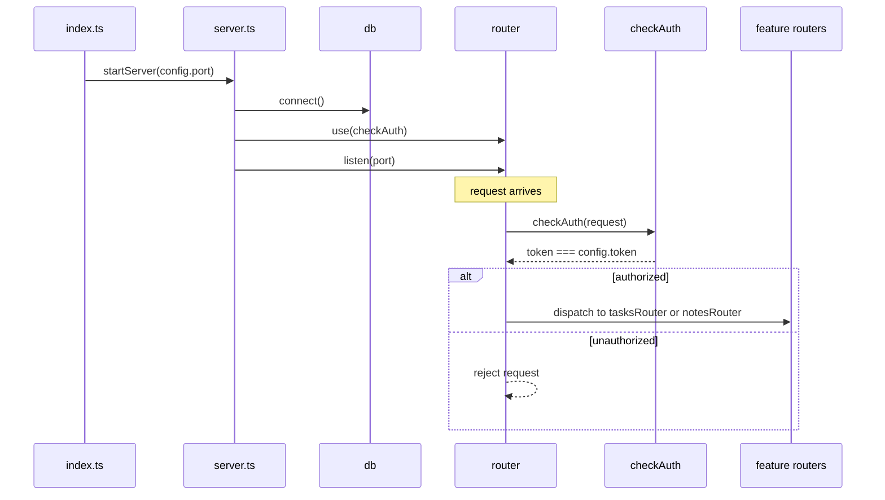
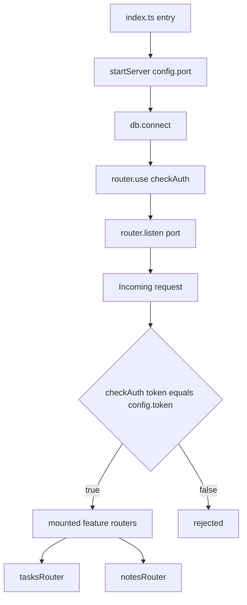

# API Gateway & Security — Module Deep Dive

## 1. Module Purpose

The **API Gateway & Security** module is the presentation/interface layer of `notes-api`. It owns everything at the HTTP-facing edge of the service:

- **Process bootstrap** — `src/index.ts` is the entry point that kicks off the service.
- **Server composition** — `src/server.ts` orchestrates startup: database connection, middleware registration, and listener binding.
- **Route aggregation** — `src/routes/index.ts` composes the per-entity feature routers (`notesRouter`, `tasksRouter`) into a single `router` object.
- **Authentication** — `src/middleware/auth.ts` provides a token-based gate via `checkAuth`.

In DDD terms this is the **application/interface domain**: it contains no business logic of its own, but it defines the seam through which all external traffic reaches the Notes Management core domain.

## 2. Internal Structure

| Sub-module | File(s) | Responsibility |
|---|---|---|
| Server Bootstrap | `src/index.ts`, `src/server.ts` | Composition root; `startServer(port)` wires DB, auth, and listener |
| Route Aggregation | `src/routes/index.ts` | Exports a unified `router` with `use()`, `listen()`, `mount()`; mounts feature routers |
| Authentication Middleware | `src/middleware/auth.ts` | `checkAuth(request)` — boolean token gate against `config.token` |

### File-by-file

- **`src/index.ts`** — Process entry point. Imports `config` and calls `startServer(config.port)` (port 8080).
- **`src/server.ts`** — Exports `startServer(port)`. Startup ordering is fixed and deliberate:
  1. `db.connect()` — initialize persistence before accepting traffic
  2. `router.use(checkAuth)` — install the auth middleware
  3. `router.listen(port)` — bind the HTTP listener
- **`src/routes/index.ts`** — Exports the aggregated `router` object and registers `tasksRouter` and `notesRouter` via `router.mount(...)`. Notably, **`usersRouter` is never mounted** — a wiring gap (see §5).
- **`src/middleware/auth.ts`** — Exports `checkAuth`, which performs a strict equality comparison between `request.token` and `config.token` and returns a boolean.

## 3. Key Interfaces

```ts
// src/server.ts
startServer(port: number): void

// src/routes/index.ts
router.use(middleware): void        // register middleware (stub no-op)
router.mount(featureRouter): void   // mount a feature router
router.listen(port): void           // bind HTTP listener (stub no-op)

// src/middleware/auth.ts
checkAuth(request: { token?: string }): boolean
```

**Configuration dependency:** the module reads `config.port` (entry point) and `config.token` (auth middleware) from `src/config.ts`, the shared kernel with the highest fan-in in the codebase.

## 4. Data / Control Flow

### Startup sequence



### Request dispatch (per the documented design)



## 5. Notable Implementation Decisions & Gaps

- **Custom router abstraction, no HTTP framework.** There is no Express/Fastify dependency; routing is a bespoke `router` object with `use`/`mount`/`listen`. This keeps the codebase dependency-free but means the HTTP contract is implied rather than enforced.
- **Auth is a shared-secret stub.** `checkAuth` is a strict-equality check against a hardcoded dev token in `config.ts`. No expiry, roles, or differentiated error responses — acceptable for a fixture, not for production. The token is also a committed secret-like value.
- **Middleware is advisory, not enforced.** `checkAuth` returns a boolean, but `router.use` is a no-op stub — nothing actually rejects unauthenticated requests at runtime today. Enforcement arrives only with a real router implementation.
- **Stubbed listener.** `router.listen` is a no-op, so no socket is bound; combined with the stub `db.connect`, `startServer` encodes startup *ordering* without runtime behavior.
- **Dead code path: users router.** `src/handlers/users.ts` implements `usersRouter.list()`, but `routes/index.ts` mounts only `tasksRouter` and `notesRouter`. The users surface is unreachable — a deliberate-looking negative case for the analysis fixture (`handwritten.claims.json`).
- **Fixed startup ordering.** DB connect → middleware install → listen is a sensible composition-root pattern: persistence is established before traffic can arrive.

## 6. Domain Relations

| Relation | Type | Description |
|---|---|---|
| → Notes Management | Composition | `router.mount` registers the feature routers; bootstrap wires handlers into the running service |
| → Data Persistence & Infrastructure | Service call | `startServer` invokes `db.connect()` before listening |
| → Configuration | Configuration dependency | `config.port` (entry) and `config.token` (auth) |

## 7. Associated Files

- `src/index.ts` — entry point
- `src/server.ts` — `startServer` composition root
- `src/routes/index.ts` — router aggregation
- `src/middleware/auth.ts` — `checkAuth` token gate
- `src/config.ts` — consumed for `port` and `token` (owned by Configuration domain)
- `src/infra/db.ts` — `db.connect()` invoked at startup (owned by Data Persistence & Infrastructure)
- `src/handlers/{notes,tasks,users}.ts` — feature routers mounted/dispatched by this module