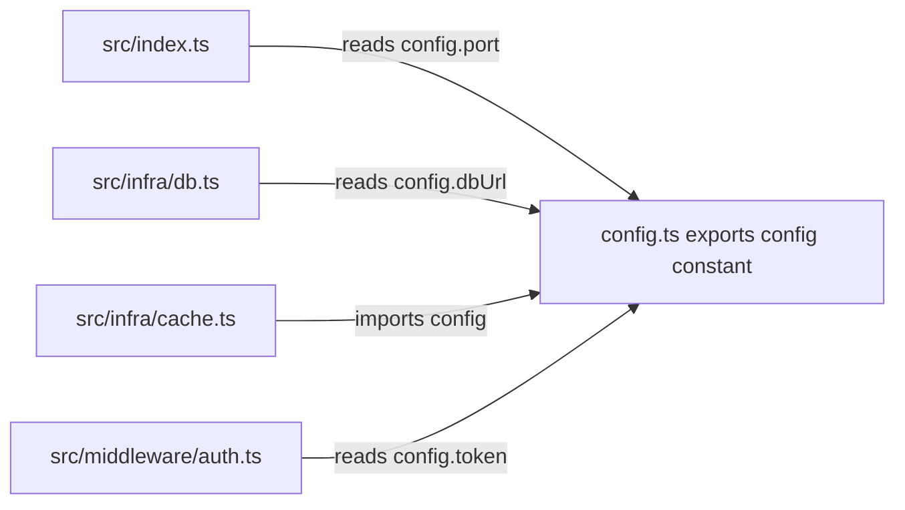
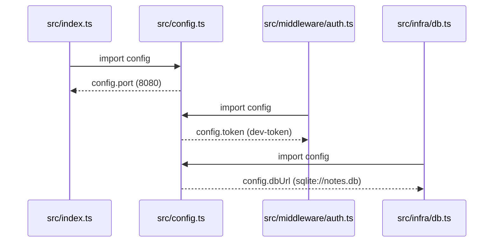

# Configuration Module — Deep Dive

## 1. Purpose

The Configuration module is the **shared kernel** of `notes-api`. It centralizes all runtime settings in a single exported constant so that every layer of the service — the composition root, the auth middleware, and the infrastructure clients — reads from one authoritative source instead of duplicating literals.

It has the **highest fan-in in the codebase** (4 known importers), which makes it the most coupled file in the project despite being the smallest.

## 2. Source

```ts
// src/config.ts
export const config = {
  port: 8080,
  token: "dev-token",
  dbUrl: "sqlite://notes.db",
};
```

[config.ts](file:///tmp/spike/notes-api/src/config.ts)

## 3. Internal Structure

The module is a single **module-level exported object literal**. There are no functions, classes, factories, or environment lookups — the values are compile-time constants resolved at module load.

| Property | Type | Value | Consumers | Semantics |
|---|---|---|---|---|
| `port` | `number` | `8080` | `src/index.ts` | TCP port the HTTP listener binds via `startServer(config.port)` |
| `token` | `string` | `"dev-token"` | `src/middleware/auth.ts` | Static shared secret compared against the incoming request token |
| `dbUrl` | `string` | `"sqlite://notes.db"` | `src/infra/db.ts` | Connection target for the (stubbed) SQLite client |

TypeScript infers the shape `{ port: number; token: string; dbUrl: string }` — there is no explicit interface or `as const` annotation.

## 4. Key Interfaces

- **Export:** named export `config` (ES module). Consumers use `import { config } from "../config"`.
- **Contract:** a plain, mutable object. No getter functions, no immutability enforcement, no schema validation. Any importer could technically mutate `config.token` at runtime; nothing prevents this.

## 5. Dependency / Data Flow

Configuration flows outward from `config.ts` to every consumer at import time; there is no runtime negotiation.



At startup, the values are pulled in the following order:



Role in the wider control flow:

1. `src/index.ts` reads `config.port` and calls `startServer(8080)`.
2. `startServer` calls `db.connect()`, which references `config.dbUrl` (currently a no-op — no real socket is opened).
3. `checkAuth` is registered on the router; per request it compares `request.token === config.token`.

## 6. Notable Implementation Decisions

- **Hardcoded literals, no env resolution.** There is no `process.env` lookup, no `.env` loading, no override mechanism. Changing any setting requires editing the file and recompiling — appropriate for a fixture/spike, inadequate for deployment.
- **Committed dev secret.** `token: "dev-token"` is a plaintext credential in source control. It is explicitly development-only; the architecture report flags it as a value that must not ship and should be externalized (env var / secrets manager) if the project graduates beyond fixture status.
- **No typing or validation.** The object is inferred, not declared against an interface, and no startup validation exists (e.g., port range check, non-empty token). A malformed edit fails silently at the consumer.
- **Mutable export.** `config` is not frozen (`Object.freeze`) and not `as const`; the shared-kernel contract relies on convention rather than enforcement.
- **Highest fan-in by design.** Centralizing port/token/dbUrl in one module gives the fixture a predictable shared-kernel node for dependency-graph analysis — edges `index→config`, `auth→config`, `db→config`, `cache→config` are exactly the kind of claims `handwritten.claims.json` exists to verify.

## 7. Known Limitations / Risks

| Issue | Severity | Note |
|---|---|---|
| Hardcoded auth token in VCS | Medium | Dev-only; must be externalized for real use |
| No environment separation | Medium | No dev/staging/prod profiles |
| No validation or immutability | Low | Consumers trust values blindly |
| `dbUrl` unused at runtime | Low (by design) | `db.connect()` is a stub; the URL is referenced but never opened |

## 8. Associated Files

| File | Relationship |
|---|---|
| `src/config.ts` | The module itself |
| `src/index.ts` | Consumer — reads `config.port` for `startServer` |
| `src/middleware/auth.ts` | Consumer — reads `config.token` in `checkAuth` |
| `src/infra/db.ts` | Consumer — reads `config.dbUrl` in `db.connect` |
| `src/infra/cache.ts` | Consumer — imports `config` (stub reference only) |

## 9. Recommendations

If this module evolves past fixture status: load values from `process.env` with defaults (`port: Number(process.env.PORT ?? 8080)`), move `token` to a secret store, declare an explicit `AppConfig` interface, and freeze the exported object.