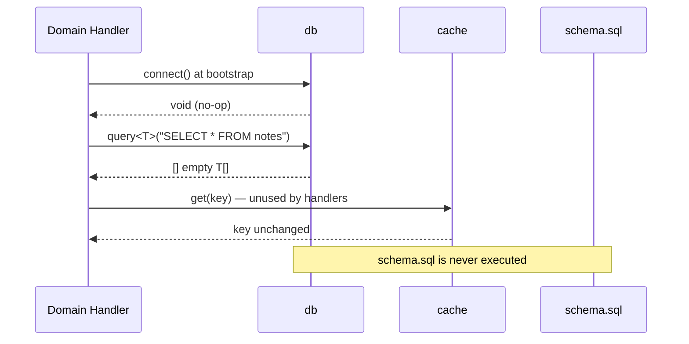
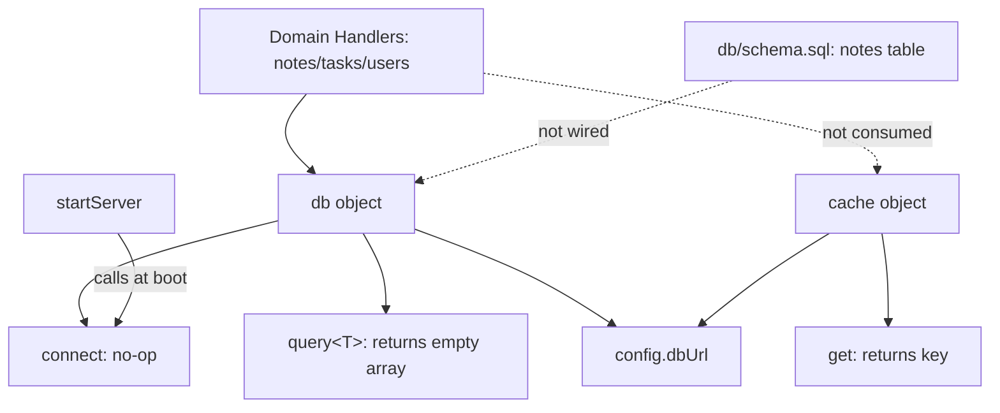

# Data Persistence & Infrastructure

## Module Purpose

The **Data Persistence & Infrastructure** domain is the infrastructure layer of `notes-api`. In DDD terms it encapsulates all technical concerns that support the domain layer: the database access client (`src/infra/db.ts`), a cache placeholder (`src/infra/cache.ts`), and the canonical SQLite schema (`db/schema.sql`).

Its core responsibility is to act as the **single persistence gateway** through which every entity handler (`notes`, `tasks`, `users`) funnels SQL queries via the generic `db.query<T>` interface. All three components are currently stubs — `connect()` is a no-op, `query()` resolves to an empty array, and `cache.get()` is an identity function — which is consistent with the project's role as an analysis fixture (validated against `handwritten.claims.json`) rather than a production service.

## Internal Structure

| Sub-module | File | Role | Importance |
|---|---|---|---|
| Database Client | `src/infra/db.ts` | Shared `db` object exposing `connect()` and generic `query<T>(sql)`. Sole integration point between handlers and persistence. | High |
| Data Schema | `db/schema.sql` | Canonical SQLite DDL for the `notes` table. | Medium |
| Cache | `src/infra/cache.ts` | Placeholder `cache` object exposing `get(key)`. Reserved for future use; imported by no handler. | Low |

### Database Client (`src/infra/db.ts`)

The module imports `config` from `../config` and exports a `db` object with two members:

- **`connect()`** — a no-op that only references `config.dbUrl` (`"sqlite://notes.db"`). Called once by `startServer()` during bootstrap to "initialize" the persistence layer before the HTTP listener binds. No real connection is established; no SQLite driver (`better-sqlite3`, `sqlite3`) is wired anywhere in the codebase.
- **`query<T>(sql)`** — an async generic stub that ignores its `sql` argument and resolves to an empty `T[]`. The generic parameter is the module's key design feature: handlers parameterize it with domain models (`Note`, `Task`, `User` from `src/models.ts`), giving the codebase a typed repository seam even though no rows are ever returned.

### Data Schema (`db/schema.sql`)

A single idempotent DDL statement:

```sql
CREATE TABLE IF NOT EXISTS notes (
  id   INTEGER PRIMARY KEY AUTOINCREMENT,
  body TEXT NOT NULL
);
```

This is the canonical persistence shape for the `Note` entity (`id`, `body`). It is the *only* table defined — a deliberate asymmetry, since `tasksRouter` and `usersRouter` issue `SELECT * FROM tasks` / `SELECT * FROM users` against tables that do not exist. The schema is also **not wired to the client**: nothing in `db.ts` reads or executes `schema.sql`, so the DDL contract is implied by the queries rather than enforced at runtime.

### Cache (`src/infra/cache.ts`)

Exports a `cache` object with `get(key)`, which references `config` as a no-op and returns `key` unchanged — a pass-through stub with no storage. No handler consumes it; it exists purely as scaffolding for a future read-through caching layer.

## Key Interfaces

```text
db.connect(): void                    — bootstrap-time initialization (no-op)
db.query<T>(sql: string): Promise<T[]> — typed query gateway (stub: returns [])
cache.get(key): any                    — cache read stub (returns key)
```

Consumers interact with the module exclusively through the exported `db` object. Both `db.ts` and `cache.ts` import `config`, coupling the infrastructure layer to the Configuration shared kernel for `dbUrl` (and nominally for future cache settings).

## Data / Control Flow

### Query path (per request)



### Module relationships



Inbound callers: `startServer` (Server Bootstrap) invokes `db.connect()`; all three entity handlers invoke `db.query<T>()`. Outbound dependencies: `src/config.ts` (Configuration domain) only — there is no real SQLite driver dependency.

## Notable Implementation Decisions

1. **Single funnel design.** All persistence flows through one generic `db.query<T>` method rather than per-entity repositories. This makes the stub→real swap a one-point change: implementing `query` against an actual SQLite driver would activate every handler simultaneously — a deliberate seam appropriate for a spike/fixture.
2. **Generic typing over runtime enforcement.** Type safety comes from the `T` parameter bound to `Note`/`Task`/`User` interfaces at the call site, not from schema validation. `SELECT *` results are trusted to match the model shape.
3. **Schema/client decoupling.** `schema.sql` documents the intended table shape but is never loaded by `db.ts`. In a real implementation, `connect()` would read `config.dbUrl`, open the database, and apply this DDL.
4. **Config coupling.** Both infra modules import `config` even though `cache` doesn't need it — keeping the fan-in to the shared kernel explicit in the dependency graph.
5. **Stub asymmetry as a fixture feature.** Only `notes` has a table; `tasks`/`users` queries would fail against a real database. Combined with the unwired cache and unmounted `usersRouter`, these gaps appear intentional — they give architecture-analysis tooling both positive edges (`handlers → db`) and negative cases to detect.

## Gaps & Caveats

- `query<T>` never reaches the schema; all reads return empty collections.
- `tasks` and `users` handlers query tables absent from `schema.sql` (would error on a real DB).
- `cache.ts` is dead code — imported nowhere outside `config`.
- No migrations, indices, constraints beyond `PRIMARY KEY`/`NOT NULL`, or write paths exist.
- `config.dbUrl` is a compile-time constant; there is no environment-based configuration.

## Associated Files

- `src/infra/db.ts` — shared `db` client (`connect`, `query<T>`)
- `src/infra/cache.ts` — `cache` stub (`get`)
- `db/schema.sql` — `notes` table DDL
- Consumers: `src/server.ts`, `src/handlers/notes.ts`, `src/handlers/tasks.ts`, `src/handlers/users.ts`
- Dependency: `src/config.ts` (`config.dbUrl`)