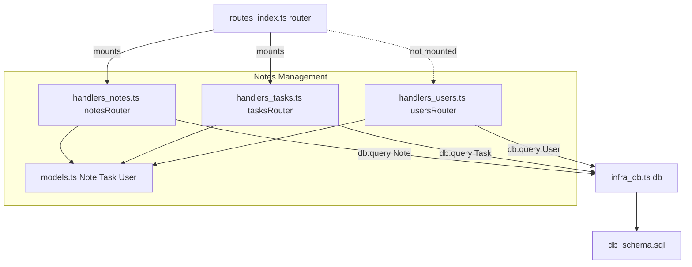
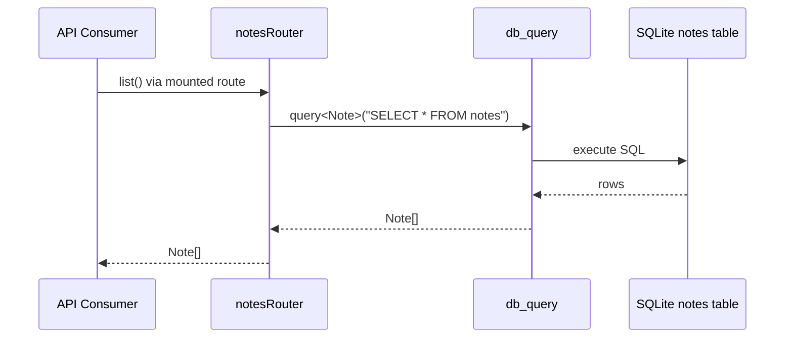
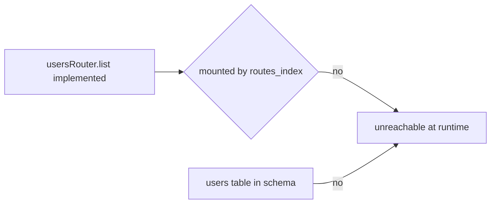

# Notes Management — Module Deep Dive

## 1. Module Purpose

Notes Management is the **core business domain** of `notes-api`. It provides the primary functional value of the service: exposing note records to API consumers over HTTP. The domain is centered on the `Note` entity and owns:

- The `notesRouter` handler that lists all notes (`src/handlers/notes.ts`)
- The canonical domain model contracts (`src/models.ts`)
- The SQL queries that address the `notes` table defined in `db/schema.sql`

Two sibling handlers — `tasksRouter` and `usersRouter` — follow the identical register/list pattern and are catalogued inside this domain, but they are secondary stubs: `tasks` has no canonical schema, and `users` is never mounted by the route aggregator.

In DDD terms this is a thin domain layer: handlers contain no business rules beyond "select all rows"; their role is to bind HTTP-facing routes to typed queries executed through the shared persistence gateway (`db.query<T>`).

## 2. Internal Structure



### Sub-modules

| Sub-module | File | Role |
|---|---|---|
| Notes Handler | `src/handlers/notes.ts` | `notesRouter.list()` runs `SELECT * FROM notes` via `db.query<Note>`; `register()` is a no-op placeholder for route binding. |
| Tasks Handler | `src/handlers/tasks.ts` | Mirrors the notes pattern with `SELECT * FROM tasks` typed as `Task`. Mounted, but no `tasks` table exists in the schema. |
| Users Handler | `src/handlers/users.ts` | Same pattern typed as `User`. **Dead code**: not mounted by `src/routes/index.ts` and no `users` table exists. |
| Domain Models | `src/models.ts` | Pure type declarations: `Note { id, body }`, `Task { id, title }`, `User { id, name }`. No runtime logic. |

## 3. Key Interfaces

### `notesRouter` / `tasksRouter` / `usersRouter`

Each handler exports a router object with a uniform contract:

- **`register()`** — placeholder for binding routes into an HTTP framework. Currently a no-op; the routers are mounted at the aggregation layer (`router.mount`) rather than self-registering.
- **`async list(): Promise<T[]>`** — executes a raw `SELECT * FROM <entity>` through `db.query<T>` and returns the result set unchanged. No filtering, pagination, transformation, or error handling.

### `db.query<T>(sql: string): Promise<T[]>`

The single integration point between this domain and persistence (`src/infra/db.ts`). It is parameterized by the domain interfaces (`Note`, `Task`, `User`) imported from `src/models.ts`, so the schema contract is enforced only by convention — the generic type parameter asserts a row shape the code does not validate.

### Entity models

```ts
interface Note { id: number; body: string }
interface Task { id: number; title: string }
interface User { id: number; name: string }
```

Only `Note` has a backing table: `notes(id INTEGER PRIMARY KEY AUTOINCREMENT, body TEXT NOT NULL)` in `db/schema.sql`.

## 4. Data and Control Flow

### Primary flow — List Notes



In the running service the request first traverses the API Gateway layer: `checkAuth` token validation, then dispatch by the aggregated router to the mounted `notesRouter`. Within this module the flow is a straight pass-through — the handler issues one SQL statement and returns typed rows.

### Secondary flows

- **List Tasks** — identical pipeline via `tasksRouter.list()` (`SELECT * FROM tasks`). Reaches the handler through the mounted router, but would fail against a real database because no `tasks` table exists.
- **List Users** — `usersRouter.list()` exists in code and calls `db.query<User>("SELECT * FROM users")`, but is unreachable at runtime: the routes aggregator never mounts it and there is no `users` table.



## 5. Notable Implementation Decisions

- **Uniform handler shape.** All three routers expose the same `register()`/`list()` surface. This uniformity is deliberate for a fixture codebase: it produces predictable dependency edges (`handlers/* → infra/db.ts`, `handlers/* → models.ts`) for architecture-analysis tooling to verify against `handwritten.claims.json`.
- **Single persistence seam.** Every entity read funnels through `db.query<T>`. Swapping the stub (which resolves to an empty `T[]`) for a real SQLite client would activate all handlers at once — a clean, single-point integration seam.
- **Schema-asymmetry by design.** Only `notes` has a canonical table definition. The `tasks` and `users` handlers query nonexistent tables, and `usersRouter` is implemented but unmounted. These look like intentional positive/negative cases for the analysis fixture rather than accidental rot: the `users.ts → db.ts` edge exists in code but is unreachable via routing.
- **No runtime model validation.** `models.ts` contains interfaces only. The `Note` type matches `schema.sql` by convention (`id`, `body`), but nothing checks that returned rows conform — appropriate for a skeleton, a real service would need row mapping/validation.
- **Read-only surface.** There are no create/update/delete operations anywhere in the domain; the `notes` schema likewise has no constraints beyond the two columns.
- **`register()` as an explicit no-op.** Keeping a declared-but-empty registration method preserves the documented router contract while deferring HTTP framework wiring — a gap between the documented role (route handler serving consumers) and actual behavior (standalone query wrapper).

## 6. Associated Files

| File | Contents |
|---|---|
| `src/handlers/notes.ts` | `notesRouter` with `register()` (no-op) and `list()` → `db.query<Note>("SELECT * FROM notes")` |
| `src/handlers/tasks.ts` | `tasksRouter` mirroring the notes pattern for `Task` |
| `src/handlers/users.ts` | `usersRouter` mirroring the pattern for `User`; unmounted dead code |
| `src/models.ts` | `Note`, `Task`, `User` interface declarations |

### Direct dependencies (outside the module)

| File | Relationship |
|---|---|
| `src/infra/db.ts` | Shared `db` object; sole query gateway (`db.query<T>`) |
| `src/routes/index.ts` | Mounts `notesRouter` and `tasksRouter` into the aggregated router |
| `db/schema.sql` | Canonical `notes` table definition |
| `src/config.ts` | Indirect dependency via the db client (`config.dbUrl`) |

## 7. Gaps and Recommendations

1. **Users handler is dead code** — either mount `usersRouter` in `src/routes/index.ts` and add a `users` table, or delete the handler.
2. **Schema/handler mismatch** — extend `db/schema.sql` with `tasks` (and `users` if kept) so mounted handlers don't query nonexistent tables.
3. **Stubbed persistence** — implement `db.query` against a real SQLite driver to activate all handlers through the existing seam.
4. **Read-only domain** — if the service graduates beyond fixture status, add write paths (`create`, `update`, `delete`) and corresponding schema constraints.